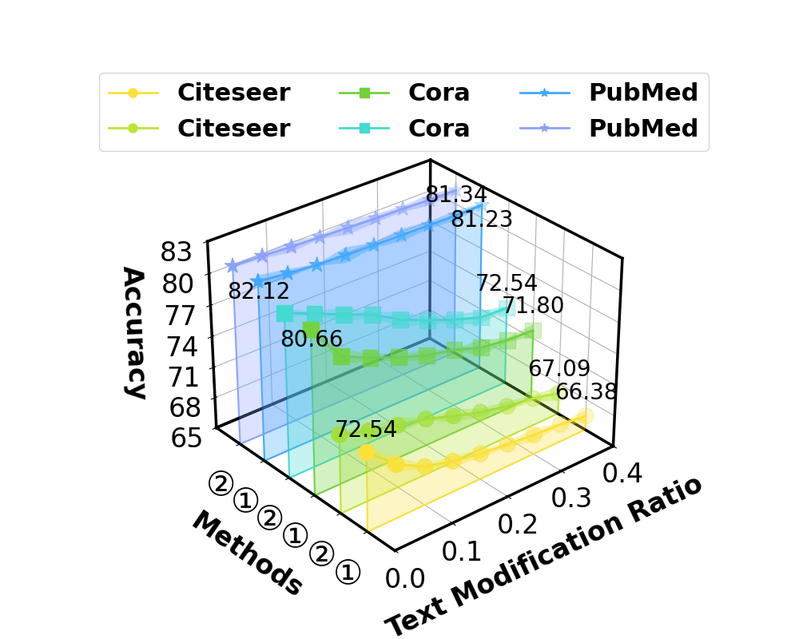

# 三维图 - 1

## 使用场景
用于反应三个维度上的大小关系，一般z轴为评测指标，y轴为不同方法或数据集，x轴为超参数/其他测评指标/不同场景。

## 效果预览

1. 坐标轴含义
    - x轴代表 Text modification ratio。
    - y轴代表不同的方法。
    - y轴代表准确率。
2. 图案/颜色含义
    - 每个方法对应一个不同颜色的平面。
    - 每个平面上方为一个折线图。
3. 图片预览



## 代码
```python
import matplotlib.pyplot as plt
import numpy as np
from mpl_toolkits.mplot3d import Axes3D
from mpl_toolkits.mplot3d.art3d import Poly3DCollection

# 固定随机种子以确保可重复性
np.random.seed(19680801)

# 数据准备
beta = np.array([0, 0.05, 0.1, 0.15, 0.2, 0.25, 0.3, 0.35, 0.4])
metrics = ['Citeseer', 'Citeseer', 'Cora', 'Cora', 'PubMed', 'PubMed']
method = [chr(0 + 9312), chr(1 + 9312), chr(0 + 9312), chr(1+ 9312), chr(0 + 9312), chr(1 + 9312)]
y_positions = np.array([1,2,3,4,5,6])

max_y = 7
max_x = 0.4
max_z = 83
min_z = 65

# 数据
data = [
    [72.54, 70.18, 68.73, 67.99, 67.48, 67.20, 66.89, 66.73, 66.38],
    [72.54, 71.68, 71.01, 70.42, 69.52, 68.69, 68.10, 67.71, 67.09],
    [80.66, 77.11, 75.82, 74.76, 73.79, 73.23, 72.31, 71.94, 71.80],
    [80.66, 79.56, 78.36, 77.30, 75.73, 74.57, 73.56, 72.68, 72.54],
    [82.12, 81.81, 81.56, 81.44, 81.37, 81.30, 81.25, 81.18, 81.23],
    [82.12, 82.02, 81.86, 81.75, 81.65, 81.55, 81.48, 81.37, 81.34]
]

# 创建三维图形
fig = plt.figure(figsize=(10, 8))
ax = fig.add_subplot(projection='3d')

shapes = ['o', 'o','s', 's','*','*']  # 对应每个数据集的形状

# 颜色设置
colors = ['#FBE139', '#BAE637', '#73D13D', '#45DAD1', '#40A9FF', '#8BA2FF']
line_width = 2
std_errors = [
    [0.36, 0.72, 0.19, 0.55, 0.43, 0.28, 0.67, 0.14, 0.61],  # 数据集 0 (Citeseer)
    [0.51, 0.23, 0.79, 0.12, 0.64, 0.38, 0.47, 0.29, 0.75],  # 数据集 1 (Citeseer)
    [0.17, 0.66, 0.41, 0.31, 0.53, 0.08, 0.76, 0.22, 0.59],  # 数据集 2 (Cora)
    [0.44, 0.15, 0.68, 0.27, 0.71, 0.33, 0.49, 0.62, 0.20],  # 数据集 3 (Cora)
    [0.56, 0.39, 0.11, 0.73, 0.25, 0.60, 0.34, 0.48, 0.16],  # 数据集 4 (PubMed)
    [0.19, 0.26, 0.52, 0.18, 0.65, 0.42, 0.30, 0.54, 0.21]   # 数据集 5 (PubMed)
]
# 绘制多边形填充、折线、虚线和数据节点
for i, (metric_data, color, y_pos) in enumerate(zip(data, colors, y_positions)):
    std_error = std_errors[i]
    # 计算置信区间的上下界
    upper_bound = [min(x + se, x + 1.0) for x, se in zip(metric_data, std_error)]  # 上限不超过数据值+1
    lower_bound = [max(x - se, x - 1.0) for x, se in zip(metric_data, std_error)]  # 下限不低于数据值-1

    # 创建置信区间填充区域（从下界到上界）
    verts_ci = [list(zip(beta, [y_pos] * len(beta), lower_bound))]
    verts_ci[0] += [(beta[-1], y_pos, upper_bound[-1])] + list(zip(beta[::-1], [y_pos] * len(beta), upper_bound[::-1]))
    poly_ci = Poly3DCollection(verts_ci, alpha=0.4, facecolor=color, edgecolor='none', zorder=-1)
    ax.add_collection3d(poly_ci)

    # 创建多边形填充（从折线到 z=65 的底部，仅填充，无边界）
    verts = [list(zip(beta, [y_pos] * len(beta), metric_data))]
    verts[0] += [(beta[-1], y_pos, min_z), (beta[0], y_pos, min_z)]
    poly = Poly3DCollection(verts, alpha=0.3, facecolor=color, zorder=0)
    ax.add_collection3d(poly)

    # 绘制多边形边界（恢复原颜色）
    boundary_x = list(beta) + [beta[-1], beta[0], beta[0]]
    boundary_y = [y_pos] * len(beta) + [y_pos, y_pos, y_pos]
    boundary_z = list(metric_data) + [min_z, min_z, metric_data[0]]
    ax.plot(boundary_x, boundary_y, boundary_z, color=color, linewidth=1.5, zorder=0)

    # 绘制折线
    ax.plot(beta, [y_pos] * len(beta), metric_data, color=color, linewidth=line_width, zorder=1)

    # 绘制数据节点
    ax.scatter(beta, [y_pos] * len(beta), metric_data, color=colors[i], s=200,
               marker=shapes[i], edgecolors=colors[i], zorder=2)
    # # 创建多边形填充（从折线到z=35的底部，仅填充，无边界）
    # verts = [list(zip(beta, [y_pos] * len(beta), metric_data))]
    # verts[0] += [(beta[-1], y_pos, min_z), (beta[0], y_pos, min_z)]
    # poly = Poly3DCollection(verts, alpha=0.4, facecolor=color, zorder=0)
    # ax.add_collection3d(poly)
    #
    # # 绘制多边形边界（恢复原颜色）
    # boundary_x = list(beta) + [beta[-1], beta[0], beta[0]]
    # boundary_y = [y_pos] * len(beta) + [y_pos, y_pos, y_pos]
    # boundary_z = list(metric_data) + [min_z, min_z, metric_data[0]]
    # ax.plot(boundary_x, boundary_y, boundary_z, color=color, linewidth=1.5, zorder=0)
    #
    # # 绘制折线（无节点标记）
    # ax.plot(beta, [y_pos] * len(beta), metric_data, color=color,
    #         linewidth=line_width, zorder=1)
    #
    # # 绘制数据节点（实心黑色圆圈，显示在折线上方，放大）
    # # ax.scatter(beta, [y_pos] * len(beta), metric_data, color='black', s=64,
    # #            marker='o', edgecolors='black', zorder=2)
    # ax.scatter(beta, [y_pos] * len(beta), metric_data, color=colors[i], s=100,
    #            marker=shapes[i], edgecolors=colors[i], zorder=2)

    # 添加第一个节点的数字标签（β=0）
    # ax.text(beta[0], y_pos, metric_data[0] + 2, f'{metric_data[0]:.2f}',
    #         color='black', fontsize=12, ha='center', va='bottom', zorder=3)
    # ax.text(beta[0], y_pos, metric_data[0] + 1.5, f'{metric_data[0]:.2f}',
    #         color='black', fontsize=12, ha='center', va='bottom', zorder=15)

    # for i in [0, 2, 4]:
    #     ax.plot([beta[0], beta[0]], [y_positions[i], y_positions[i + 1]],
    #             [data[i][0], data[i + 1][0]], color='black', linestyle='dashed',
    #             linewidth=2, zorder=0.5)


    if i == 2:
        ax.text(beta[0], y_pos, metric_data[0] - 2, f'{metric_data[0]:.2f}',
                color='black', fontsize=20, ha='center', va='bottom', zorder=20)
    elif i ==0:
        ax.text(beta[0], y_pos, metric_data[0] + 1, f'{metric_data[0]:.2f}',
                color='black', fontsize=20, ha='center', va='bottom', zorder=20)
    elif i ==4:
        ax.text(beta[0], y_pos, metric_data[0] -2, f'{metric_data[0]:.2f}',
                color='black', fontsize=20, ha='center', va='bottom', zorder=20)

    if i == 4:
        ax.text(beta[-1], y_pos, metric_data[-1] - 2.6, f'{metric_data[-1]:.2f}',
                color='black', fontsize=20, ha='center', va='bottom', zorder=20)
    elif i == 5:
        ax.text(beta[-1], y_pos, metric_data[-1] -1.6 , f'{metric_data[-1]:.2f}',
                color='black', fontsize=20, ha='center', va='bottom', zorder=20)
    else:
        ax.text(beta[-1], y_pos, metric_data[-1] + 1.2, f'{metric_data[-1]:.2f}',
                color='black', fontsize=20, ha='center', va='bottom', zorder=20)

# 设置轴标签

# 创建图例
legend_handles = []
for i, (metric, color, shape) in enumerate(zip(metrics, colors, shapes)):
    # 为每条折线/散点创建图例条目
    line = ax.plot([], [], [], color=colors[i], linestyle='-', linewidth=2,
                   marker=shapes[i], markersize=8, label=metric)[0]
    legend_handles.append(line)

# 添加图例
font_properties = {'weight': 'bold','size': 22}
ax.legend(handles=legend_handles, fontsize=18,
          title_fontsize=24, ncol=3,prop=font_properties,bbox_to_anchor=(1.2, 1.15),)


ax.set_xlabel('Text Modification Ratio', fontsize=24,labelpad=20,weight='bold' )
ax.set_ylabel('Methods', fontsize=24,labelpad = 30,weight='bold')
ax.set_zlabel('Accuracy', fontsize=24,labelpad = 20,weight='bold')

# 设置y轴刻度为指标名称，放大字体
ax.set_yticks(y_positions)
ax.set_yticklabels(method, fontsize=24)

ax.set_yticks([1, 2, 3, 4, 5, 6])  # 确保刻度位置为 [1, 2, 3, 4, 5, 6]
ax.set_yticklabels(method, fontsize=28)  # 确保标签与刻度一一对应

# 设置x轴从0开始
ax.set_xlim(0, 0.40)
ax.set_zlim(65, 83)
ax.set_ylim(0, max_y)
# ax.set_xticks([0, 0.1, 0.2, 0.3, 0.4])
ax.set_zticks([65, 68, 71, 74, 77, 80, 83])

ax.tick_params(axis='x', labelsize=24, direction='in', length=0,pad = 3)
ax.tick_params(axis='y', labelsize=30, direction='in', length=0,pad = 10)
ax.tick_params(axis='z', labelsize=24, direction='in', length=0,pad = 8)

# 绘制 x-y 平面边界（z=35）
ax.plot([0, 0.4], [0, 0], [min_z, min_z], color='black', linewidth=2.5, zorder=0)  # 底部 x 轴
ax.plot([0, 0.4], [max_y, max_y], [min_z, min_z], color='black', linewidth=2.5, zorder=0)  # 顶部 x 轴
ax.plot([0, 0], [0, max_y], [min_z, min_z], color='black', linewidth=2.5, zorder=0)   # 左侧 y 轴
ax.plot([0.4, 0.4], [0, max_y], [min_z, min_z], color='black', linewidth=2.5, zorder=0)  # 右侧 y 轴

# 绘制 x-z 平面边界（y=0）
ax.plot([0, max_x], [max_y, max_y], [min_z, min_z], color='black', linewidth=2.5, zorder=0)  # 底部 x 轴（与 x-y 重叠）
ax.plot([0, 0], [max_y, max_y], [min_z, max_z], color='black', linewidth=2.5, zorder=0)  # 左侧 z 轴
ax.plot([max_x, max_x], [0, 0], [min_z, max_z], color='black', linewidth=2.5, zorder=0)  # 右侧 z 轴


# 绘制 y-z 平面边界（x=0）
ax.plot([0, max_x], [max_y, max_y], [max_z, max_z], color='black', linewidth=2.5, zorder=0)   # 底部 y 轴（与 x-y 重叠）
ax.plot([max_x, max_x], [0, max_y], [max_z, max_z], color='black', linewidth=2.5, zorder=0)   # 顶部 y 轴
ax.plot([max_x, max_x], [max_y, max_y], [min_z, max_z], color='black', linewidth=2.5, zorder=0)  # 右侧 z 轴

# 启用传统网格
ax.grid(True)

# 设置背景为白色，移除任何灰色平面
fig.patch.set_facecolor('white')
ax.set_facecolor('white')
ax.xaxis.set_pane_color((1.0, 1.0, 1.0, 0.0))
ax.yaxis.set_pane_color((1.0, 1.0, 1.0, 0.0))
ax.zaxis.set_pane_color((1.0, 1.0, 1.0, 0.0))
# ax.set_box_aspect([1, 1, 1])
# 显示图形
fig.subplots_adjust(top=0.8, bottom=0.1, left=0.12, right=0.9, hspace=0.2, wspace=0.2)
ax.view_init(elev=30, azim=-130, roll=0)
plt.show()
```
