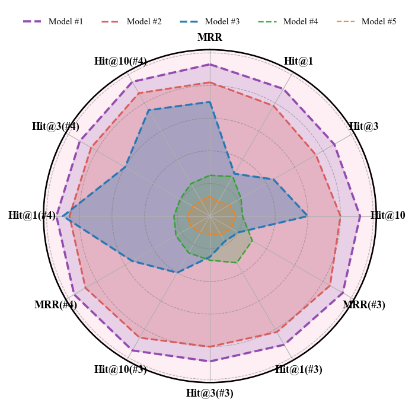

# 雷达图

## 使用场景

可以用于表示不同方法在多个维度下的效果对比。一般用于对比不同模型的综合表现，每个轴都可以代表一种测评指标。

## 效果预览

1. 坐标轴含义
    - 圆中的每个坐标轴都代表一种不同的测评指标。
2. 颜色/线性含义
    - 不同的颜色/线性代表不用的模型/方法。
    - 不同的颜色代表某个方法所覆盖的区域，用于比较综合表现 (覆盖区域越大，综合表现越好)。
3. 图片预览



## 代码
```python
import numpy as np
import matplotlib.pyplot as plt

plt.rcParams['font.family'] = 'Times New Roman'
plt.rcParams['axes.unicode_minus'] = False

# labels (12 axes)
labels = [
    "MRR", "Hit@1", "Hit@3", "Hit@10",
    "MRR(#3)", "Hit@1(#3)", "Hit@3(#3)", "Hit@10(#3)",
    "MRR(#4)", "Hit@1(#4)", "Hit@3(#4)", "Hit@10(#4)"
]

num_vars = len(labels)
angles = np.linspace(0, 2 * np.pi, num_vars, endpoint=False).tolist()
angles += angles[:1]

# --- Data (keep consistent with the previous version) ---
purple = [0.93, 0.90, 0.88, 0.92, 0.94, 0.91, 0.89, 0.95, 0.96, 0.94, 0.92, 0.95]
red    = [0.82, 0.78, 0.75, 0.80, 0.85, 0.82, 0.80, 0.86, 0.88, 0.86, 0.84, 0.87]
blue   = [0.70, 0.30, 0.45, 0.60, 0.20, 0.18, 0.25, 0.40, 0.55, 0.90, 0.60, 0.75]
green  = [0.25, 0.28, 0.22, 0.20, 0.30, 0.33, 0.27, 0.26, 0.24, 0.22, 0.21, 0.23]
orange = [0.12, 0.10, 0.14, 0.16, 0.15, 0.13, 0.11, 0.12, 0.13, 0.14, 0.12, 0.11]

series = [purple, red, blue, green, orange]
series = [s + s[:1] for s in series]  # close the polygon

# --- Plot ---
fig, ax = plt.subplots(figsize=(7, 7), subplot_kw=dict(polar=True))
ax.set_theta_offset(np.pi / 2)
ax.set_theta_direction(-1)

ax.set_xticks(angles[:-1])
ax.set_xticklabels(labels, fontsize=13, fontweight='bold')

# Remove numeric y labels
ax.set_yticks([])
ax.set_ylim(0, 1.02)

# --- Background and grid ---
ax.set_facecolor('#fdeff4')
ax.spines['polar'].set_visible(True)
ax.spines['polar'].set_linewidth(1.6)
ax.spines['polar'].set_edgecolor('k')

# Draw multiple gray concentric circles to represent scale levels
radii = np.linspace(0.2, 1.0, 5)
for r in radii:
    ax.plot(np.linspace(0, 2*np.pi, 400), [r]*400, '--', color='gray', linewidth=0.8, alpha=0.6)

# --- Plot series ---
colors = ['#8e44ad', '#d9534f', '#1f77b4', '#2ca02c', '#ff7f0e']
common_linestyle = '--'
fill_alphas = [0.18, 0.22, 0.30, 0.22, 0.20]
edge_alphas = [0.95, 0.9, 0.95, 0.9, 0.9]
linewidths = [2.6, 2.2, 2.4, 1.8, 1.6]
legend_labels = ['Model #1', 'Model #2', 'Model #3', 'Model #4', 'Model #5']
handles = []

for vals, c, fa, ea, lw, lbl in zip(series, colors, fill_alphas, edge_alphas, linewidths, legend_labels):
    line, = ax.plot(angles, vals, color=c, linewidth=lw, linestyle=common_linestyle, alpha=ea, label=lbl)
    ax.fill(angles, vals, color=c, alpha=fa)
    handles.append(line)

# Bold outer circle
outer_circle = plt.Circle((0, 0), 1.02, transform=ax.transData._b, fill=False, edgecolor='k', linewidth=2.0)
ax.add_artist(outer_circle)

# Legend: single row on top
ax.legend(handles=handles,
          loc='upper center',
          bbox_to_anchor=(0.5, 1.12),
          ncol=len(handles),
          frameon=False,
          fontsize=11)

plt.tight_layout()
plt.show()

```


