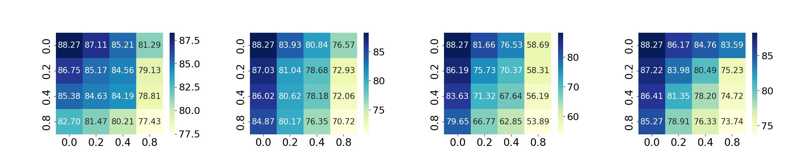

# 热力图 - 1

## 使用场景
在两种组合维度下的效果对比，两个组合维度一般相似，如：不同场景的扰动率，不同超参数取值等。

## 效果预览

1. 坐标轴含义
    - x轴代表一种质量退化场景的扰动率。
    - y轴代表另一种质量退化场景的扰动率。
    - 场景/超参数两两组合。
2. 颜色含义
    - 颜色的深浅代表节点分类准确率。
    - 一般python中都有默认的颜色设置。
3. 图片预览



## 代码
```python
import matplotlib.pyplot as plt
import numpy as np
import matplotlib.gridspec as gridspec
import seaborn as sns
from matplotlib.colors import LinearSegmentedColormap

# 创建三维图形
fig = plt.figure(figsize=(29, 4.3))
gs = gridspec.GridSpec(1, 4, width_ratios=[1, 1, 1, 1])
gs.update(left=0.07, right=0.97, top=0.8, bottom=0.18, wspace=0.45)

ax1 = fig.add_subplot(gs[0])  # First subplot (wider)
ax2 = fig.add_subplot(gs[1])
ax3 = fig.add_subplot(gs[2])
ax4 = fig.add_subplot(gs[3])

# 自定义渐变色
soft_warm = LinearSegmentedColormap.from_list(
    "soft_warm", ["#FFE58F", "#FFA940", "#D94F03", "#800D00"]
)

# "#FFE58F", "#FFA940", "#D94F03", "#800D00"

# Data
data = np.array([
    [88.27, 87.11, 85.21, 81.29],
    [86.75, 85.17, 84.56, 79.13],
    [85.38, 84.63, 84.19, 78.81],
    [82.70, 81.47, 80.21, 77.43]
])

# Set x and y tick labels
x_labels = ['0.0', '0.2', '0.4', '0.8']
y_labels = ['0.0', '0.2', '0.4', '0.8']

# Heatmap on axs[1]
sns.heatmap(data, annot=True, fmt=".2f", cmap="YlGnBu", xticklabels=x_labels, yticklabels=y_labels,
            ax=ax1, annot_kws={"size": 15})

# Customize labels and title for the heatmap
cbar = ax1.collections[0].colorbar  # 获取热力条对象
cbar.ax.tick_params(labelsize=18)
# cbar.set_label('Accuracy (%)', fontsize=20)
ax1.tick_params(axis='x', labelsize=19)
ax1.tick_params(axis='y', labelsize=19)

# Data
data = np.array([
    [88.27, 83.93, 80.84, 76.57],
    [87.03, 81.04, 78.68, 72.93],
    [86.02, 80.62, 78.18, 72.06],
    [84.87, 80.17, 76.35, 70.72]
])

# Set x and y tick labels
x_labels = ['0.0', '0.2', '0.4', '0.8']
y_labels = ['0.0', '0.2', '0.4', '0.8']

# Heatmap on axs[1]
sns.heatmap(data, annot=True, fmt=".2f", cmap="YlGnBu", xticklabels=x_labels, yticklabels=y_labels,
            ax=ax2, annot_kws={"size": 15})

# Customize labels and title for the heatmap
cbar = ax2.collections[0].colorbar  # 获取热力条对象
cbar.ax.tick_params(labelsize=18)
# cbar.set_label('Accuracy (%)', fontsize=20)
ax2.tick_params(axis='x', labelsize=19)
ax2.tick_params(axis='y', labelsize=19)


# Data
data = np.array([
    [88.27, 81.66, 76.53, 58.69],
    [86.19, 75.73, 70.37, 58.31],
    [83.63, 71.32, 67.64, 56.19],
    [79.65, 66.77, 62.85, 53.89]
])

# Set x and y tick labels
x_labels = ['0.0', '0.2', '0.4', '0.8']
y_labels = ['0.0', '0.2', '0.4', '0.8']

# Heatmap on axs[1]
sns.heatmap(data, annot=True, fmt=".2f", cmap="YlGnBu", xticklabels=x_labels, yticklabels=y_labels,
            ax=ax3, annot_kws={"size": 15})

# Customize labels and title for the heatmap
cbar = ax3.collections[0].colorbar  # 获取热力条对象
cbar.ax.tick_params(labelsize=18)
# cbar.set_label('Accuracy (%)', fontsize=20)
ax3.tick_params(axis='x', labelsize=19)
ax3.tick_params(axis='y', labelsize=19)


# Data
data = np.array([
    [88.27, 86.17, 84.76, 83.59],
    [87.22, 83.98, 80.49, 75.23],
    [86.41, 81.35, 78.20, 74.72],
    [85.27, 78.91, 76.33, 73.74]
])

# Set x and y tick labels
x_labels = ['0.0', '0.2', '0.4', '0.8']
y_labels = ['0.0', '0.2', '0.4', '0.8']

# Heatmap on axs[1]
sns.heatmap(data, annot=True, fmt=".2f", cmap="YlGnBu", xticklabels=x_labels, yticklabels=y_labels,
            ax=ax4, annot_kws={"size": 15})

# Customize labels and title for the heatmap
cbar = ax4.collections[0].colorbar  # 获取热力条对象
cbar.ax.tick_params(labelsize=18)
# cbar.set_label('Accuracy (%)', fontsize=20)
ax4.tick_params(axis='x', labelsize=19)
ax4.tick_params(axis='y', labelsize=19)

plt.show()
```
