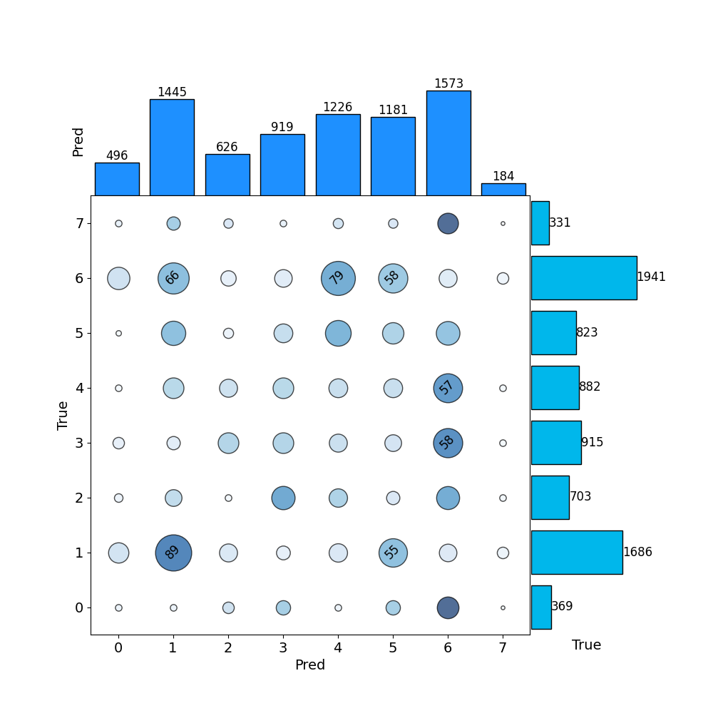

# 热力图 - 2

## 使用场景
在两种组合维度下的效果对比，两个组合维度一般相似，如：不同场景的扰动率，不同超参数取值等。

## 效果预览

1. 坐标轴含义
    - x轴代表预测结果。
    - y轴代表真实结果。
    - x和y轴上的柱状图代表其他指标。
2. 图案/颜色含义
    - 圆圈的大小和颜色的深浅代表评测指标的大小。
3. 图片预览



## 代码
```python
import numpy as np
import matplotlib.pyplot as plt
import matplotlib.cm as cm

# 设置随机种子以确保可重复性
np.random.seed(42)

# 提供的真实和预测簇的节点数
true_cluster_sizes = np.array([369, 1686, 703, 915, 882, 823, 1941, 331])
pred_cluster_sizes = np.array([496, 1445, 626, 919, 1226, 1181, 1573, 184])
n_true_clusters = len(true_cluster_sizes)
n_pred_clusters = len(pred_cluster_sizes)
total_nodes = 1445  # 基于文档中的节点总数

# 生成模拟的混淆矩阵，确保与真实和预测簇的节点数一致
confusion_matrix = np.random.randint(10, 100, size=(n_true_clusters, n_pred_clusters))
# 按比例调整以匹配真实簇的节点数
confusion_matrix = (confusion_matrix.T * true_cluster_sizes / confusion_matrix.sum(axis=1)).T.astype(int)
# 微调以确保预测簇的节点数匹配
for j in range(n_pred_clusters):
    confusion_matrix[:, j] = (confusion_matrix[:, j] * pred_cluster_sizes[j] / confusion_matrix[:, j].sum()).astype(int)
# 确保总节点数接近1445
confusion_matrix = (confusion_matrix / confusion_matrix.sum() * total_nodes).astype(int)

# 计算比例（节点数/真实簇总节点数）
proportions = confusion_matrix / confusion_matrix.sum(axis=1)[:, np.newaxis]

# 创建图形布局，无间隙
fig = plt.figure(figsize=(10, 10))
gs = fig.add_gridspec(2, 2, width_ratios=[8, 2], height_ratios=[2, 8], wspace=0.0, hspace=0.0)

# 热图
ax_heatmap = fig.add_subplot(gs[1, 0])
for i in range(n_true_clusters):
    for j in range(n_pred_clusters):
        node_count = confusion_matrix[i, j]
        proportion = proportions[i, j]
        # 圆圈大小基于节点数，放大因子调整
        size = node_count * 15
        # 加深颜色并增大差异，使用Blues调色板
        color = cm.Blues(proportion * 2.5)
        # 圆圈中心位于刻度线交叉点，添加黑色边界
        ax_heatmap.scatter(j, i, s=size, c=[color], alpha=0.7, edgecolor='black', linewidth=1)
        # 为较大圆圈（节点数 > 50）添加数字标签，倾斜45度
        if node_count > 50:
            ax_heatmap.text(j, i, str(node_count), ha='center', va='center', color='black', fontsize=12, rotation=45)

# 设置热图轴标签和刻度，移除网格线
ax_heatmap.set_xlabel('Pred', fontsize=14)
ax_heatmap.set_ylabel('True', fontsize=14)
ax_heatmap.set_xticks(np.arange(n_pred_clusters))
ax_heatmap.set_yticks(np.arange(n_true_clusters))
ax_heatmap.set_xticklabels(np.arange(n_pred_clusters), fontsize=14)
ax_heatmap.set_yticklabels(np.arange(n_true_clusters), fontsize=14)
ax_heatmap.grid(False)
ax_heatmap.set_xlim(-0.5, n_pred_clusters - 0.5)
ax_heatmap.set_ylim(-0.5, n_true_clusters - 0.5)
ax_heatmap.set_aspect('equal', adjustable='box')

# 顶部柱状图（预测簇）
ax_top = fig.add_subplot(gs[0, 0], sharex=ax_heatmap)
ax_top.bar(np.arange(n_pred_clusters), pred_cluster_sizes, width=0.8, color='#1E90FF', edgecolor='black', align='center')
# 在柱子上添加数字
for i, v in enumerate(pred_cluster_sizes):
    ax_top.text(i, v, str(v), ha='center', va='bottom', fontsize=12, color='black')
ax_top.set_ylabel('Pred', fontsize=14)
ax_top.tick_params(axis='both', which='both', bottom=False, labelbottom=False, left=False, labelleft=False)
ax_top.spines['top'].set_visible(False)
ax_top.spines['right'].set_visible(False)
ax_top.spines['bottom'].set_visible(False)
ax_top.spines['left'].set_visible(False)

# 右侧柱状图（真实簇）
ax_right = fig.add_subplot(gs[1, 1], sharey=ax_heatmap)
ax_right.barh(np.arange(n_true_clusters), true_cluster_sizes, height=0.8, color='#00B7EB', edgecolor='black', align='center')
# 在柱子上添加数字
for i, v in enumerate(true_cluster_sizes):
    ax_right.text(v, i, str(v), ha='left', va='center', fontsize=12, color='black')
ax_right.set_xlabel('True', fontsize=14)
ax_right.tick_params(axis='both', which='both', left=False, labelleft=False, bottom=False, labelbottom=False)
ax_right.spines['top'].set_visible(False)
ax_right.spines['right'].set_visible(False)
ax_right.spines['bottom'].set_visible(False)
ax_right.spines['left'].set_visible(False)

# 显示图形
plt.show()
```