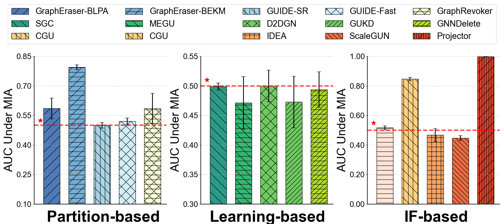

# 直方图 - 1

## 使用场景
多种方法在同一任务，同一指标下的效果对比；超参数实验中，不同超参数对应的模型效果对比；
一般用于比较直观的比较模型性能。

## 效果预览
1. 坐标轴含义
    - x轴代表不同类型的方法。
    - y轴代表方法在 Membership Inference Attack 下的AUC。
2. 颜色/条纹含义
    - 不同的颜色和条纹都是用于区分不同的方法。
    - 通过条纹 + 颜色的形式可以区分更加明显，同时让图案更加美观。
3. 图片预览



## 代码

``` python
import matplotlib.pyplot as plt
import numpy as np


# 统一设置字体
fig,axes = plt.subplots(1,1,figsize=(4,4),dpi=100,facecolor="w")
fig.subplots_adjust(left=0.2,bottom=0.2)

axes.set_xlabel('X')
axes.set_ylabel('Y')

# 设置西文字体为新罗马字体
from matplotlib import rcParams

config = {
    "font.family":'Arial',  # 设置字体类型
    "axes.unicode_minus": False #解决负号无法显示的问题
}
rcParams.update(config)


# 数据：每个数据点以及对应的误差
data = [0.5852, 0.7951 ,0.5004 , 0.5208 , 0.5862,
        0.499, 0.4712, 0.5000, 0.4727, 0.4938,
        0.5170, 0.8465,0.4677,0.4473, 0.9986]
errors = [0.0525, 0.0118, 0.0138 , 0.0161,  0.0756,
          0.006,0.0446, 0.0267, 0.0436, 0.0300,
          0.0129, 0.0109,0.0433,0.0163 ,0.0013]

# 颜色设置，可以调整为你想要的 RGB
colors = ['#4F79B7', '#76AED4', '#A9D4E5', '#D2EDF6', '#F5FBD5',
          '#2B9B87','#36B772','#70CA62','#B0DC2C','#F8E61F',
         '#FEE4D7','#FDD182','#F7A461','#EC6C43','#D9432B']

# 填充条纹样式
# hatch_par = ['/|', '-/', 'x', '-\ ', '+',
#              '-x', '|x', 'x','\//' ,'-||',
#              '-\/','|//','+x', '-//', '/||']

hatch_par = ['/', '-/', '\|', 'x', '\ - /',
             '\ ', '-\ ', '\/','//' ,'-//',
             '-','|\ ','+', '\ \ ', '/||']
method = ['GraphEraser-BLPA','GraphEraser-BEKM','GUIDE-SR','GUIDE-Fast',
          'GraphRevoker','SGC', 'MEGU', 'D2DGN', 'GUKD', 'GNNDelete',
          'GIF','CGU','IDEA','ScaleGUN','Projector']

# 创建1行3列的子图
fig, axs = plt.subplots(1, 3, figsize=(18, 8))  # 创建1行3列的子图布局

# 第一个直方图
# for i in range(0,5):
barw = 0.65
axs[0].bar(0, height=data[0], color=colors[0], width=barw, edgecolor="black", linewidth=1, hatch=hatch_par[0], yerr=errors[0], error_kw={'elinewidth': 2}, capsize=5, label=method[0])
axs[0].bar(1, height=data[1], color=colors[1], width=barw, edgecolor="black", linewidth=1, hatch=hatch_par[1], yerr=errors[1], error_kw={'elinewidth': 2}, capsize=5, label=method[1])
axs[0].bar(2, height=data[2], color=colors[2], width=barw, edgecolor="black", linewidth=1, hatch=hatch_par[2], yerr=errors[2], error_kw={'elinewidth': 2}, capsize=5, label=method[2])
axs[0].bar(3, height=data[3], color=colors[3], width=barw, edgecolor="black", linewidth=1, hatch=hatch_par[3], yerr=errors[3], error_kw={'elinewidth': 2}, capsize=5, label=method[3])
axs[0].bar(4, height=data[4], color=colors[4], width=barw, edgecolor="black", linewidth=1, hatch=hatch_par[4], yerr=errors[4], error_kw={'elinewidth': 2}, capsize=5, label=method[4])
axs[0].set_ylim(0.1, 0.85)
axs[0].axhline(y=0.5, color='r', linestyle='--', linewidth=3, alpha=0.8)
axs[0].scatter(-0.45, 0.525, color='red', marker='*', s=150)
axs[0].set_ylabel("AUC Under MIA", fontsize=30)
axs[0].set_xticks([])  # 不显示X轴的刻度
axs[0].set_yticks(np.arange(0.1, 0.9, 0.15))  # 设置Y轴刻度
axs[0].grid(True, axis='y', linestyle='--', alpha=0.7)

# 第二个直方图
# for i in range(5,10):
#     axs[1].bar(i, height=data[i], color=colors[i], width=0.5, edgecolor="black", linewidth=1, hatch=hatch_par[i], yerr=errors[i], error_kw={'elinewidth': 2}, capsize=5, label=method[i])

axs[1].bar(0, height=data[5], color=colors[5], width=barw, edgecolor="black", linewidth=1, hatch=hatch_par[5], yerr=errors[5], error_kw={'elinewidth': 2}, capsize=5, label=method[5])
axs[1].bar(1, height=data[6], color=colors[6], width=barw, edgecolor="black", linewidth=1, hatch=hatch_par[6], yerr=errors[6], error_kw={'elinewidth': 2}, capsize=5, label=method[6])
axs[1].bar(2, height=data[7], color=colors[7], width=barw, edgecolor="black", linewidth=1, hatch=hatch_par[7], yerr=errors[7], error_kw={'elinewidth': 2}, capsize=5, label=method[7])
axs[1].bar(3, height=data[8], color=colors[7], width=barw, edgecolor="black", linewidth=1, hatch=hatch_par[8], yerr=errors[8], error_kw={'elinewidth': 2}, capsize=5, label=method[8])
axs[1].bar(4, height=data[9], color=colors[8], width=barw, edgecolor="black", linewidth=1, hatch=hatch_par[9], yerr=errors[9], error_kw={'elinewidth': 2}, capsize=5, label=method[9])
axs[1].set_ylim(0.3, 0.55)
axs[1].axhline(y=0.5, color='r', linestyle='--', linewidth=3, alpha=0.8)
axs[1].scatter(-0.45, 0.51, color='red', marker='*', s=150)
axs[1].set_ylabel("AUC Under MIA", fontsize=30)
axs[1].set_xticks([])  # 不显示X轴的刻度
axs[1].set_yticks(np.arange(0.3, 0.55, 0.05))  # 设置Y轴刻度
axs[1].grid(True, axis='y', linestyle='--', alpha=0.7)

# 第三个直方图
# for i in range(10,15):
#     axs[2].bar(i, height=data[i], color=colors[i], width=0.5, edgecolor="black", linewidth=1, hatch=hatch_par[i], yerr=errors[i], error_kw={'elinewidth': 2}, capsize=5, label=method[i])

axs[2].bar(0, height=data[10], color=colors[10], width=barw, edgecolor="black", linewidth=1, hatch=hatch_par[10], yerr=errors[10], error_kw={'elinewidth': 2}, capsize=5, label=method[10])
axs[2].bar(1, height=data[11], color=colors[11], width=barw, edgecolor="black", linewidth=1, hatch=hatch_par[11], yerr=errors[11], error_kw={'elinewidth': 2}, capsize=5, label=method[11])
axs[2].bar(2, height=data[12], color=colors[12], width=barw, edgecolor="black", linewidth=1, hatch=hatch_par[12], yerr=errors[12], error_kw={'elinewidth': 2}, capsize=5, label=method[12])
axs[2].bar(3, height=data[13], color=colors[13], width=barw, edgecolor="black", linewidth=1, hatch=hatch_par[13], yerr=errors[13], error_kw={'elinewidth': 2}, capsize=5, label=method[13])
axs[2].bar(4, height=data[14], color=colors[14], width=barw, edgecolor="black", linewidth=1, hatch=hatch_par[14], yerr=errors[14], error_kw={'elinewidth': 2}, capsize=5, label=method[14])
axs[2].set_ylim(0, 1)
axs[2].axhline(y=0.5, color='r', linestyle='--', linewidth=3, alpha=0.8)
axs[2].scatter(-0.45, 0.55, color='red', marker='*', s=150)
axs[2].set_ylabel("AUC Under MIA", fontsize=30)
axs[2].set_xticks([])  # 不显示X轴的刻度
# axs[2].set_yticks([0.00,0.20,0.40,0.60,0.80,1.00])
import matplotlib.ticker as mtick
axs[2].yaxis.set_major_formatter(mtick.FormatStrFormatter('%.2f'))
axs[2].set_yticks(np.arange(0.0, 1.2, 0.20))
axs[2].grid(True, axis='y', linestyle='--', alpha=0.7)

axs[1].tick_params(axis='y', labelsize=20)
axs[2].tick_params(axis='y', labelsize=20)
axs[0].tick_params(axis='y', labelsize=20)

font = {'fontweight': 'bold'}
# plt.subplots_adjust(bottom=0.08)
fig.text(0.205, 0.01, 'Partition-based', ha='center', fontsize=40,weight = 'bold' )
fig.text(0.531, 0.01, 'Learning-based', ha='center', fontsize=40,weight = 'bold' )
fig.text(0.865, 0.01, 'IF-based', ha='center', fontsize=40,weight = 'bold' )
# 将图例放到右侧
# 注意，我们只在最后一个子图上显示图例，确保只显示一次
handles, labels = [], []
for ax in axs:
    for handle, label in zip(*ax.get_legend_handles_labels()):
        handles.append(handle)
        labels.append(label)

    ax.spines['top'].set_visible(False)
    ax.spines['right'].set_visible(False)
    ax.spines['left'].set_linewidth(1.5)
    ax.spines['bottom'].set_linewidth(1.5)

# axs[2].legend(loc='upper left', bbox_to_anchor=(1, 1), fontsize=12)
# axs[2].legend(handles=handles, labels=labels, loc='upper left', bbox_to_anchor=(1, 1), fontsize=14)
#
# # 调整图形布局，避免图形重叠
# plt.tight_layout()
#
# # 显示图形
# plt.show()

# 调整图例的位置，避免遮挡.
order=[0,5,11,1,6,11,2,7,12,3,8,13,4,9,14]

fig.legend([handles[idx] for idx in order],[labels[idx] for idx in order],loc='upper center', bbox_to_anchor=(0.50, 1), ncol=5, fontsize=22)

# 调整布局，避免图例遮挡

plt.tight_layout(rect=[0, 0.05, 1, 0.78])

plt.show()

```
