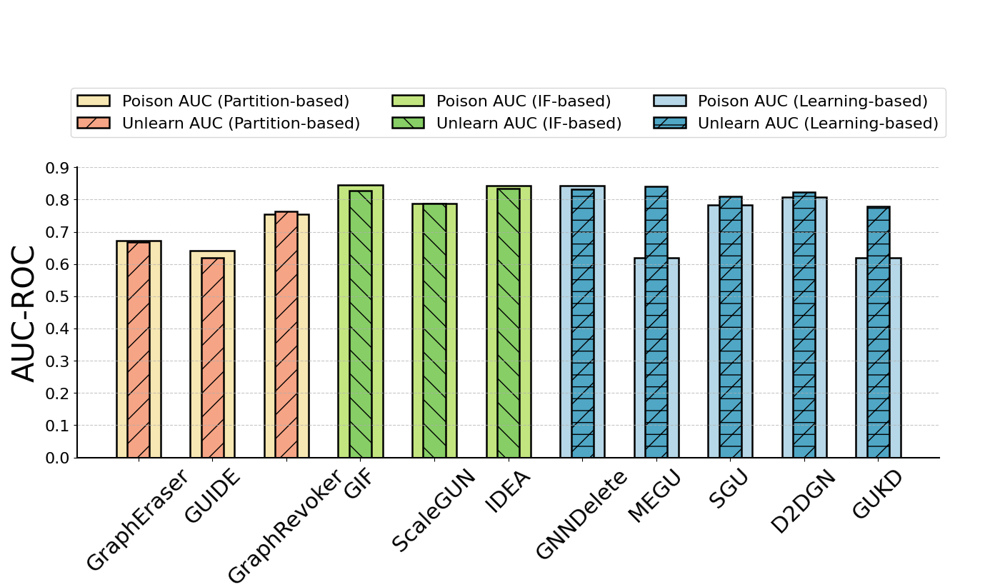

# 直方图 - 2

## 使用场景
多种方法在同一任务，同一指标下的效果对比；超参数实验中，不同超参数对应的模型效果对比；
一般用于比较直观的比较模型性能。

## 效果预览
1. 坐标轴含义
    - x轴代表不同类型的方法。
    - y轴代表不同方法的AUC。
2. 颜色/条纹含义
    - 不同的颜色和条纹代表不同类型的AUC。
    - 有条纹的代表 Poison AUC，无条纹的代表 Unlearn AUC。
3. 图片预览



## 代码

```python
import numpy as np
import matplotlib.pyplot as plt

# Example data
methods = ['GraphEraser', 'GUIDE', 'GraphRevoker', 'GIF', 'ScaleGUN', 'IDEA', 'GNNDelete', 'MEGU', 'SGU', 'D2DGN', 'GUKD']
data1 = [0.6672, 0.6203, 0.7639, 0.8280, 0.7878, 0.8349, 0.8323, 0.8407, 0.8088, 0.8222, 0.7787]  # Example data for first bar
data2 = [0.6719, 0.6411, 0.7550, 0.8458, 0.7878, 0.8434, 0.8428, 0.6183, 0.7833, 0.8065, 0.6186]  # Example data for second bar
hatch_par = ['/', '-/', '\|', 'x', '\ - /',
             '\ ', '-\ ', '\/','//' ,'-//',
             '-','|\ ','+', '\ \ ', '/||']
x = np.arange(len(methods))  # the label locations
bar_width = 0.6  # the width of the bars
inner_bar_width = bar_width * 0.5  # Adjusted width for inner bars

fig, ax = plt.subplots(figsize=(14, 9))

# Assign different colors and labels to three groups
outer_colors = ['#F7E7B2'] * 3 + ['#C3E580'] * 3 + ['#B6D7E7'] * 5
inner_colors = ['#F5A485'] * 3 + ['#86CE65'] * 3 + ['#4FA6C5'] * 5

# Plot each group separately for legend differentiation
# Group 1: methods 1-3
bars1_group1 = ax.bar(x[:3], data2[:3], bar_width, label='Poison AUC (Partition-based)', color='#F7E7B2', edgecolor='black', linewidth=1.8)
bars2_group1 = ax.bar(x[:3], data1[:3], inner_bar_width, hatch=hatch_par[0],label='Unlearn AUC (Partition-based)', color='#F5A485', edgecolor='black', linewidth=1.8)

# Group 2: methods 4-6
bars1_group2 = ax.bar(x[3:6], data2[3:6], bar_width, label='Poison AUC (IF-based)', color='#C3E580', edgecolor='black', linewidth=1.8)
bars2_group2 = ax.bar(x[3:6], data1[3:6], inner_bar_width,hatch=hatch_par[5], label='Unlearn AUC (IF-based)', color='#86CE65', edgecolor='black', linewidth=1.8)

# Group 3: methods 7-11
bars1_group3 = ax.bar(x[6:], data2[6:], bar_width, label='Poison AUC (Learning-based)', color='#B6D7E7', edgecolor='black', linewidth=1.8)
bars2_group3 = ax.bar(x[6:], data1[6:], inner_bar_width, hatch=hatch_par[1],label='Unlearn AUC (Learning-based)', color='#4FA6C5', edgecolor='black', linewidth=1.8)

# Adjust positions to make inner bars appear inset
for bar1, bar2 in zip(bars1_group1 + bars1_group2 + bars1_group3, bars2_group1 + bars2_group2 + bars2_group3):
    bar2.set_x(bar1.get_x() + (bar_width - inner_bar_width) / 2)

# Add labels, title, and custom x-axis tick labels
ax.set_ylabel('AUC-ROC', fontsize=30)
ax.set_xticks(x)
ax.set_xticklabels(methods, fontsize= 22, rotation=45, ha='center')
ax.tick_params(axis='y', labelsize=16)  # 将字体大小调整为 16
ax.set_ylim(0, 0.9)  # 设置 y 轴的最小值为 0.6，最大值为 0.9

ax.legend(fontsize=16, loc='upper center', bbox_to_anchor=(0.50, 1.3),ncol = 3)  # Place legend outside the plot

# Add gridlines and enhance visuals
ax.grid(axis='y', linestyle='--', alpha=0.7)
ax.spines['top'].set_visible(False)
ax.spines['right'].set_visible(False)
ax.spines['left'].set_linewidth(1.5)
ax.spines['bottom'].set_linewidth(1.5)

# Display the plot
plt.tight_layout(rect=[0, 0.0, 1, 0.95])
plt.show()

```
