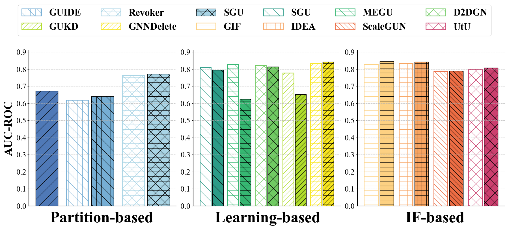

# 直方图 - 3

## 使用场景
多种方法在同一任务，同一指标下的效果对比；超参数实验中，不同超参数对应的模型效果对比；
一般用于比较直观的比较模型性能。

## 效果预览
1. 坐标轴含义
    - x轴代表不同类型的方法。
    - y轴代表方法在 Poisoning Attack 下的AUC。
    - 柱子两两分组代表在 Unlearning 前后的效果对比。
2. 颜色/条纹含义
    - 不同的颜色和条纹都是用于区分不同的方法。
    - 通过条纹 + 颜色的形式可以区分更加明显，同时让图案更加美观。
3. 图片预览



## 代码

```python
import matplotlib.pyplot as plt
import numpy as np


# 统一设置字体
fig,axes = plt.subplots(1,1,figsize=(4,4),dpi=100,facecolor="w")
fig.subplots_adjust(left=0.2,bottom=0.2)

axes.set_xlabel('X')
axes.set_ylabel('Y')

# 设置西文字体为新罗马字体
from matplotlib import rcParams

config = {
    "font.family":'Times New Roman',  # 设置字体类型
    "axes.unicode_minus": False #解决负号无法显示的问题
}
rcParams.update(config)


# 数据：每个数据点以及对应的误差
data1 = [0.6672, 0.6203, 0.7639,
         0.8088, 0.8279,  0.8222,0.7787, 0.8323,
         0.8280, 0.8349, 0.7878,0.8005]  # Example data for first bar
data2 = [0.6719, 0.6411, 0.7709,
         0.7941,  0.6247,0.8147,0.6531,0.8428,
         0.8458, 0.8434, 0.7890,0.8076]  # Example data for second bar

# 颜色设置，可以调整为你想要的 RGB
colors = ['#4F79B7', '#76AED4', '#A9D4E5',
          '#2B9B87','#36B772','#70CA62','#B0DC2C','#F8E61F',
         '#FDD182','#F7A461','#EC6C43','#CB3F6E']

# 填充条纹样式
# hatch_par = ['/|', '-/', , '-\ ', '+',
#              '-x', '|x', 'x','\//' ,'-||',
#              '-\/','|//','+x', '-//', '/||']
hatch_par = ['/',  '\|', '\ - /',
             '\ ', '-\ ', '\/','//' ,'-//',
             '-','+', '\ \ ','x']
method =  ['Eraser', 'GUIDE', 'Revoker',
           'SGU',  'MEGU', 'D2DGN','GUKD','GNNDelete',
           'GIF', 'IDEA' ,'ScaleGUN','UtU']
# 创建1行3列的子图
fig, axs = plt.subplots(1, 3, figsize=(18, 8))  # 创建1行3列的子图布局

# 第一个直方图
# for i in range(0,5):
barw = 0.4
gap = 0.05
x_data1 = []
x_data2 = []
for i in range(0,10):
    x_data1.append(i - barw / 2 - gap / 2)
    x_data2.append(i + barw / 2 + gap / 2)

axs[0].bar(x_data2[0], height=data2[0], color=colors[0], width=barw, edgecolor="black", linewidth=1, hatch=hatch_par[0],  capsize=5)
axs[0].bar(x_data1[1], height=data1[1], color='white', width=barw, edgecolor=colors[1], linewidth=2, hatch=hatch_par[1],  capsize=5, label=method[1])
axs[0].bar(x_data2[1], height=data2[1], color=colors[1], width=barw, edgecolor="black", linewidth=1, hatch=hatch_par[1],  capsize=5)
axs[0].bar(x_data1[2], height=data1[2], color='white', width=barw, edgecolor=colors[2], linewidth=2, hatch=hatch_par[2],  capsize=5, label=method[2])
axs[0].bar(x_data2[2], height=data2[2], color=colors[2], width=barw, edgecolor="black", linewidth=1, hatch=hatch_par[2],  capsize=5, label=method[3])

axs[0].set_ylim(0, 0.91)
axs[0].set_ylabel("AUC-ROC", fontsize=30,weight = 'bold')
axs[0].set_xticks([])  # 不显示X轴的刻度
axs[0].set_yticks(np.arange(0, 0.91, 0.1))  # 设置Y轴刻度
axs[0].grid(True, axis='y', linestyle='--', alpha=0.7)

# 第二个直方图
# for i in range(5,10):
#     axs[1].bar(i, height=data[i], color=colors[i], width=0.5, edgecolor="black", linewidth=1, hatch=hatch_par[i], yerr=errors[i], error_kw={'elinewidth': 2}, capsize=5, label=method[i])
#
axs[1].bar(x_data1[0], height=data1[3], color='white', width=barw, edgecolor=colors[3], linewidth=2, hatch=hatch_par[3],  capsize=5, label=method[3])
axs[1].bar(x_data2[0], height=data2[3], color=colors[3], width=barw, edgecolor="black", linewidth=1, hatch=hatch_par[3],  capsize=5)
axs[1].bar(x_data1[1], height=data1[4], color='white', width=barw, edgecolor=colors[4], linewidth=2, hatch=hatch_par[4],  capsize=5, label=method[4])
axs[1].bar(x_data2[1], height=data2[4], color=colors[4], width=barw, edgecolor="black", linewidth=1, hatch=hatch_par[4],  capsize=5)
axs[1].bar(x_data1[2], height=data1[5], color='white', width=barw, edgecolor=colors[5], linewidth=2, hatch=hatch_par[5],  capsize=5, label=method[5])
axs[1].bar(x_data2[2], height=data2[5], color=colors[5], width=barw, edgecolor="black", linewidth=1, hatch=hatch_par[5],  capsize=5)
axs[1].bar(x_data1[3], height=data1[6], color='white', width=barw, edgecolor=colors[6], linewidth=2, hatch=hatch_par[6],  capsize=5, label=method[6])
axs[1].bar(x_data2[3], height=data2[6], color=colors[6], width=barw, edgecolor="black", linewidth=1, hatch=hatch_par[6],  capsize=5)
axs[1].bar(x_data1[4], height=data1[7], color='white', width=barw, edgecolor=colors[7], linewidth=2, hatch=hatch_par[7],  capsize=5, label=method[7])
axs[1].bar(x_data2[4], height=data2[7], color=colors[7], width=barw, edgecolor="black", linewidth=1, hatch=hatch_par[7],  capsize=5)
axs[1].set_ylim(0, 0.91)
axs[1].set_xticks([])  # 不显示X轴的刻度
axs[1].set_yticks(np.arange(0, 0.91, 0.1))  # 设置Y轴刻度
axs[1].grid(True, axis='y', linestyle='--', alpha=0.7)#

axs[2].bar(x_data1[0], height=data1[8], color='white', width=barw, edgecolor=colors[8], linewidth=2, hatch=hatch_par[8],  capsize=5, label=method[8])
axs[2].bar(x_data2[0], height=data2[8], color=colors[8], width=barw, edgecolor="black", linewidth=1, hatch=hatch_par[8],  capsize=5)
axs[2].bar(x_data1[1], height=data1[9], color='white', width=barw, edgecolor=colors[9], linewidth=2, hatch=hatch_par[9],  capsize=5, label=method[9])
axs[2].bar(x_data2[1], height=data2[9], color=colors[9], width=barw, edgecolor="black", linewidth=1, hatch=hatch_par[9],  capsize=5)
axs[2].bar(x_data1[2], height=data1[10], color='white', width=barw, edgecolor=colors[10], linewidth=2, hatch=hatch_par[10],  capsize=5, label=method[10])
axs[2].bar(x_data2[2], height=data2[10], color=colors[10], width=barw, edgecolor="black", linewidth=1, hatch=hatch_par[10],  capsize=5)
axs[2].bar(x_data1[3], height=data1[11], color='white', width=barw, edgecolor=colors[11], linewidth=2, hatch=hatch_par[11],  capsize=5, label=method[11])
axs[2].bar(x_data2[3], height=data2[11], color=colors[11], width=barw, edgecolor="black", linewidth=1, hatch=hatch_par[11],  capsize=5)
axs[2].set_ylim(0, 0.91)
axs[2].set_xticks([])  # 不显示X轴的刻度
axs[2].set_yticks(np.arange(0, 0.91, 0.1))  # 设置Y轴刻度
axs[2].grid(True, axis='y', linestyle='--', alpha=0.7)

axs[1].tick_params(axis='y', labelsize=20)
axs[2].tick_params(axis='y', labelsize=20)
axs[0].tick_params(axis='y', labelsize=20)

font = {'fontweight': 'bold'}
# plt.subplots_adjust(bottom=0.08)
fig.text(0.20, 0.016, 'Partition-based', ha='center', fontsize=40,weight = 'bold' )
fig.text(0.526, 0.016, 'Learning-based', ha='center', fontsize=40,weight = 'bold' )
fig.text(0.855, 0.016, 'IF-based', ha='center', fontsize=40,weight = 'bold' )
# 将图例放到右侧
# 注意，我们只在最后一个子图上显示图例，确保只显示一次
handles, labels = [], []
for ax in axs:
    for handle, label in zip(*ax.get_legend_handles_labels()):
        handles.append(handle)
        labels.append(label)

    ax.spines['top'].set_visible(False)
    ax.spines['right'].set_visible(False)
    ax.spines['left'].set_linewidth(1.5)
    ax.spines['bottom'].set_linewidth(1.5)

# axs[2].legend(loc='upper left', bbox_to_anchor=(1, 1), fontsize=12)
# axs[2].legend(handles=handles, labels=labels, loc='upper left', bbox_to_anchor=(1, 1), fontsize=14)
#
# # 调整图形布局，避免图形重叠
# plt.tight_layout()
#
# # 显示图形
# plt.show()

# 调整图例的位置，避免遮挡.
order=[0,6,1,7,2,8,3,9,4,10,5,11]
font_properties = {'weight': 'bold','size': 25}
fig.legend([handles[idx] for idx in order],[labels[idx] for idx in order],loc='upper center', bbox_to_anchor=(0.50, 1), ncol=6, fontsize=22,prop = font_properties)

# 调整布局，避免图例遮挡

plt.tight_layout(rect=[0, 0.05, 1, 0.80])

plt.show()

```
