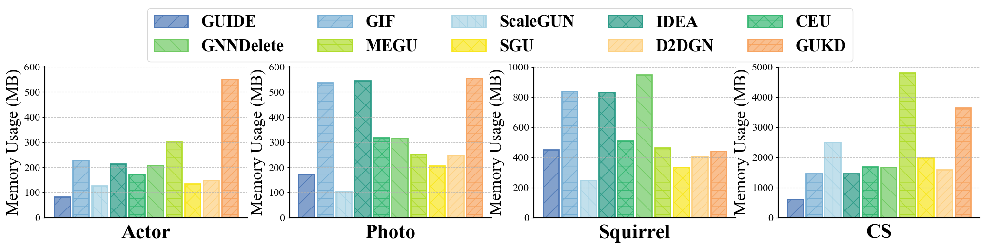

# 直方图 - 4

## 使用场景
多种方法在同一任务，同一指标下的效果 (时间，内存开销) 对比；超参数实验中，不同超参数对应的模型效果对比；
一般用于比较直观的比较模型性能。

## 效果预览
1. 坐标轴含义
    - x轴代表不同类型的方法。
    - y轴代表不同方法的 Memory Usage。
2. 颜色/条纹含义
    - 不同的颜色和条纹都是用于区分不同的方法。
    - 通过条纹 + 颜色的形式可以区分更加明显，同时让图案更加美观。
3. 图片预览



## 代码
```python
import matplotlib.pyplot as plt
import numpy as np
# 设置西文字体为新罗马字体
from matplotlib import rcParams

config = {
    "font.family": 'Times New Roman',  # 设置字体类型
    "axes.unicode_minus": False  # 解决负号无法显示的问题
}

rcParams.update(config)
colors = ['#4F79B7', '#76AED4', '#A9D4E5',
          '#2B9B87', '#36B772', '#70CA62', '#B0DC2C', '#F8E61F',
           '#FDD182', '#F7A461', '#EC6C43', '#D9432B']
innercolors = ['#83A1CC', '#9FC6E0', '#C2E0EC',
          '#6AB8AA', '#72CC9C', '#9AD991', '#C7E66B', '#FAED62',
           '#FDDEA7', '#F9BF90', '#EC6C43', '#D9432B']


incolor =['#95AED3']
# 填充条纹样式
hatch_par = ['/', '-/', '\|', 'x', '\ - /',
             '\ ', '-\ ', '\/', '//' ,'-//',
             '-','|\ ','+', '\ \ ','-/\ ' '/||']

methods = [ 'GUIDE', 'GIF', 'ScaleGUN', 'IDEA',
           'CEU', 'GNNDelete', 'MEGU', 'SGU', 'D2DGN', 'GUKD']

# 各数据集的内存开销数据
data_CS = [ 608.7031, 1465.6675, 2495.0117, 1464.6147, 1678.6474, 1663.205, 4795.0336, 1971.7099, 1596.6875, 3630.0844]
data_photo = [ 171.2089, 537.0615, 103.852, 544.2934, 319.2861, 317.1899, 252.4912, 206.0961, 249.0908, 553.8628]
data_actor = [ 81.5893, 226.8877, 126.562, 214.7558, 170.3466, 209.0136, 301.2524, 135.3652, 148.7607, 551.436]
data_squi = [450.1313, 838.3427, 245.3711, 832.0678, 508.7534, 945.8002, 462.019, 332.7104, 408.4209, 440.3916]

# 设置绘图
fig, axs = plt.subplots(1, 4, figsize=(25, 5))
barw = 0.85
# axs[0].bar(0, height=data_squi[0], color='white', width=barw, edgecolor=colors[0], linewidth=2, hatch=hatch_par[0],  capsize=5, label=methods[0])
axs[0].bar(0, height=data_actor[0], color=innercolors[0] ,width=barw, edgecolor=colors[0], linewidth=2, hatch=hatch_par[0],  capsize=5, label=methods[0])
# axs[0].bar(1, height=data_squi[1], color='white', width=barw, edgecolor=colors[1], linewidth=2, hatch=hatch_par[1],  capsize=5, label=methods[0])
axs[0].bar(1, height=data_actor[1], color=innercolors[1], width=barw, edgecolor=colors[1], linewidth=2, hatch=hatch_par[1],  capsize=5, label=methods[1])
axs[0].bar(2, height=data_actor[2], color=innercolors[2], width=barw, edgecolor=colors[2], linewidth=2, hatch=hatch_par[2],  capsize=5, label=methods[2])
axs[0].bar(3, height=data_actor[3], color=innercolors[3], width=barw, edgecolor=colors[3], linewidth=2, hatch=hatch_par[3],  capsize=5, label=methods[3])
axs[0].bar(4, height=data_actor[4], color=innercolors[4], width=barw, edgecolor=colors[4], linewidth=2, hatch=hatch_par[4],  capsize=5, label=methods[4])
axs[0].bar(5, height=data_actor[5], color=innercolors[5], width=barw, edgecolor=colors[5], linewidth=2, hatch=hatch_par[5],  capsize=5, label=methods[5])
axs[0].bar(6, height=data_actor[6], color=innercolors[6], width=barw, edgecolor=colors[6], linewidth=2, hatch=hatch_par[6], capsize=5, label=methods[6])
axs[0].bar(7, height=data_actor[7], color=innercolors[7], width=barw, edgecolor=colors[7], linewidth=2, hatch=hatch_par[7], capsize=5, label=methods[7])
axs[0].bar(8, height=data_actor[8], color=innercolors[8], width=barw, edgecolor=colors[8], linewidth=2, hatch=hatch_par[8], capsize=5, label=methods[8])
axs[0].bar(9, height=data_actor[9], color=innercolors[9], width=barw, edgecolor=colors[9], linewidth=2, hatch=hatch_par[9], capsize=5, label=methods[9])
axs[0].set_ylim(0,600)
axs[0].set_yticks(np.arange(0,601, 100))  # 设置Y轴刻度
axs[0].set_ylabel("Memory Usage (MB)",  fontsize=25)
axs[0].set_xticks([])  # 不显示X轴的刻度
axs[0].set_xlabel('Actor', fontsize=30,weight = 'bold',labelpad = 10)
axs[0].grid(True, axis='y', linestyle='--', alpha=0.7)
axs[0].tick_params(axis='y', labelsize=16)

# 调整间距

axs[1].bar(0, height=data_photo[0], color=innercolors[0], width=barw, edgecolor=colors[0], linewidth=2, hatch=hatch_par[0],  capsize=5)
axs[1].bar(1, height=data_photo[1], color=innercolors[1],  width=barw, edgecolor=colors[1], linewidth=2, hatch=hatch_par[1],  capsize=5)
axs[1].bar(2, height=data_photo[2], color=innercolors[2],  width=barw, edgecolor=colors[2], linewidth=2, hatch=hatch_par[2],  capsize=5)
axs[1].bar(3, height=data_photo[3], color=innercolors[3],  width=barw, edgecolor=colors[3], linewidth=2, hatch=hatch_par[3],  capsize=5)
axs[1].bar(4, height=data_photo[4], color=innercolors[4],  width=barw, edgecolor=colors[4], linewidth=2, hatch=hatch_par[4],  capsize=5)
axs[1].bar(5, height=data_photo[5], color=innercolors[5],  width=barw, edgecolor=colors[5], linewidth=2, hatch=hatch_par[5],  capsize=5)
axs[1].bar(6, height=data_photo[6], color=innercolors[6], width=barw, edgecolor=colors[6], linewidth=2, hatch=hatch_par[6], capsize=5)
axs[1].bar(7, height=data_photo[7], color=innercolors[7],  width=barw, edgecolor=colors[7], linewidth=2, hatch=hatch_par[7], capsize=5)
axs[1].bar(8, height=data_photo[8], color=innercolors[8],  width=barw, edgecolor=colors[8], linewidth=2, hatch=hatch_par[8], capsize=5)
axs[1].bar(9, height=data_photo[9], color=innercolors[9],  width=barw, edgecolor=colors[9], linewidth=2, hatch=hatch_par[9], capsize=5)
axs[1].set_ylim(0, 600)
axs[1].set_yticks(np.arange(0, 601, 100))  # 设置Y轴刻度
axs[1].set_ylabel("Memory Usage (MB)",  fontsize=25)
axs[1].set_xticks([])  # 不显示X轴的刻度
axs[1].set_xlabel('Photo', fontsize=30, weight='bold', labelpad=10)
axs[1].grid(True, axis='y', linestyle='--', alpha=0.7)
axs[1].tick_params(axis='y', labelsize=16)

axs[2].bar(0, height=data_squi[0], color=innercolors[0],  width=barw, edgecolor=colors[0], linewidth=2, hatch=hatch_par[0],  capsize=5)
# axs[0].bar(1, height=data_squi[1], color='white', width=barw, edgecolor=colors[1], linewidth=2, hatch=hatch_par[1],  capsize=5, label=methods[0])
axs[2].bar(1, height=data_squi[1], color=innercolors[1], width=barw, edgecolor=colors[1], linewidth=2, hatch=hatch_par[1],  capsize=5)
axs[2].bar(2, height=data_squi[2], color=innercolors[2],  width=barw, edgecolor=colors[2], linewidth=2, hatch=hatch_par[2],  capsize=5)
axs[2].bar(3, height=data_squi[3], color=innercolors[3],  width=barw, edgecolor=colors[3], linewidth=2, hatch=hatch_par[3],  capsize=5)
axs[2].bar(4, height=data_squi[4], color=innercolors[4],  width=barw, edgecolor=colors[4], linewidth=2, hatch=hatch_par[4],  capsize=5)
axs[2].bar(5, height=data_squi[5], color=innercolors[5], width=barw, edgecolor=colors[5], linewidth=2, hatch=hatch_par[5],  capsize=5)
axs[2].bar(6, height=data_squi[6], color=innercolors[6], width=barw, edgecolor=colors[6], linewidth=2, hatch=hatch_par[6], capsize=5)
axs[2].bar(7, height=data_squi[7], color=innercolors[7],  width=barw, edgecolor=colors[7], linewidth=2, hatch=hatch_par[7], capsize=5)
axs[2].bar(8, height=data_squi[8], color=innercolors[8],  width=barw, edgecolor=colors[8], linewidth=2, hatch=hatch_par[8], capsize=5)
axs[2].bar(9, height=data_squi[9], color=innercolors[9],  width=barw, edgecolor=colors[9], linewidth=2, hatch=hatch_par[9], capsize=5)
axs[2].set_ylim(0,1000)
axs[2].set_yticks(np.arange(0,1001, 200))  # 设置Y轴刻度
axs[2].set_ylabel("Memory Usage (MB)",  fontsize=25)
axs[2].set_xticks([])  # 不显示X轴的刻度
axs[2].set_xlabel('Squirrel', fontsize=30,weight = 'bold',labelpad = 10)
axs[2].grid(True, axis='y', linestyle='--', alpha=0.7)
axs[2].tick_params(axis='y', labelsize=16)


axs[3].bar(0, height=data_CS[0], color=innercolors[0],  width=barw, edgecolor=colors[0], linewidth=2, hatch=hatch_par[0],  capsize=5)
# axs[0].bar(1, height=data_squi[1], color='white', width=barw, edgecolor=colors[1], linewidth=2, hatch=hatch_par[1],  capsize=5, label=methods[0])
axs[3].bar(1, height=data_CS[1], color=innercolors[1],  width=barw, edgecolor=colors[1], linewidth=2, hatch=hatch_par[1],  capsize=5)
axs[3].bar(2, height=data_CS[2], color=innercolors[2], width=barw, edgecolor=colors[2], linewidth=2, hatch=hatch_par[2],  capsize=5)
axs[3].bar(3, height=data_CS[3], color=innercolors[3],  width=barw, edgecolor=colors[3], linewidth=2, hatch=hatch_par[3],  capsize=5)
axs[3].bar(4, height=data_CS[4], color=innercolors[4],  width=barw, edgecolor=colors[4], linewidth=2, hatch=hatch_par[4],  capsize=5)
axs[3].bar(5, height=data_CS[5], color=innercolors[5],  width=barw, edgecolor=colors[5], linewidth=2, hatch=hatch_par[5],  capsize=5)
axs[3].bar(6, height=data_CS[6], color=innercolors[6],  width=barw, edgecolor=colors[6], linewidth=2, hatch=hatch_par[6], capsize=5)
axs[3].bar(7, height=data_CS[7], color=innercolors[7],  width=barw, edgecolor=colors[7], linewidth=2, hatch=hatch_par[7], capsize=5)
axs[3].bar(8, height=data_CS[8], color=innercolors[8], width=barw, edgecolor=colors[8], linewidth=2, hatch=hatch_par[8], capsize=5)
axs[3].bar(9, height=data_CS[9], color=innercolors[9],  width=barw, edgecolor=colors[9], linewidth=2, hatch=hatch_par[9], capsize=5)
axs[3].set_ylim(0,5000)
axs[3].set_yticks(np.arange(0,5001, 1000))  # 设置Y轴刻度
axs[3].set_ylabel("Memory Usage (MB)",  fontsize=25)
axs[3].set_xticks([])  # 不显示X轴的刻度
axs[3].set_xlabel('CS', fontsize=30,weight = 'bold',labelpad = 10)
axs[3].grid(True, axis='y', linestyle='--', alpha=0.7)
axs[3].tick_params(axis='y', labelsize=16)

for ax in axs:
    ax.spines['top'].set_visible(False)
    ax.spines['right'].set_visible(False)
    ax.spines['left'].set_linewidth(1.5)
    ax.spines['bottom'].set_linewidth(1.5)

handles = []
labels = []
for ax in axs:
    for handle, label in zip(*ax.get_legend_handles_labels()):
        handles.append(handle)
        labels.append(label)

font_properties = {'weight': 'bold', 'size': 25}
order=[0,5,1,6,2,7,3,8,4,9]
fig.legend([handles[idx] for idx in order],[labels[idx] for idx in order], bbox_to_anchor=(0.5, 1), loc='upper center', ncol=5, prop=font_properties)
plt.subplots_adjust(left=0.045, bottom=0.105, right=0.980, top=0.725, wspace=0.210, hspace=None)
# plt.tight_layout(rect=[0.01, 0.05, 0.9, 0.8])
# plt.subplots_adjust(hspace=0.05)
# 显示图形
plt.show()
```
