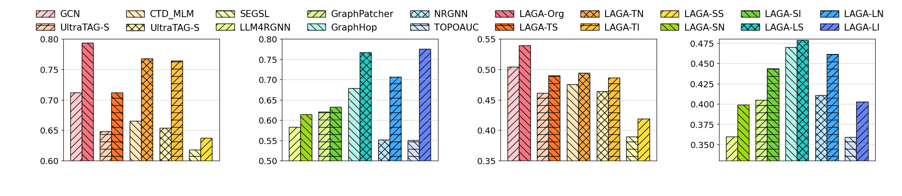

# 直方图 - 5

## 使用场景
多种方法在同一任务，同一指标下的效果对比；超参数实验中，不同超参数对应的模型效果对比；
一般用于比较直观的比较模型性能。

## 效果预览
1. 坐标轴含义
    - x轴代表不同的场景。
    - y轴代表方法在节点聚类的NMI。
    - 方法根据不同场景两两一组 (baseline + our method)。
2. 颜色/条纹含义
    - 不同的颜色和条纹都是用于区分不同的方法，通过深浅色区分 baseline 和 our method。
    - 通过条纹 + 颜色的形式可以区分更加明显，同时让图案更加美观。
3. 图片预览



## 代码
```python
import matplotlib.pyplot as plt
import numpy as np
import matplotlib.gridspec as gridspec
import matplotlib.patches as mpatches

fig = plt.figure(figsize=(28, 4.5))
gs = gridspec.GridSpec(1, 4, width_ratios=[1, 1, 1, 1])
gs.update(left=0.07, right=0.97, top=0.8, bottom=0.18, wspace=0.40)

ax1 = fig.add_subplot(gs[0])  # First subplot (wider)
ax2 = fig.add_subplot(gs[1])
ax3 = fig.add_subplot(gs[2])
ax4 = fig.add_subplot(gs[3])

# Data
ax1_data = [0.7120, 0.7935, 0.6481, 0.7122, 0.6652, 0.7678, 0.6542, 0.7642, 0.6178, 0.6377]
# ax1_errors = [0.052, 0.062, 0.084, 0.067, 0.073, 0.061, 0.080, 0.053, 0.092, 0.054, 0.088, 0.066]
ax2_data = [0.5827, 0.6140, 0.6204, 0.6328, 0.6783, 0.7672, 0.5515, 0.7062, 0.5509, 0.7753]
ax3_data = [0.5043, 0.5398, 0.4610, 0.4903, 0.4759, 0.4944, 0.4638, 0.4866, 0.3893, 0.4192]
ax4_data = [0.3597, 0.3987, 0.4049, 0.4436, 0.4699, 0.4786, 0.4105, 0.4614, 0.3591, 0.4026]

# 创建组间的间隔（可以调整间隔的大小）
bar_width = 0.5  # 每个柱子的宽度
group_gap = 0.3  # 组之间的间隔
n = len(ax1_data) // 2  # 每组包含两个数据

# 设置 X 轴的位置，按组安排
x = np.arange(n) * (bar_width * 2 + group_gap)  # 控制每组的柱子的位置
hatches1 = ['//', '-//', '\\\\', 'xx', '-\\\\']  # 填充线条样式
hatches2 = ['\\\\', '-\\\\', 'xx', '-//', '//']
# hatches2 = ['xx', 'xx', 'xx', 'xx', 'xx']
colors1 = ['#FFCCD1', '#FFD2B9', '#FFE7BA', '#FFF1B8', '#FFFFB8']
colors2 = ['#F57582', '#FF762A', '#FFA940', '#FFC53D', '#FBE139']
# colors2 = ['#9F69E2', '#9F69E2', '#9F69E2', '#9F69E2', '#9F69E2']
colors3 = ['#EAFF8F', '#D9F78E', '#B5F5EC', '#BAE7FF', '#D6E4FF']
colors4 = ['#A0D911', '#73D13D', '#26C9C3', '#40A9FF', '#6682F5']
# colors4 = ['#9F69E2', '#9F69E2', '#9F69E2', '#9F69E2', '#9F69E2']
# colors4 = ['#EFDBFF', '#EFDBFF', '#EFDBFF', '#EFDBFF', '#EFDBFF']

# 绘制每组的两个柱子 ax1
for i in range(n):
    ax1.bar(x[i], ax1_data[2 * i], width=bar_width, hatch=hatches1[i], edgecolor='black', color=colors1[i], label=f'Group {i+1} - Bar 1' if i == 0 else "")  # 第一根柱子
    ax1.bar(x[i] + bar_width, ax1_data[2 * i + 1], width=bar_width, hatch=hatches2[i], edgecolor='black', color=colors2[i], label=f'Group {i+1} - Bar 2' if i == 0 else "")  # 第二根柱子

ax1.set_ylim(0.6, 0.8)
ax1.tick_params(axis='y', labelsize=14)
ax1.set_xticks([])
ax1.grid(True, linestyle='--', alpha=0.8)


# 绘制每组的两个柱子 ax2
for i in range(n):
    ax2.bar(x[i], ax2_data[2 * i], width=bar_width, hatch=hatches1[i], edgecolor='black', color=colors3[i], label=f'Group {i+1} - Bar 1' if i == 0 else "")  # 第一根柱子
    ax2.bar(x[i] + bar_width, ax2_data[2 * i + 1], width=bar_width, hatch=hatches2[i], edgecolor='black', color=colors4[i], label=f'Group {i+1} - Bar 2' if i == 0 else "")  # 第二根柱子

ax2.set_ylim(0.5, 0.8)
ax2.tick_params(axis='y', labelsize=14)
ax2.set_xticks([])
ax2.grid(True, linestyle='--', alpha=0.8)


# 绘制每组的两个柱子 ax3
for i in range(n):
    ax3.bar(x[i], ax3_data[2 * i], width=bar_width, hatch=hatches1[i], edgecolor='black', color=colors1[i], label=f'Group {i+1} - Bar 1' if i == 0 else "")  # 第一根柱子
    ax3.bar(x[i] + bar_width, ax3_data[2 * i + 1], width=bar_width, hatch=hatches2[i], edgecolor='black', color=colors2[i], label=f'Group {i+1} - Bar 2' if i == 0 else "")  # 第二根柱子

ax3.set_ylim(0.35, 0.55)
ax3.tick_params(axis='y', labelsize=14)
ax3.set_xticks([])
ax3.grid(True, linestyle='--', alpha=0.8)

# 绘制每组的两个柱子 ax4
for i in range(n):
    ax4.bar(x[i], ax4_data[2 * i], width=bar_width, hatch=hatches1[i], edgecolor='black', color=colors3[i], label=f'Group {i+1} - Bar 1' if i == 0 else "")  # 第一根柱子
    ax4.bar(x[i] + bar_width, ax4_data[2 * i + 1], width=bar_width, hatch=hatches2[i], edgecolor='black', color=colors4[i], label=f'Group {i+1} - Bar 2' if i == 0 else "")  # 第二根柱子

ax4.set_ylim(0.33, 0.48)
ax4.tick_params(axis='y', labelsize=14)
ax4.set_xticks([])
ax4.grid(True, linestyle='--', alpha=0.8)

legend_elements = [
    mpatches.Patch(facecolor='white', color=color, hatch=hatch, label=method)
    for method, hatch, color in zip(['GCN', 'UltraTAG-S', 'CTD_MLM', 'UltraTAG-S', 'SEGSL', 'LLM4RGNN', 'GraphPatcher', 'GraphHop', 'NRGNN', 'TOPOAUC',
                                     'LAGA-Org', 'LAGA-TS', 'LAGA-TN', 'LAGA-TI', 'LAGA-SS', 'LAGA-SN', 'LAGA-SI', 'LAGA-LS', 'LAGA-LN', 'LAGA-LI'],
                                    ['//', '-//', '\\\\', 'xx', '-\\\\', '//', '-//', '\\\\', 'xx', '-\\\\',
                                     '\\\\', '-\\\\', 'xx', '-//', '//', '\\\\', '-\\\\', 'xx', '-//', '//'],
                                    ['#FFCCD1', '#FFD2B9', '#FFE7BA', '#FFF1B8', '#FFFFB8', '#EAFF8F', '#D9F78E', '#B5F5EC', '#BAE7FF', '#D6E4FF',
                                     '#F57582', '#FF762A', '#FFA940', '#FFC53D', '#FBE139', '#A0D911', '#73D13D', '#26C9C3', '#40A9FF', '#6682F5'])
]

for leg in legend_elements:
    leg.set_edgecolor('black')

fig.legend(handles=legend_elements, loc='upper center', ncol=10, bbox_to_anchor=(0.51, 0.99), fontsize=15, handletextpad=0.6, columnspacing=1.8, frameon=False)

plt.show()

```
