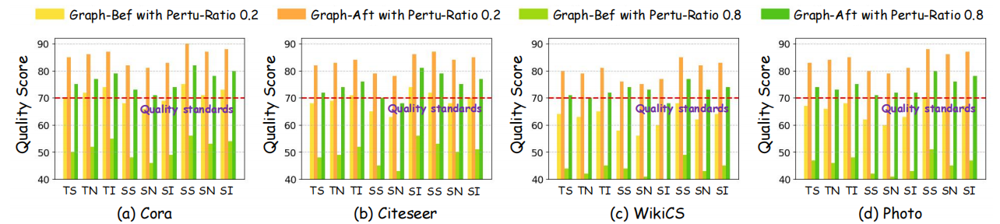

# 直方图 - 6

## 使用场景
多种方法在同一任务，同一指标下的效果对比；超参数实验中，不同超参数对应的模型效果对比；
一般用于比较直观的比较模型性能。

## 效果预览
1. 坐标轴含义
    - x轴代表不同优化前的图数据和优化后的图数据。
    - y轴代表图数据的专家评分。
2. 颜色/条纹含义
    - 不同的颜色用于优化前后的图数据，以及不同的扰动率。
3. 图片预览



## 代码
```python
import matplotlib.pyplot as plt
import numpy as np
import matplotlib.gridspec as gridspec
import matplotlib.patches as mpatches

fig = plt.figure(figsize=(30, 4.5))
gs = gridspec.GridSpec(1, 4, width_ratios=[1, 1, 1, 1])
gs.update(left=0.07, right=0.97, top=0.8, bottom=0.18, wspace=0.30)

ax1 = fig.add_subplot(gs[0])  # First subplot (wider)
ax2 = fig.add_subplot(gs[1])
ax3 = fig.add_subplot(gs[2])
ax4 = fig.add_subplot(gs[3])

# Data
ax1_data = [70, 85, 50, 75,   # ts
            72, 86, 52, 77,   # tn
            74, 87, 55, 79,   # ti
            68, 82, 48, 73,   # ss
            66, 81, 46, 71,   # sn
            69, 83, 49, 74,   # si
            75, 90, 56, 82,   # ls
            71, 87, 53, 78,   # ln
            73, 88, 54, 80]   # li

ax2_data = [68, 82, 48, 72,   # ts
            69, 83, 49, 74,   # tn
            71, 84, 52, 76,   # ti
            65, 79, 45, 70,   # ss
            63, 78, 43, 68,   # sn
            74, 86, 56, 81,   # si
            72, 87, 53, 79,   # ls
            68, 84, 50, 75,   # ln
            70, 85, 51, 77]   # li

ax3_data = [64, 80, 44, 71,   # ts
            63, 79, 42, 70,   # tn
            65, 81, 45, 72,   # ti
            58, 76, 44, 74,   # ss
            56, 75, 41, 73,   # sn
            60, 77, 40, 68,   # si
            68, 85, 49, 77,   # ls
            62, 82, 43, 73,   # ln
            64, 83, 45, 74]   # li

ax4_data = [67, 83, 47, 74,   # ts
            66, 84, 46, 73,   # tn
            68, 85, 48, 75,   # ti
            62, 80, 42, 71,   # ss
            60, 79, 41, 72,   # sn
            63, 81, 43, 72,   # si
            70, 88, 51, 80,   # ls
            65, 86, 45, 76,   # ln
            67, 87, 47, 78]   # li

# 创建组间的间隔（可以调整间隔的大小）
bar_width = 0.8  # 每个柱子的宽度
group_gap = 1.0  # 组之间的间隔
n = len(ax1_data) // 4  # 每组包含四个数据

# 设置 X 轴的位置，按组安排
x = np.arange(n) * (bar_width * 4 + group_gap)  # 控制每组的柱子的位置
hatches1 = ['//', '-//', '\\\\', 'xx', '-\\\\']  # 填充线条样式
hatches2 = ['\\\\', '-\\\\', 'xx', '-//', '//']

colors = ['#FBE139', '#FFA940', '#A0D911', '#52C41A']

# 绘制每组的两个柱子 ax1
for i in range(n):
    ax1.bar(x[i], ax1_data[4 * i], width=bar_width, color=colors[0], label=f'Group {i+1} - Bar 1' if i == 0 else "")  # 第一根柱子
    ax1.bar(x[i] + 1*bar_width, ax1_data[4 * i + 1], width=bar_width, color=colors[1], label=f'Group {i+1} - Bar 2' if i == 0 else "")  # 第二根柱子
    ax1.bar(x[i] + 2*bar_width, ax1_data[4 * i + 2], width=bar_width, color=colors[2], label=f'Group {i+1} - Bar 3' if i == 0 else "")  # 第三根柱子
    ax1.bar(x[i] + 3*bar_width, ax1_data[4 * i + 3], width=bar_width, color=colors[3], label=f'Group {i+1} - Bar 4' if i == 0 else "")  # 第四根柱子

ax1.set_ylim(40, 92)
ax1.tick_params(axis='y', labelsize=14)
ax1.set_xticks([])
ax1.grid(True, linestyle='--', alpha=0.8)
ax1.axhline(y=70, color='red', linestyle='--', linewidth=2)


# 绘制每组的两个柱子 ax2
for i in range(n):
    ax2.bar(x[i], ax2_data[4 * i], width=bar_width, color=colors[0], label=f'Group {i+1} - Bar 1' if i == 0 else "")  # 第一根柱子
    ax2.bar(x[i] + 1*bar_width, ax2_data[4 * i + 1], width=bar_width, color=colors[1], label=f'Group {i+1} - Bar 2' if i == 0 else "")  # 第二根柱子
    ax2.bar(x[i] + 2*bar_width, ax2_data[4 * i + 2], width=bar_width, color=colors[2], label=f'Group {i+1} - Bar 3' if i == 0 else "")  # 第三根柱子
    ax2.bar(x[i] + 3*bar_width, ax2_data[4 * i + 3], width=bar_width, color=colors[3], label=f'Group {i+1} - Bar 4' if i == 0 else "")  # 第四根柱子

ax2.set_ylim(40, 92)
ax2.tick_params(axis='y', labelsize=14)
ax2.set_xticks([])
ax2.grid(True, linestyle='--', alpha=0.8)
ax2.axhline(y=70, color='red', linestyle='--', linewidth=2)


# 绘制每组的两个柱子 ax1
for i in range(n):
    ax3.bar(x[i], ax3_data[4 * i], width=bar_width, color=colors[0], label=f'Group {i+1} - Bar 1' if i == 0 else "")  # 第一根柱子
    ax3.bar(x[i] + 1*bar_width, ax3_data[4 * i + 1], width=bar_width, color=colors[1], label=f'Group {i+1} - Bar 2' if i == 0 else "")  # 第二根柱子
    ax3.bar(x[i] + 2*bar_width, ax3_data[4 * i + 2], width=bar_width, color=colors[2], label=f'Group {i+1} - Bar 3' if i == 0 else "")  # 第三根柱子
    ax3.bar(x[i] + 3*bar_width, ax3_data[4 * i + 3], width=bar_width, color=colors[3], label=f'Group {i+1} - Bar 4' if i == 0 else "")  # 第四根柱子

ax3.set_ylim(40, 92)
ax3.tick_params(axis='y', labelsize=14)
ax3.set_xticks([])
ax3.grid(True, linestyle='--', alpha=0.8)
ax3.axhline(y=70, color='red', linestyle='--', linewidth=2)


# 绘制每组的两个柱子 ax1
for i in range(n):
    ax4.bar(x[i], ax4_data[4 * i], width=bar_width, color=colors[0], label=f'Group {i+1} - Bar 1' if i == 0 else "")  # 第一根柱子
    ax4.bar(x[i] + 1*bar_width, ax4_data[4 * i + 1], width=bar_width, color=colors[1], label=f'Group {i+1} - Bar 2' if i == 0 else "")  # 第二根柱子
    ax4.bar(x[i] + 2*bar_width, ax4_data[4 * i + 2], width=bar_width, color=colors[2], label=f'Group {i+1} - Bar 3' if i == 0 else "")  # 第三根柱子
    ax4.bar(x[i] + 3*bar_width, ax4_data[4 * i + 3], width=bar_width, color=colors[3], label=f'Group {i+1} - Bar 4' if i == 0 else "")  # 第四根柱子

ax4.set_ylim(40, 92)
ax4.tick_params(axis='y', labelsize=14)
ax4.set_xticks([])
ax4.grid(True, linestyle='--', alpha=0.8)
ax4.axhline(y=70, color='red', linestyle='--', linewidth=2)

legend_elements = [
    mpatches.Patch(facecolor='white', color=color, label=method)
    for method, color in zip(['before opt', 'before opt', 'before opt', 'before opt'],
                            ['#FBE139', '#FFA940', '#A0D911', '#52C41A'])
]

fig.legend(handles=legend_elements, loc='upper center', ncol=4, bbox_to_anchor=(0.455, 0.99), fontsize=20, handletextpad=0.6, columnspacing=9.5, frameon=False)

plt.show()

```