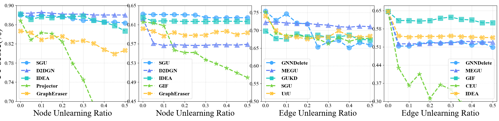

# 折线图 - 1

## 使用场景

反应多种方法在不同条件下的效果变化趋势，多用于鲁棒性相关的实验，对比不同方法的变化趋势。

## 效果预览

1. 坐标轴含义
    - x轴代表不同的 Node/Edge unlearning ratio。
    - y轴代表 F1-score。
2. 线条/颜色含义
    - 不同的颜色和线形代表不同的方法。
    - 在每个数据点添加不同的图案也用于区分不同方法，同时增加美观程度。
3. 图片预览



## 代码

```python
import matplotlib.pyplot as plt
import numpy as np

from matplotlib import rcParams

config = {
    "font.family":'Times New Roman',  # 设置字体类型
    "axes.unicode_minus": False #解决负号无法显示的问题
}
rcParams.update(config)
# 方法名称
methods = ['SGU', 'D2DGN', 'IDEA', 'Projector', 'GraphEraser']

# x轴数据
x = np.arange(0, 0.51, 0.05)

# 每个方法对应的数据（复制四份）
data_1 = {
    'SGU': [0.8801, 0.8764, 0.8801, 0.8782, 0.8764, 0.8727, 0.869, 0.869, 0.8653, 0.8653, 0.8635],
    'D2DGN': [0.8838, 0.8838, 0.8856, 0.8838, 0.8819, 0.8819, 0.8819, 0.8801, 0.8801, 0.8801, 0.8801],
    'IDEA': [0.8819, 0.8708, 0.8764, 0.8745, 0.8764, 0.8764, 0.8782, 0.869, 0.8653, 0.8579, 0.8469],
    'Projector': [0.8684, 0.8284, 0.8432, 0.8413, 0.8247, 0.7786, 0.7454, 0.6937, 0.6236, 0.5738, 0.476],
    'GraphEraser': [0.8468, 0.8432, 0.8284, 0.8339, 0.8358, 0.8247, 0.8266, 0.821, 0.8081, 0.7989, 0.8063]
}
data_2 = {
    'SGU': [0.6321,0.6309,0.6311,0.6309,0.6306,0.6301,0.6249,0.6240,0.6246,0.6244,0.6244],
    'D2DGN': [0.6226, 0.5711, 0.5663, 0.5682, 0.5671, 0.5664, 0.5669, 0.568, 0.5678, 0.5673, 0.5689],
    'IDEA': [0.6251,0.617,0.6179,0.6173,0.6166,0.6167,0.6165,0.617,0.6171,0.617,0.6166],
    'GIF': [0.6156,0.6132,0.608,0.5569,0.5518,0.5518,0.5369,0.5288,0.5195,0.5093,0.4996],
    'GraphEraser': [0.6017,0.5962,0.5863,0.5938,0.5877,0.5877,0.5883,0.5949,0.5963,0.589,0.5931]
}
data_3 = {
    'GNNDelete':[0.7538,0.7282,0.7462,0.7207,0.7177,0.6532,0.6667,0.6712,0.6508,0.6655,0.6592],
    'MEGU':[0.7222,0.7234,0.7207,0.7192,0.7192,0.7162,0.7147,0.7102,0.7087,0.7117,0.7102],
    'GUKD':[0.6982,0.6772,0.6757,0.6898,0.6817,0.6862,0.6802,0.6817,0.6862,0.6742,0.6732],
    'SGU':[0.75225,0.6917,0.6857,0.6857,0.6814,0.6757,0.6629,0.68,0.6686,0.6771,0.6771],
    'UtU':[0.7402,0.7,0.681,0.681,0.6753,0.681,0.6810,0.6987,0.6838,0.681,0.6837]
}

data_4 = {
    'GNNDelete':[0.6469,0.5132,0.5132,0.5219,0.5285,0.5241,0.5263,0.5285,0.5175,0.5263,0.5088],
    'MEGU':[0.6469,0.5219,0.5219,0.5219,0.5241,0.5263,0.5263,0.5307,0.5307,0.5285,0.5285],
    'GIF':[0.6469,0.6118,0.6118,0.6096,0.6118,0.6206,0.625,0.6162,0.614,0.6031,0.6031],
    'CEU':[0.6469,0.4298,0.3618,0.4057,0.3114,0.364,0.3465,0.2939,0.261,0.2215,0.2566],
    'IDEA':[0.6469,0.5526,0.5482,0.5504,0.5504,0.5504,0.5526,0.5504,0.5482,0.5461,0.5461]
}
font_properties = {'weight': 'bold', 'size': 16}
# 设置绘图
plt.figure(figsize=(33, 5))

# 每个方法的颜色（复制四份）
# colors_1 = ['#005490', '#2F7BBC', '#69ADD1', '#4D7DB6', '#45A6B2']
colors_1=['#1890FF','#096DD9','#40A9FF','#91D5FF','#69C0FF']
# colors_2 = ['#C1E37C','#85CB6B','#44A55B','#067B40','#1E9D87']
colors_2 = ['#06868A','#45DAD1','#0FB4B4','#87E8DE','#26C9C3']
colors_3 = ['#237804','#389E0D','#73D13D','#95DE64','#52C41A']
colors_4 =  ['#FF8F50','#FFB186','#F55C08','#FFD2B9','#FF762A']
colors_mix = ['#40A9FF','#6682F5','#26C9C3','#73D13D','#FFC53D','#FFA940']
colors_1 = colors_2 = colors_3 = colors_4 = colors_mix
# 节点样式（不同的标记图标，复制四份）
markers_1 = ['o', '^', 's', '*', 'X']
markers_2 = markers_1.copy()
markers_3 = markers_1.copy()
markers_4 = markers_1.copy()

# 绘制第一个子图
ax1 = plt.subplot(1, 4, 1)
# 绘制每个方法的折线图
# plt.plot(x, data_1['SGU'], label='SGU', color=colors_1[0], linestyle='--', linewidth=3, alpha=0.7)
# plt.scatter(x, data_1['SGU'], color=colors_1[0], marker=markers_1[0], s=300, edgecolors=colors_1[0], alpha=0.6, zorder=5)
# plt.plot(x, data_1['D2DGN'], label='D2DGN', color=colors_1[1], linestyle='--', linewidth=3, alpha=0.7)
# plt.scatter(x, data_1['D2DGN'], color=colors_1[1], marker=markers_1[1], s=300, edgecolors=colors_1[1], alpha=0.6, zorder=5)
# plt.plot(x, data_1['IDEA'], label='IDEA', color=colors_1[2], linestyle='--', linewidth=3, alpha=0.7)
# plt.scatter(x, data_1['IDEA'], color=colors_1[2], marker=markers_1[2], s=300, edgecolors=colors_1[2], alpha=0.6, zorder=5)
# plt.plot(x, data_1['Projector'], label='Projector', color=colors_1[3], linestyle='--', linewidth=3, alpha=0.7)
# plt.scatter(x, data_1['Projector'], color=colors_1[3], marker=markers_1[3], s=300, edgecolors=colors_1[3], alpha=0.6, zorder=5)
# plt.plot(x, data_1['GraphEraser'], label='GraphEraser', color=colors_1[4], linestyle='--', linewidth=3, alpha=0.7)
# plt.scatter(x, data_1['GraphEraser'], color=colors_1[4], marker=markers_1[4], s=300, edgecolors=colors_1[4], alpha=0.6, zorder=5)

# 绘制每个方法的折线图
plt.plot(x, data_1['SGU'], label='SGU', color=colors_1[0], linestyle='--', linewidth=3, alpha=1)
plt.scatter(x, data_1['SGU'], color=colors_1[0], marker=markers_1[0], s=200, edgecolors=colors_1[0], alpha=0.7, zorder=5)
plt.plot(x, data_1['D2DGN'], label='D2DGN', color=colors_1[1], linestyle='--', linewidth=3, alpha=1)
plt.scatter(x, data_1['D2DGN'], color=colors_1[1], marker=markers_1[1], s=200, edgecolors=colors_1[1], alpha=0.7, zorder=5)
plt.plot(x, data_1['IDEA'], label='IDEA', color=colors_1[2], linestyle='--', linewidth=3, alpha=1)
plt.scatter(x, data_1['IDEA'], color=colors_1[2], marker=markers_1[2], s=200, edgecolors=colors_1[2], alpha=0.7, zorder=5)
plt.plot(x, data_1['Projector'], label='Projector', color=colors_1[3], linestyle='--', linewidth=3, alpha=1)
plt.scatter(x, data_1['Projector'], color=colors_1[3], marker=markers_1[3], s=200, edgecolors=colors_1[3], alpha=0.7, zorder=5)
plt.plot(x, data_1['GraphEraser'], label='GraphEraser', color=colors_1[4], linestyle='--', linewidth=3, alpha=1)
plt.scatter(x, data_1['GraphEraser'], color=colors_1[4], marker=markers_1[4], s=200, edgecolors=colors_1[4], alpha=0.7, zorder=5)

# 设置标题和轴标签
# ax1.set_title('Comparison of Methods 1', fontsize=18, fontweight='bold')
ax1.set_xlabel('Node Unlearning Ratio', fontsize=25)
ax1.set_ylabel('F1-score(%)', fontsize=30)
# 设置y轴范围为0.7到0.9
ax1.set_ylim(0.7, 0.9)
ax1.set_yticks(np.arange(0.7, 0.9,0.04))
# 设置x轴范围，间隔为0.05
ax1.set_xlim(-0.02, 0.52)
ax1.set_xticks(np.arange(0, 0.51, 0.1))

# 添加网格，设置为细的虚线
ax1.grid(True, linestyle=':', linewidth=0.7)

# 调整X轴和Y轴的数字大小
ax1.tick_params(axis='x', labelsize=16)
ax1.tick_params(axis='y', labelsize=16)

# 获取原始图例
legend_1 = ax1.legend(loc='best', fontsize=12,prop = font_properties)

# 重新绘制图例，使其包含散点样式
for legobj, marker in zip(legend_1.legend_handles, markers_1):
    legobj.set_marker(marker)
    legobj.set_markersize(10)

# 绘制第二个子图
ax2 = plt.subplot(1, 4, 2)
# 绘制每个方法的折线图
# plt.plot(x, data_2['SGU'], label='SGU', color=colors_2[0], linestyle='--', linewidth=3, alpha=0.7)
# plt.scatter(x, data_2['SGU'], color=colors_2[0], marker=markers_2[0], s=300, edgecolors=colors_2[0], alpha=0.6, zorder=5)
# plt.plot(x, data_2['D2DGN'], label='D2DGN', color=colors_2[1], linestyle='--', linewidth=3, alpha=0.7)
# plt.scatter(x, data_2['D2DGN'], color=colors_2[1], marker=markers_2[1], s=300, edgecolors=colors_2[1], alpha=0.6, zorder=5)
# plt.plot(x, data_2['IDEA'], label='IDEA', color=colors_2[2], linestyle='--', linewidth=3, alpha=0.7)
# plt.scatter(x, data_2['IDEA'], color=colors_2[2], marker=markers_2[2], s=300, edgecolors=colors_2[2], alpha=0.6, zorder=5)
# plt.plot(x, data_2['GIF'], label='GIF', color=colors_2[3], linestyle='--', linewidth=3, alpha=0.7)
# plt.scatter(x, data_2['GIF'], color=colors_2[3], marker=markers_2[3], s=300, edgecolors=colors_2[3], alpha=0.6, zorder=5)
# plt.plot(x, data_2['GraphEraser'], label='GraphEraser', color=colors_2[4], linestyle='--', linewidth=3, alpha=0.7)
# plt.scatter(x, data_2['GraphEraser'], color=colors_2[4], marker=markers_2[4], s=300, edgecolors=colors_2[4], alpha=0.6, zorder=5)

plt.plot(x, data_2['SGU'], label='SGU', color=colors_2[0], linestyle='--', linewidth=3, alpha=1)
plt.scatter(x, data_2['SGU'], color=colors_2[0], marker=markers_2[0], s=200, edgecolors=colors_2[0], alpha=0.7, zorder=5)
plt.plot(x, data_2['D2DGN'], label='D2DGN', color=colors_2[1], linestyle='--', linewidth=3, alpha=1)
plt.scatter(x, data_2['D2DGN'], color=colors_2[1], marker=markers_2[1], s=200, edgecolors=colors_2[1], alpha=0.7, zorder=5)
plt.plot(x, data_2['IDEA'], label='IDEA', color=colors_2[2], linestyle='--', linewidth=3, alpha=1)
plt.scatter(x, data_2['IDEA'], color=colors_2[2], marker=markers_2[2], s=200, edgecolors=colors_2[2], alpha=0.7, zorder=5)
plt.plot(x, data_2['GIF'], label='GIF', color=colors_2[3], linestyle='--', linewidth=3, alpha=1)
plt.scatter(x, data_2['GIF'], color=colors_2[3], marker=markers_2[3], s=200, edgecolors=colors_2[3], alpha=0.7, zorder=5)
plt.plot(x, data_2['GraphEraser'], label='GraphEraser', color=colors_2[4], linestyle='--', linewidth=3, alpha=1)
plt.scatter(x, data_2['GraphEraser'], color=colors_2[4], marker=markers_2[4], s=200, edgecolors=colors_2[4], alpha=0.7, zorder=5)

# 设置标题和轴标签
# ax2.set_title('Comparison of Methods 2', fontsize=18, fontweight='bold')
ax2.set_xlabel('Node Unlearning Ratio', fontsize=25)

# 设置y轴范围为0.7到0.9
ax2.set_ylim(0.45, 0.65)
ax2.set_yticks(np.arange(0.45, 0.651, 0.04))
# 设置x轴范围，间隔为0.05
ax2.set_xlim(-0.02, 0.52)
ax2.set_xticks(np.arange(0, 0.51, 0.1))

# 添加网格，设置为细的虚线
ax2.grid(True, linestyle=':', linewidth=0.7)

# 调整X轴和Y轴的数字大小
ax2.tick_params(axis='x', labelsize=16)
ax2.tick_params(axis='y', labelsize=16)

# 获取原始图例
font_properties = {'weight': 'bold', 'size': 16}
legend_2 = ax2.legend(loc='best', fontsize=12,prop = font_properties)

# 重新绘制图例，使其包含散点样式
for legobj, marker in zip(legend_2.legend_handles, markers_2):
    legobj.set_marker(marker)
    legobj.set_markersize(10)

# 绘制第三个子图
ax3 = plt.subplot(1, 4, 3)
# 绘制每个方法的折线图
plt.plot(x, data_3['GNNDelete'], label='GNNDelete', color=colors_3[0], linestyle='--', linewidth=3, alpha=1)
plt.scatter(x, data_3['GNNDelete'], color=colors_3[0], marker=markers_3[0], s=200, edgecolors=colors_3[0], alpha=0.7, zorder=5)
plt.plot(x, data_3['MEGU'], label='MEGU', color=colors_3[1], linestyle='--', linewidth=3, alpha=1)
plt.scatter(x, data_3['MEGU'], color=colors_3[1], marker=markers_3[1], s=200, edgecolors=colors_3[1], alpha=0.7, zorder=5)
plt.plot(x, data_3['GUKD'], label='GUKD', color=colors_3[2], linestyle='--', linewidth=3, alpha=1)
plt.scatter(x, data_3['GUKD'], color=colors_3[2], marker=markers_3[2], s=200, edgecolors=colors_3[2], alpha=0.7, zorder=5)
plt.plot(x, data_3['SGU'], label='SGU', color=colors_3[3], linestyle='--', linewidth=3, alpha=1)
plt.scatter(x, data_3['SGU'], color=colors_3[3], marker=markers_3[3], s=200, edgecolors=colors_3[3], alpha=0.7, zorder=5)
plt.plot(x, data_3['UtU'], label='UtU', color=colors_3[4], linestyle='--', linewidth=3, alpha=1)
plt.scatter(x, data_3['UtU'], color=colors_3[4], marker=markers_3[4], s=200, edgecolors=colors_3[4], alpha=0.7, zorder=5)

# 设置标题和轴标签
# ax3.set_title('Comparison of Methods 3', fontsize=18, fontweight='bold')
ax3.set_xlabel('Edge Unlearning Ratio', fontsize=25)

# 设置y轴范围为0.7到0.9
ax3.set_ylim(0.5, 0.77)
ax3.set_yticks(np.arange(0.5, 0.77, 0.05))
# 设置x轴范围，间隔为0.05
ax3.set_xlim(-0.02, 0.52)
ax3.set_xticks(np.arange(0, 0.51, 0.1))

# 添加网格，设置为细的虚线
ax3.grid(True, linestyle=':', linewidth=0.7)

# 调整X轴和Y轴的数字大小
ax3.tick_params(axis='x', labelsize=16)
ax3.tick_params(axis='y', labelsize=16)

# 获取原始图例
font_properties = {'weight': 'bold', 'size': 16}
legend_3 = ax3.legend(loc='lower left', fontsize=12,prop = font_properties)

# 重新绘制图例，使其包含散点样式
for legobj, marker in zip(legend_3.legend_handles, markers_3):
    legobj.set_marker(marker)
    legobj.set_markersize(10)

# 绘制第四个子图
ax4 = plt.subplot(1, 4, 4)
# 绘制每个方法的折线图
plt.plot(x, data_4['GNNDelete'], label='GNNDelete', color=colors_4[0], linestyle='--', linewidth=3, alpha=1)
plt.scatter(x, data_4['GNNDelete'], color=colors_4[0], marker=markers_4[0], s=200, edgecolors=colors_4[0], alpha=0.7, zorder=5)
plt.plot(x, data_4['MEGU'], label='MEGU', color=colors_4[1], linestyle='--', linewidth=3, alpha=1)
plt.scatter(x, data_4['MEGU'], color=colors_4[1], marker=markers_4[1], s=200, edgecolors=colors_4[1], alpha=0.7, zorder=5)
plt.plot(x, data_4['GIF'], label='GIF', color=colors_4[2], linestyle='--', linewidth=3, alpha=1)
plt.scatter(x, data_4['GIF'], color=colors_4[2], marker=markers_4[2], s=200, edgecolors=colors_4[2], alpha=0.7, zorder=5)
plt.plot(x, data_4['CEU'], label='CEU', color=colors_4[3], linestyle='--', linewidth=3, alpha=1)
plt.scatter(x, data_4['CEU'], color=colors_4[3], marker=markers_4[3], s=200, edgecolors=colors_4[3], alpha=0.7, zorder=5)
plt.plot(x, data_4['IDEA'], label='IDEA', color=colors_4[4], linestyle='--', linewidth=3, alpha=1)
plt.scatter(x, data_4['IDEA'], color=colors_4[4], marker=markers_4[4], s=200, edgecolors=colors_4[4], alpha=0.7, zorder=5)

# 设置标题和轴标签
# ax4.set_title('Comparison of Methods 4', fontsize=18, fontweight='bold')
ax4.set_xlabel('Edge Unlearning Ratio', fontsize=25)
ax4.set_xticks(np.arange(0, 0.51, 0.1))

# 设置y轴范围为0.7到0.9
ax4.set_ylim(0.3, 0.67)
ax4.set_yticks(np.arange(0.3, 0.67, 0.07))
# 设置x轴范围，间隔为0.05
ax4.set_xlim(-0.02, 0.52)


# 添加网格，设置为细的虚线
ax4.grid(True, linestyle=':', linewidth=0.7)

# 调整X轴和Y轴的数字大小
ax4.tick_params(axis='x', labelsize=16)
ax4.tick_params(axis='y', labelsize=16)
# ax1.set_title("GraphSAINT",fontsize=30, fontweight='bold',pad=15)
# ax2.set_title("Cluster-GCN",fontsize=30, fontweight='bold',pad=15)
# ax3.set_title("GAT",fontsize=30, fontweight='bold',pad=15)
# ax4.set_title("GCN",fontsize=30, fontweight='bold',pad=15)
# 获取原始图例
font_properties = {'weight': 'bold', 'size': 16}
legend_4 = ax4.legend(loc='best', fontsize=12,prop = font_properties)

# 重新绘制图例，使其包含散点样式
for legobj, marker in zip(legend_4.legend_handles, markers_4):
    legobj.set_marker(marker)
    legobj.set_markersize(10)

plt.subplots_adjust(left=0.044, bottom=0.125, right=0.995, top=0.8825, wspace=0.193, hspace=None)
plt.tight_layout()
plt.show()
```
