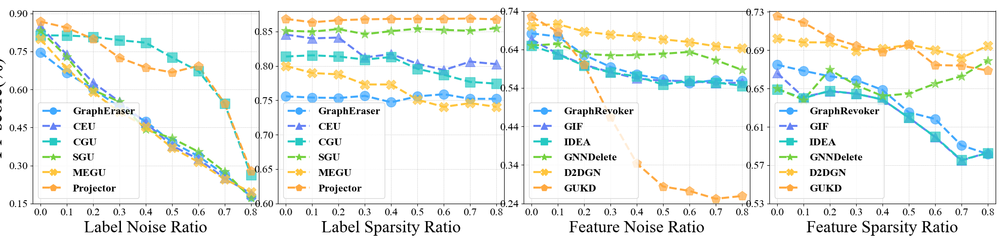

# 折线图 - 2

## 使用场景

反应多种方法在不同条件下的效果变化趋势，多用于鲁棒性相关的实验，对比不同方法的变化趋势。

## 效果预览

1. 坐标轴含义
    - x轴代表不同的 Label noise/Label sparsity/Feature noise/Feature sparsity ratio。
    - y轴代表 F1-score。
2. 线条/颜色含义
    - 不同的颜色和线形代表不同的方法。
    - 在每个数据点添加不同的图案也用于区分不同方法，同时增加美观程度。
3. 图片预览



## 代码

```python
import matplotlib.pyplot as plt
import numpy as np

from matplotlib import rcParams

config = {
    "font.family":'Times New Roman',  # 设置字体类型
    "axes.unicode_minus": False #解决负号无法显示的问题
}
rcParams.update(config)
# 方法名称
methods = ['SGU', 'D2DGN', 'IDEA', 'Projector', 'GraphEraser']

# x轴数据
x = np.arange(0, 0.9,0.1)

# 每个方法对应的数据（复制四份）
#cora label_noise
data_1 = {
    'GraphEraser': [0.7465, 0.6657, 0.6026, 0.5306, 0.4745, 0.3919, 0.3369, 0.2646, 0.1775],
    'CEU': [0.8491, 0.7380, 0.6277, 0.5524, 0.4690, 0.3782, 0.3255, 0.2506, 0.1886],
    'CGU': [0.8137, 0.8130, 0.8081, 0.7946, 0.7847, 0.7266, 0.6731, 0.5446, 0.2627],
    'SGU': [0.8321, 0.7292, 0.5982, 0.5517, 0.4421, 0.4077, 0.3546, 0.2753, 0.1720],
    'MEGU': [0.7989, 0.6834, 0.5897, 0.5118, 0.4528, 0.3708, 0.3140, 0.2461, 0.1948],
    'Projector': [0.8684, 0.8438, 0.7995, 0.7257, 0.6870, 0.6673, 0.6931, 0.5455, 0.2774]
}
#cora label_sparse
data_2 = {
    'GraphEraser': [0.7558, 0.7540, 0.7534, 0.7565, 0.7472, 0.7558, 0.7589, 0.7522, 0.7522],
    'CEU': [0.8456, 0.8401, 0.8413, 0.8124, 0.8173, 0.8032, 0.7940, 0.8063, 0.8026],
    'CGU': [0.8137, 0.8155, 0.8137, 0.8093, 0.8130, 0.7958, 0.7872, 0.7768, 0.7743],
    'SGU': [0.8512, 0.8499, 0.8536, 0.8462, 0.8506, 0.8542, 0.8524, 0.8512, 0.8549],
    'MEGU': [0.8001, 0.7897, 0.7878, 0.7731, 0.7731, 0.7509, 0.7405, 0.7460, 0.7405],
    'Projector': [0.8684, 0.8635, 0.8665, 0.8678, 0.8684, 0.8684, 0.8684, 0.8690, 0.8678]
}
#citeseer featuer_noise
data_3 = {
    'GraphRevoker': [0.6817, 0.6736, 0.6258, 0.5946, 0.5748, 0.5628, 0.5523, 0.5607, 0.5583],
    'GIF': [0.6662, 0.6285, 0.6003, 0.5811, 0.5646, 0.5586, 0.5580, 0.5523, 0.5535],
    'IDEA': [0.6495, 0.6273, 0.5979, 0.5799, 0.5703, 0.5486, 0.5586, 0.5544, 0.5456],
    'GNNDelete': [0.6502, 0.6544, 0.6285, 0.6246, 0.6255, 0.6288, 0.6336, 0.6123, 0.5868],
    'D2DGN': [0.7021, 0.7060, 0.6862, 0.6784, 0.6739, 0.6664, 0.6592, 0.6483, 0.6429],
    'GUKD': [0.7255, 0.6856, 0.6003, 0.4643, 0.3441, 0.2841, 0.2727, 0.2523, 0.2595]
}

#citeseer featuer_sparsity
data_4 = {
    "GraphRevoker": [0.6748, 0.6685, 0.6628, 0.6589, 0.6486, 0.6252, 0.6183, 0.5907, 0.5817],
    "GIF": [0.6662, 0.6411, 0.6471, 0.6447, 0.6384, 0.6198, 0.5994, 0.5748, 0.5832],
    "IDEA": [0.6492, 0.6399, 0.6477, 0.6444, 0.6387, 0.6195, 0.5997, 0.5754, 0.5826],
    "GNNDelete": [0.6502, 0.6381, 0.6697, 0.6535, 0.6423, 0.6447, 0.6550, 0.6628, 0.6790],
    "D2DGN": [0.7021, 0.6982, 0.6982, 0.6892, 0.6916, 0.6958, 0.6904, 0.6820, 0.6946],
    "GUKD": [0.7255, 0.7189, 0.7033, 0.6949, 0.6883, 0.6961, 0.6745, 0.6739, 0.6688]
}
font_properties = {'weight': 'bold', 'size': 16}
# 设置绘图
plt.figure(figsize=(33, 5))

# 每个方法的颜色（复制四份）
# colors_1 = ['#005490', '#2F7BBC', '#69ADD1', '#4D7DB6', '#45A6B2']
colors_1=['#1890FF','#096DD9','#40A9FF','#91D5FF','#69C0FF','#91D5FF']
# colors_2 = ['#C1E37C','#85CB6B','#44A55B','#067B40','#1E9D87']
colors_2 = ['#06868A','#45DAD1','#0FB4B4','#87E8DE','#26C9C3']
colors_3 = ['#237804','#389E0D','#73D13D','#95DE64','#52C41A']
colors_4 =  ['#FF8F50','#FFB186','#F55C08','#FFD2B9','#FF762A']
colors_mix = ['#40A9FF','#6682F5','#26C9C3','#73D13D','#FFC53D','#FFA940']
# 节点样式（不同的标记图标，复制四份）
markers_1 = ['o', '^', 's', '*', 'X','p','H','d']
markers_2 = markers_1.copy()
markers_3 = markers_1.copy()
markers_4 = markers_1.copy()
linew = 3
alphaline = 0.7
# 绘制第一个子图
ax1 = plt.subplot(1, 4, 1)
# 绘制每个方法的折线图
plt.plot(x, data_1['GraphEraser'], label='GraphEraser', color=colors_mix[0], linestyle='--', linewidth=linew, alpha=1)
plt.scatter(x, data_1['GraphEraser'], color=colors_mix[0], marker=markers_1[0], s=200, edgecolors=colors_mix[0], alpha=alphaline, zorder=5)
plt.plot(x, data_1['CEU'], label='CEU', color=colors_mix[1], linestyle='--', linewidth=linew, alpha=1)
plt.scatter(x, data_1['CEU'], color=colors_mix[1], marker=markers_1[1], s=200, edgecolors=colors_mix[1], alpha=alphaline, zorder=5)
plt.plot(x, data_1['CGU'], label='CGU', color=colors_mix[2], linestyle='--', linewidth=linew, alpha=1)
plt.scatter(x, data_1['CGU'], color=colors_mix[2], marker=markers_1[2], s=200, edgecolors=colors_mix[2], alpha=alphaline, zorder=5)
plt.plot(x, data_1['SGU'], label='SGU', color=colors_mix[3], linestyle='--', linewidth=linew ,alpha=1)
plt.scatter(x, data_1['SGU'], color=colors_mix[3], marker=markers_1[3], s=200, edgecolors=colors_mix[3], alpha=alphaline, zorder=5)
plt.plot(x, data_1['MEGU'], label='MEGU', color=colors_mix[4], linestyle='--', linewidth=linew, alpha=1)
plt.scatter(x, data_1['MEGU'], color=colors_mix[4], marker=markers_1[4], s=200, edgecolors=colors_mix[4], alpha=alphaline, zorder=5)
plt.plot(x, data_1['Projector'], label='Projector', color=colors_mix[5], linestyle='--', linewidth=linew, alpha=1)
plt.scatter(x, data_1['Projector'], color=colors_mix[5], marker=markers_1[5], s=200, edgecolors=colors_mix[5], alpha=alphaline, zorder=5)
# 设置标题和轴标签
# ax1.set_title('Comparison of Methods 1', fontsize=18, fontweight='bold')
ax1.set_xlabel('Label Noise Ratio', fontsize=25)
ax1.set_ylabel('F1-score(%)', fontsize=30)
# 设置y轴范围为0.7到0.9
ax1.set_ylim(0.15, 0.91)
ax1.set_yticks(np.arange(0.15, 0.91,0.15))
# 设置x轴范围，间隔为0.05
ax1.set_xlim(-0.03, 0.83)
ax1.set_xticks(np.arange(0, 0.83, 0.1))

# 添加网格，设置为细的虚线
ax1.grid(True, linestyle=':', linewidth=0.7)

# 调整X轴和Y轴的数字大小
ax1.tick_params(axis='x', labelsize=16)
ax1.tick_params(axis='y', labelsize=16)

# 获取原始图例
legend_1 = ax1.legend(loc='lower left', fontsize=12,prop = font_properties)

# 重新绘制图例，使其包含散点样式
for legobj, marker in zip(legend_1.legend_handles, markers_1):
    legobj.set_marker(marker)
    legobj.set_markersize(10)

# 绘制第二个子图
ax2 = plt.subplot(1, 4, 2)
# 绘制每个方法的折线图
plt.plot(x, data_2['GraphEraser'], label='GraphEraser', color=colors_mix[0], linestyle='--', linewidth=linew, alpha=1)
plt.scatter(x, data_2['GraphEraser'], color=colors_mix[0], marker=markers_1[0], s=200, edgecolors=colors_mix[0], alpha=alphaline, zorder=5)
plt.plot(x, data_2['CEU'], label='CEU', color=colors_mix[1], linestyle='--', linewidth=linew, alpha=1)
plt.scatter(x, data_2['CEU'], color=colors_mix[1], marker=markers_1[1], s=200, edgecolors=colors_mix[1], alpha=alphaline, zorder=5)
plt.plot(x, data_2['CGU'], label='CGU', color=colors_mix[2], linestyle='--', linewidth=linew, alpha=1)
plt.scatter(x, data_2['CGU'], color=colors_mix[2], marker=markers_1[2], s=200, edgecolors=colors_mix[2], alpha=alphaline, zorder=5)
plt.plot(x, data_2['SGU'], label='SGU', color=colors_mix[3], linestyle='--', linewidth=linew ,alpha=1)
plt.scatter(x, data_2['SGU'], color=colors_mix[3], marker=markers_1[3], s=200, edgecolors=colors_mix[3], alpha=alphaline, zorder=5)
plt.plot(x, data_2['MEGU'], label='MEGU', color=colors_mix[4], linestyle='--', linewidth=linew, alpha=1)
plt.scatter(x, data_2['MEGU'], color=colors_mix[4], marker=markers_1[4], s=200, edgecolors=colors_mix[4], alpha=alphaline, zorder=5)
plt.plot(x, data_2['Projector'], label='Projector', color=colors_mix[5], linestyle='--', linewidth=linew, alpha=1)
plt.scatter(x, data_2['Projector'], color=colors_mix[5], marker=markers_1[5], s=200, edgecolors=colors_mix[5], alpha=alphaline, zorder=5)
# 设置标题和轴标签
# ax2.set_title('Comparison of Methods 2', fontsize=18, fontweight='bold')
ax2.set_xlabel('Label Sparsity Ratio', fontsize=25)

# 设置y轴范围为0.7到0.9
ax2.set_ylim(0.60, 0.88)
ax2.set_yticks(np.arange(0.60, 0.881, 0.05))
# 设置x轴范围，间隔为0.05
ax2.set_xlim(-0.03, 0.83)
ax2.set_xticks(np.arange(0, 0.83, 0.1))

# 添加网格，设置为细的虚线
ax2.grid(True, linestyle=':', linewidth=0.7)

# 调整X轴和Y轴的数字大小
ax2.tick_params(axis='x', labelsize=16)
ax2.tick_params(axis='y', labelsize=16)

# 获取原始图例
font_properties = {'weight': 'bold', 'size': 16}
legend_2 = ax2.legend(loc='best', fontsize=12,prop = font_properties)

# 重新绘制图例，使其包含散点样式
for legobj, marker in zip(legend_2.legend_handles, markers_2):
    legobj.set_marker(marker)
    legobj.set_markersize(10)

# 绘制第三个子图
ax3 = plt.subplot(1, 4, 3)
# 绘制每个方法的折线图
# 绘制每个方法的折线图
plt.plot(x, data_3['GraphRevoker'], label='GraphRevoker', color=colors_mix[0], linestyle='--', linewidth=linew, alpha=1)
plt.scatter(x, data_3['GraphRevoker'], color=colors_mix[0], marker=markers_1[0], s=200, edgecolors=colors_mix[0], alpha=alphaline, zorder=5)
plt.plot(x, data_3['GIF'], label='GIF', color=colors_mix[1], linestyle='--', linewidth=linew, alpha=1)
plt.scatter(x, data_3['GIF'], color=colors_mix[1], marker=markers_1[1], s=200, edgecolors=colors_mix[1], alpha=alphaline, zorder=5)
plt.plot(x, data_3['IDEA'], label='IDEA', color=colors_mix[2], linestyle='--', linewidth=linew, alpha=1)
plt.scatter(x, data_3['IDEA'], color=colors_mix[2], marker=markers_1[2], s=200, edgecolors=colors_mix[2], alpha=alphaline, zorder=5)
plt.plot(x, data_3['GNNDelete'], label='GNNDelete', color=colors_mix[3], linestyle='--', linewidth=linew, alpha=1)
plt.scatter(x, data_3['GNNDelete'], color=colors_mix[3], marker=markers_1[3], s=200, edgecolors=colors_mix[3], alpha=alphaline, zorder=5)
plt.plot(x, data_3['D2DGN'], label='D2DGN', color=colors_mix[4], linestyle='--', linewidth=linew, alpha=1)
plt.scatter(x, data_3['D2DGN'], color=colors_mix[4], marker=markers_1[4], s=200, edgecolors=colors_mix[4], alpha=alphaline, zorder=5)
plt.plot(x, data_3['GUKD'], label='GUKD', color=colors_mix[5], linestyle='--', linewidth=linew, alpha=1)
plt.scatter(x, data_3['GUKD'], color=colors_mix[5], marker=markers_1[5], s=200, edgecolors=colors_mix[5], alpha=alphaline, zorder=5)

# 设置标题和轴标签
# ax3.set_title('Comparison of Methods 3', fontsize=18, fontweight='bold')
ax3.set_xlabel('Feature Noise Ratio', fontsize=25)

# 设置y轴范围为0.7到0.9
ax3.set_ylim(0.24, 0.74)
ax3.set_yticks(np.arange(0.24, 0.741, 0.1))
# 设置x轴范围，间隔为0.05
ax3.set_xlim(-0.03, 0.83)
ax3.set_xticks(np.arange(0, 0.83, 0.1))

# 添加网格，设置为细的虚线
ax3.grid(True, linestyle=':', linewidth=0.7)

# 调整X轴和Y轴的数字大小
ax3.tick_params(axis='x', labelsize=16)
ax3.tick_params(axis='y', labelsize=16)

# 获取原始图例
font_properties = {'weight': 'bold', 'size': 16}
legend_3 = ax3.legend(loc='lower left', fontsize=12,prop = font_properties)

# 重新绘制图例，使其包含散点样式
for legobj, marker in zip(legend_3.legend_handles, markers_3):
    legobj.set_marker(marker)
    legobj.set_markersize(10)

# 绘制第四个子图
ax4 = plt.subplot(1, 4, 4)
# 绘制每个方法的折线图
plt.plot(x, data_4['GraphRevoker'], label='GraphRevoker', color=colors_mix[0], linestyle='--', linewidth=linew, alpha=1)
plt.scatter(x, data_4['GraphRevoker'], color=colors_mix[0], marker=markers_1[0], s=200, edgecolors=colors_mix[0], alpha=alphaline, zorder=5)
plt.plot(x, data_4['GIF'], label='GIF', color=colors_mix[1], linestyle='--', linewidth=linew, alpha=1)
plt.scatter(x, data_4['GIF'], color=colors_mix[1], marker=markers_1[1], s=200, edgecolors=colors_mix[1], alpha=alphaline, zorder=5)
plt.plot(x, data_4['IDEA'], label='IDEA', color=colors_mix[2], linestyle='--', linewidth=linew, alpha=1)
plt.scatter(x, data_4['IDEA'], color=colors_mix[2], marker=markers_1[2], s=200, edgecolors=colors_mix[2], alpha=alphaline, zorder=5)
plt.plot(x, data_4['GNNDelete'], label='GNNDelete', color=colors_mix[3], linestyle='--', linewidth=linew, alpha=1)
plt.scatter(x, data_4['GNNDelete'], color=colors_mix[3], marker=markers_1[3], s=200, edgecolors=colors_mix[3], alpha=alphaline, zorder=5)
plt.plot(x, data_4['D2DGN'], label='D2DGN', color=colors_mix[4], linestyle='--', linewidth=linew, alpha=1)
plt.scatter(x, data_4['D2DGN'], color=colors_mix[4], marker=markers_1[4], s=200, edgecolors=colors_mix[4], alpha=alphaline, zorder=5)
plt.plot(x, data_4['GUKD'], label='GUKD', color=colors_mix[5], linestyle='--', linewidth=linew, alpha=1)
plt.scatter(x, data_4['GUKD'], color=colors_mix[5], marker=markers_1[5], s=200, edgecolors=colors_mix[5], alpha=alphaline, zorder=5)

# ax4.set_title('Comparison of Methods 4', fontsize=18, fontweight='bold')
ax4.set_xlabel('Feature Sparsity Ratio', fontsize=25)
ax4.set_xticks(np.arange(0, 0.83, 0.1))

# 设置y轴范围为0.7到0.9
ax4.set_ylim(0.53, 0.731)
ax4.set_yticks(np.arange(0.53, 0.731, 0.04))
# 设置x轴范围，间隔为0.05
ax4.set_xlim(-0.03, 0.83)


# 添加网格，设置为细的虚线
ax4.grid(True, linestyle=':', linewidth=0.7)

# 调整X轴和Y轴的数字大小
ax4.tick_params(axis='x', labelsize=16)
ax4.tick_params(axis='y', labelsize=16)
# ax1.set_title("GraphSAINT",fontsize=30, fontweight='bold',pad=15)
# ax2.set_title("Cluster-GCN",fontsize=30, fontweight='bold',pad=15)
# ax3.set_title("GAT",fontsize=30, fontweight='bold',pad=15)
# ax4.set_title("GCN",fontsize=30, fontweight='bold',pad=15)
# 获取原始图例
font_properties = {'weight': 'bold', 'size': 16}
legend_4 = ax4.legend(loc='lower left', fontsize=12,prop = font_properties)

# 重新绘制图例，使其包含散点样式
for legobj, marker in zip(legend_4.legend_handles, markers_4):
    legobj.set_marker(marker)
    legobj.set_markersize(10)

plt.subplots_adjust(left=0.044, bottom=0.125, right=0.995, top=0.8825, wspace=0.193, hspace=None)
plt.tight_layout()
plt.show()
```