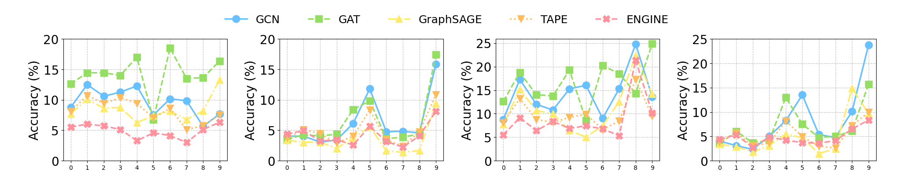

# 折线图 - 3

## 使用场景

反应多种方法在不同条件下的效果变化趋势，多用于鲁棒性相关的实验，对比不同方法的变化趋势。

## 效果预览

1. 坐标轴含义
    - x轴代表不同的质量退化场景。
    - y轴代表节点分类准确率。
2. 线条/颜色含义
    - 不同的颜色和线形代表不同的方法。
    - 在每个数据点添加不同的图案也用于区分不同方法，同时增加美观程度。
3. 图片预览



## 代码
```python
import matplotlib.pyplot as plt
import numpy as np
import matplotlib.gridspec as gridspec
import matplotlib.patches as mpatches

fig = plt.figure(figsize=(28, 4.5))
gs = gridspec.GridSpec(1, 4, width_ratios=[1, 1, 1, 1])
gs.update(left=0.07, right=0.97, top=0.8, bottom=0.18, wspace=0.32)

ax1 = fig.add_subplot(gs[0])  # First subplot (wider)
ax2 = fig.add_subplot(gs[1])
ax3 = fig.add_subplot(gs[2])
ax4 = fig.add_subplot(gs[3])

# data
gcn1 = [8.78, 12.5, 10.59, 11.27, 12.28, 7.53, 10.15, 9.87, 5.65, 7.68]
gat1 = [12.62, 14.45, 14.45, 14.02, 17.03, 6.77, 18.52, 13.51, 13.66, 16.37]
graphsage1 = [7.69, 10.1, 8.65, 8.74, 6.25, 7.42, 8.16, 6.78, 8.19, 13.3]
tape1 = [8.11, 10.72, 9.41, 10.35, 9.44, 7.02, 8.61, 5.12, 5.75, 7.54]
engine1 = [5.52, 6.02, 5.71, 5.13, 3.29, 4.57, 4.13, 2.99, 5.13, 6.32]

x_pos = np.arange(10)

ax1.plot(x_pos, gcn1, marker='o', markersize=12, linestyle='-', linewidth=2.5, label='GCN', color='#69C0FF')
ax1.plot(x_pos, gat1, marker='s', markersize=12, linestyle='--', linewidth=2.5, label='GAT', color='#95DE64')
ax1.plot(x_pos, graphsage1, marker='^', markersize=12, linestyle='-.', linewidth=2.5, label='GraphSAGE', color='#FFEB6B')
ax1.plot(x_pos, tape1, marker='v', markersize=12, linestyle=':', linewidth=2.5, label='TAPE', color='#FFBC5C')
ax1.plot(x_pos, engine1, marker='X', markersize=12, linestyle='--', linewidth=2.5, label='ENGINE', color='#FF929D')

ax1.set_ylabel('Accuracy (%)', fontsize=20)
ax1.set_xticks([0, 1, 2, 3, 4, 5, 6, 7, 8, 9])
ax1.tick_params(axis='y', labelsize=20)
ax1.set_yticks([0, 5, 10, 15, 20])
ax1.grid(True, linestyle='--', alpha=0.8)

# data
gcn2 = [4.04, 4.02, 3.07, 3.38, 6.13, 11.81, 4.77, 4.83, 4.57, 15.87]
gat2 = [3.48, 4.27, 4.06, 4.36, 8.42, 9.83, 3.63, 3.85, 4.4, 17.44]
graphsage2 = [3.37, 3.05, 3.03, 2.04, 3.7, 5.59, 1.62, 1.38, 1.67, 9.42]
tape2 = [3.74, 5.11, 4.43, 2.91, 4.02, 8.33, 3.46, 2.35, 4.77, 10.85]
engine2 = [4.37, 4.95, 3.21, 3.45, 2.57, 5.66, 3.15, 2.23, 4.07, 8.13]

ax2.plot(x_pos, gcn2, marker='o', markersize=12, linestyle='-', linewidth=2.5, label='GCN', color='#69C0FF')
ax2.plot(x_pos, gat2, marker='s', markersize=12, linestyle='--', linewidth=2.5, label='GAT', color='#95DE64')
ax2.plot(x_pos, graphsage2, marker='^', markersize=12, linestyle='-.', linewidth=2.5, label='GraphSAGE', color='#FFEB6B')
ax2.plot(x_pos, tape2, marker='v', markersize=12, linestyle=':', linewidth=2.5, label='TAPE', color='#FFBC5C')
ax2.plot(x_pos, engine2, marker='X', markersize=12, linestyle='--', linewidth=2.5, label='ENGINE', color='#FF929D')

ax2.set_ylabel('Accuracy (%)', fontsize=20)
ax2.set_xticks([0, 1, 2, 3, 4, 5, 6, 7, 8, 9])
ax2.tick_params(axis='y', labelsize=20)
ax2.set_yticks([0, 5, 10, 15, 20])
ax2.grid(True, linestyle='--', alpha=0.8)

# data
gcn3 = [8.78, 17.28, 11.98, 10.77, 15.27, 16.04, 8.99, 15.29, 24.81, 13.52]
gat3 = [12.62, 18.75, 14.03, 13.76, 19.29, 8.54, 20.23, 18.53, 14.34, 24.89]
graphsage3 = [7.69, 15.14, 10.66, 10.0, 6.41, 5.04, 7.41, 12.57, 22.42, 14.17]
tape3 = [8.11, 13.21, 8.77, 8.15, 9.22, 9.87, 6.64, 8.43, 17.29, 9.44]
engine3 = [5.52, 9.13, 6.41, 8.33, 6.87, 7.42, 6.75, 5.33, 21.36, 10.09]

ax3.plot(x_pos, gcn3, marker='o', markersize=12, linestyle='-', linewidth=2.5, label='GCN', color='#69C0FF')
ax3.plot(x_pos, gat3, marker='s', markersize=12, linestyle='--', linewidth=2.5, label='GAT', color='#95DE64')
ax3.plot(x_pos, graphsage3, marker='^', markersize=12, linestyle='-.', linewidth=2.5, label='GraphSAGE', color='#FFEB6B')
ax3.plot(x_pos, tape3, marker='v', markersize=12, linestyle=':', linewidth=2.5, label='TAPE', color='#FFBC5C')
ax3.plot(x_pos, engine3, marker='X', markersize=12, linestyle='--', linewidth=2.5, label='ENGINE', color='#FF929D')

ax3.set_ylabel('Accuracy (%)', fontsize=20)
ax3.set_xticks([0, 1, 2, 3, 4, 5, 6, 7, 8, 9])
ax3.tick_params(axis='y', labelsize=20)
ax3.set_yticks([0, 5, 10, 15, 20, 25])
ax3.grid(True, linestyle='--', alpha=0.8)

gcn4 = [4.04, 3.09, 2.32, 5.01, 8.24, 13.52, 5.35, 4.77, 10.1, 23.76]
gat4 = [3.48, 6.05, 3.69, 4.22, 12.97, 7.52, 4.75, 5.0, 6.11, 15.69]
graphsage4 = [3.37, 2.9, 1.79, 3.08, 5.52, 4.71, 1.47, 2.47, 14.87, 9.7]
tape4 = [3.74, 5.64, 3.15, 3.56, 8.21, 4.92, 2.99, 2.6, 7.21, 9.92]
engine4 = [4.37, 5.32, 2.74, 4.86, 4.22, 3.71, 3.62, 4.1, 6.52, 8.35]

ax4.plot(x_pos, gcn4, marker='o', markersize=12, linestyle='-', linewidth=2.5, label='GCN', color='#69C0FF')
ax4.plot(x_pos, gat4, marker='s', markersize=12, linestyle='--', linewidth=2.5, label='GAT', color='#95DE64')
ax4.plot(x_pos, graphsage4, marker='^', markersize=12, linestyle='-.', linewidth=2.5, label='GraphSAGE', color='#FFEB6B')
ax4.plot(x_pos, tape4, marker='v', markersize=12, linestyle=':', linewidth=2.5, label='TAPE', color='#FFBC5C')
ax4.plot(x_pos, engine4, marker='X', markersize=12, linestyle='--', linewidth=2.5, label='ENGINE', color='#FF929D')

ax4.set_ylabel('Accuracy (%)', fontsize=20)
ax4.set_xticks([0, 1, 2, 3, 4, 5, 6, 7, 8, 9])
ax4.tick_params(axis='y', labelsize=20)
ax4.set_yticks([0, 5, 10, 15, 20, 25])
ax4.grid(True, linestyle='--', alpha=0.8)

plt.legend(fontsize=18, ncol=5, loc=(-3.0, 1.08), frameon=False, columnspacing=2.5)

plt.show()

```