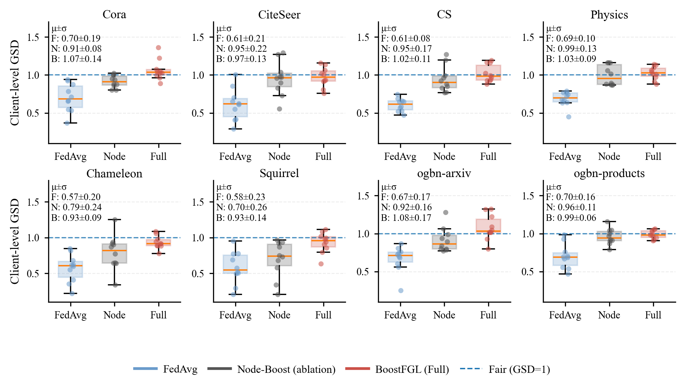

# 箱线图 - ClientGSD_plot


## 使用场景

对比不同方法在各数据集上的 Client-level GSD 分布（中位数、四分位区间与离群点），同时用抖动散点展示每个客户端的具体取值，适合做方法公平性/稳定性对比。

## 效果预览

1. 坐标轴含义
    - x 轴为方法类别（FedAvg / NodeBoost / Full）。
    - y 轴为 Client-level GSD（越接近 1 通常表示越“公平/均衡”，具体含义以你的定义为准）。
2. 图形元素含义
    - 箱线图展示分布：中位数、上下四分位与离群点。
    - 叠加的抖动散点展示每个客户端的具体 GSD 值。
    - 图中常配有 y=1 的参考虚线。
    - 2×4 子图分别对应 8 个数据集。
3. 图片预览



## 代码

```python
import os
import numpy as np
import matplotlib.pyplot as plt
from matplotlib.lines import Line2D

# =========================
# ICML-ish plot style
# =========================
plt.rcParams.update({
    "font.family": "serif",
    "font.serif": ["Times New Roman", "Times", "DejaVu Serif"],
    "mathtext.fontset": "stix",
    "pdf.fonttype": 42,
    "ps.fonttype": 42,

    "axes.linewidth": 0.8,
    "axes.labelsize": 9,
    "xtick.labelsize": 7.5,
    "ytick.labelsize": 7.5,
    "xtick.major.size": 3,
    "ytick.major.size": 3,
    "xtick.major.width": 0.8,
    "ytick.major.width": 0.8,

    "legend.fontsize": 8,
    "legend.frameon": False,

    "savefig.bbox": "tight",
    "savefig.dpi": 300,
})

# 你指定的两种主色
C_FED  = "#6A9BCB"  # FedAvg
C_FULL = "#CB5148"  # BoostFGL full
C_NODE = "#555555"  # Node-Boost ablation (中性灰，审稿人常见风格)

DATASETS = ["Cora", "CiteSeer", "CS", "Physics",
            "Chameleon", "Squirrel", "ogbn-arxiv", "ogbn-products"]

SAVE_DIR = r"D:\BoostFGL"
os.makedirs(SAVE_DIR, exist_ok=True)


def _clip(x, lo=0.05, hi=3.0):
    return np.clip(x, lo, hi)

def make_demo_client_gsd(dataset, method, n_clients=10, rng=None):
    if rng is None:
        rng = np.random.default_rng(0)

    hetero = dataset in ["Chameleon", "Squirrel"]
    large  = dataset in ["ogbn-arxiv", "ogbn-products"]

    if method == "FedAvg":
        mu = 0.72 if not hetero else 0.58
        sd = 0.18 if not large else 0.13
        left_tail_prob = 0.25 if hetero else 0.15
        left_shift = 0.35 if hetero else 0.25
    elif method == "NodeBoost":
        mu = 0.92 if not hetero else 0.84
        sd = 0.14 if not large else 0.10
        left_tail_prob = 0.18 if hetero else 0.10
        left_shift = 0.22 if hetero else 0.16
    else:  # "Full"
        mu = 0.98 if not hetero else 0.95
        sd = 0.10 if not large else 0.08
        left_tail_prob = 0.12 if hetero else 0.06
        left_shift = 0.16 if hetero else 0.10

    xs = []
    for _ in range(n_clients):
        if rng.random() < left_tail_prob:
            x = rng.normal(mu - left_shift, sd)
        else:
            x = rng.normal(mu, sd)
        if rng.random() < (0.06 if method != "FedAvg" else 0.04):
            x += rng.normal(0.35, 0.10)
        xs.append(x)

    return _clip(np.array(xs), lo=0.05, hi=2.5)


# =========================
# Plot helpers
# =========================
def summarize(arr):
    arr = np.asarray(arr)
    return float(arr.mean()), float(arr.std(ddof=1)) if arr.size > 1 else 0.0, int(arr.size)

def jitter_scatter(ax, x_center, ys, color, seed=0):
    rng = np.random.default_rng(seed)
    xs = x_center + rng.uniform(-0.08, 0.08, size=len(ys))
    ax.scatter(xs, ys, s=14, color=color, alpha=0.55, linewidths=0.0, zorder=3)

def plot_supp2_client_gsd(demo=True):
    rng = np.random.default_rng(42)

    fig, axes = plt.subplots(2, 4, figsize=(6.9, 3.8))
    axes = axes.ravel()

    # 每个 dataset 画三组 box
    methods = ["FedAvg", "NodeBoost", "Full"]
    colors  = [C_FED, C_NODE, C_FULL]
    labels  = ["FedAvg", "Node-Boost (ablation)", "BoostFGL (Full)"]

    for i, ds in enumerate(DATASETS):
        ax = axes[i]

        gsd_per_client = {}

        if demo:
            for m in methods:
                gsd_per_client[m] = make_demo_client_gsd(ds, m if m != "Full" else "Full",
                                                         n_clients=10, rng=rng)
        else:
            raise NotImplementedError(
                "把 demo=False 时的数据读取逻辑接上你的真实 gsd_per_client 列表即可。"
            )

        data_groups = [gsd_per_client["FedAvg"], gsd_per_client["NodeBoost"], gsd_per_client["Full"]]

        # boxplot
        bp = ax.boxplot(
            data_groups,
            positions=[1, 2, 3],
            widths=0.55,
            patch_artist=True,
            showfliers=False,
            medianprops=dict(linewidth=1.0),
            whiskerprops=dict(linewidth=0.9),
            capprops=dict(linewidth=0.9),
        )
        for patch, c in zip(bp["boxes"], colors):
            patch.set_facecolor(c)
            patch.set_alpha(0.25)
            patch.set_edgecolor(c)
            patch.set_linewidth(1.0)

        # jitter points
        for j, (m, c) in enumerate(zip(methods, colors), start=1):
            jitter_scatter(ax, j, gsd_per_client[m], c, seed=1000 + i * 10 + j)

        # fair reference line
        ax.axhline(1.0, linestyle="--", linewidth=0.9, alpha=0.8)

        ax.set_title(ds, fontsize=9, pad=2.5)
        ax.set_xticks([1, 2, 3])
        ax.set_xticklabels(["FedAvg", "Node", "Full"], rotation=0)

        # y-limits：让对比更清晰；hetero 稍放宽
        if ds in ["Chameleon", "Squirrel"]:
            ax.set_ylim(0.1, 1.8)
        else:
            ax.set_ylim(0.1, 1.7)

        ax.grid(True, axis="y", linestyle="--", linewidth=0.6, alpha=0.25)
        ax.spines["top"].set_visible(False)
        ax.spines["right"].set_visible(False)

        if i % 4 == 0:
            ax.set_ylabel("Client-level GSD")

        # 写统计信息（审稿人爱看）
        mu_f, sd_f, _ = summarize(gsd_per_client["FedAvg"])
        mu_n, sd_n, _ = summarize(gsd_per_client["NodeBoost"])
        mu_b, sd_b, _ = summarize(gsd_per_client["Full"])
        txt = (
            f"μ±σ\n"
            f"F: {mu_f:.2f}±{sd_f:.2f}\n"
            f"N: {mu_n:.2f}±{sd_n:.2f}\n"
            f"B: {mu_b:.2f}±{sd_b:.2f}"
        )
        ax.text(0.02, 0.98, txt, transform=ax.transAxes,
                va="top", ha="left", fontsize=7.0)

    # Legend (global)
    handles = [
        Line2D([0],[0], color=C_FED,  lw=2.0, label=labels[0]),
        Line2D([0],[0], color=C_NODE, lw=2.0, label=labels[1]),
        Line2D([0],[0], color=C_FULL, lw=2.0, label=labels[2]),
        Line2D([0],[0], 
            #    color="gray", 
               lw=1.0, linestyle="--", label="Fair (GSD=1)"),
    ]
    fig.legend(handles=handles, loc="lower center", ncol=4,
               columnspacing=1.0, handlelength=2.0, handletextpad=0.6,
               bbox_to_anchor=(0.5, -0.02))

    fig.tight_layout(pad=0.6, w_pad=0.8, h_pad=0.9)
    plt.subplots_adjust(bottom=0.20)

    # out_pdf = os.path.join(SAVE_DIR, "ClientGSD.pdf")
    # out_png = os.path.join(SAVE_DIR, "ClientGSD.png")
    # plt.savefig(out_pdf)
    # plt.savefig(out_png)
    plt.show()

    print("[Saved]", out_pdf)
    print("[Saved]", out_png)


if __name__ == "__main__":
    plot_supp2_client_gsd(demo=True)
```
