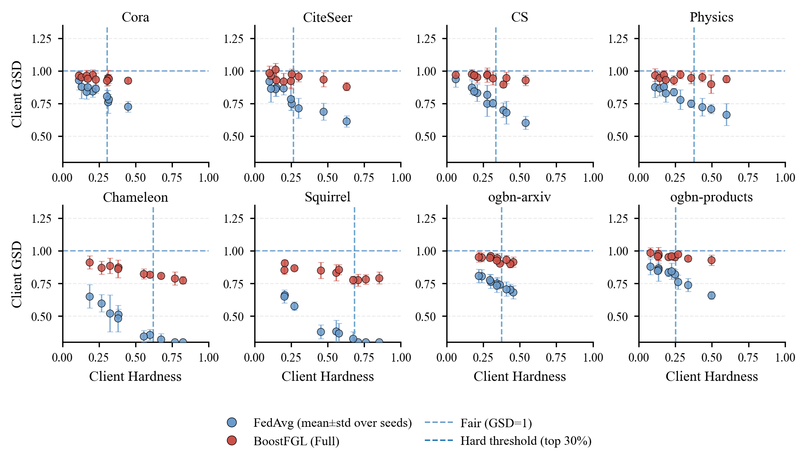

# 散点图 - GSD_plot


## 使用场景

分析“客户端难度（Hardness）”与“客户端 GSD”之间的关系，并在同一张图中对比两种设置（例如 FedAvg vs Boost/Full）。适合在补充材料里解释：难客户端是否更不公平/更难对齐。

## 效果预览

1. 坐标轴含义
    - x 轴为 Client Hardness（客户端难度）。
    - y 轴为 Client GSD。
2. 图形元素含义
    - 每个点代表一个客户端；误差棒表示跨随机种子（或重复实验）的均值 ± 标准差。
    - 不同颜色代表不同方法/设置（如 FedAvg 与 Boost）。
    - 图中常包含 y=1 的参考虚线，以及 Hardness 的阈值竖线（top-r% 作为 hard clients）。
    - 2×4 子图分别对应 8 个数据集。
3. 图片预览



## 代码

```python
import os
import numpy as np
import matplotlib.pyplot as plt
from matplotlib.lines import Line2D

# =========================
# ICML-ish style (single-column)
# =========================
plt.rcParams.update({
    "font.family": "serif",
    "font.serif": ["Times New Roman", "Times", "DejaVu Serif"],
    "mathtext.fontset": "stix",
    "pdf.fonttype": 42,
    "ps.fonttype": 42,
    "axes.linewidth": 0.8,
    "axes.labelsize": 9,
    "xtick.labelsize": 7.5,
    "ytick.labelsize": 7.5,
    "xtick.major.size": 3,
    "ytick.major.size": 3,
    "xtick.major.width": 0.8,
    "ytick.major.width": 0.8,
    "legend.fontsize": 8,
    "legend.frameon": False,
    "savefig.bbox": "tight",
    "savefig.dpi": 300,
})

# =========================
# Config
# =========================
SAVE_DIR = r"D:\BoostFGL"
os.makedirs(SAVE_DIR, exist_ok=True)

DATASETS = ["Cora", "CiteSeer", "CS", "Physics",
            "Chameleon", "Squirrel", "ogbn-arxiv", "ogbn-products"]

C_FED  = "#6A9BCB"
C_BST  = "#CB5148"

N_CLIENTS = 10
N_SEEDS   = 5       # 增强版关键：多 seed
R_HARD    = 0.30    # hard clients top 30%

def spearman_rho(x, y):
    x = np.asarray(x, dtype=float)
    y = np.asarray(y, dtype=float)
    mask = np.isfinite(x) & np.isfinite(y)
    x = x[mask]; y = y[mask]
    if x.size < 3:
        return np.nan

    def rankdata(a):
        a = np.asarray(a)
        order = np.argsort(a)
        ranks = np.empty_like(order, dtype=float)
        ranks[order] = np.arange(1, len(a) + 1, dtype=float)
        uniq, inv, counts = np.unique(a, return_inverse=True, return_counts=True)
        for i, c in enumerate(counts):
            if c > 1:
                idx = np.where(inv == i)[0]
                ranks[idx] = ranks[idx].mean()
        return ranks

    rx = rankdata(x)
    ry = rankdata(y)
    rx -= rx.mean()
    ry -= ry.mean()
    denom = np.sqrt((rx**2).sum()) * np.sqrt((ry**2).sum())
    if denom < 1e-12:
        return np.nan
    return float((rx * ry).sum() / denom)

def gen_demo_dataset(ds, n_clients=N_CLIENTS, n_seeds=N_SEEDS, seed=0):
    rng = np.random.default_rng(seed)

    hetero = ds in ["Chameleon", "Squirrel"]
    large  = ds in ["ogbn-arxiv", "ogbn-products"]

    # hardness distribution (fixed per client)
    if hetero:
        h = rng.beta(2.0, 2.0, size=n_clients) * 0.80 + 0.10  # ~[0.1, 0.9]
    else:
        h = rng.beta(1.7, 3.1, size=n_clients) * 0.70 + 0.05  # ~[0.05, 0.75]
    h = np.clip(h, 0.0, 1.0)

    # parameters controlling "reviewer-believable" behavior
    # FedAvg baseline
    base_f  = 0.92 if not hetero else 0.78
    slope_f = 0.50 if not hetero else 0.75   # stronger negative trend for hetero
    sd_seed_f = 0.06 if not large else 0.045  # across-seed variability

    # BoostFGL
    base_b  = 0.99 if not hetero else 0.94
    slope_b = 0.14 if not hetero else 0.20    # weaker negative trend
    sd_seed_b = 0.04 if not large else 0.03   # smaller variability

    # generate per-seed GSD for each client
    gsd_f = np.zeros((n_clients, n_seeds))
    gsd_b = np.zeros((n_clients, n_seeds))

    for s in range(n_seeds):
        # small seed drift (shared)
        drift_f = rng.normal(0.0, 0.02)
        drift_b = rng.normal(0.0, 0.015)

        # per client noise each seed
        noise_f = rng.normal(0.0, sd_seed_f, size=n_clients)
        noise_b = rng.normal(0.0, sd_seed_b, size=n_clients)

        gsd_f[:, s] = base_f - slope_f * h + drift_f + noise_f
        gsd_b[:, s] = base_b - slope_b * h + drift_b + noise_b

        # occasional outliers (realistic)
        if hetero and s == 0:
            idx = rng.choice(n_clients, size=max(1, n_clients // 10), replace=False)
            gsd_f[idx, s] -= rng.uniform(0.10, 0.22, size=idx.size)
        if rng.random() < 0.4:
            idx = rng.choice(n_clients, size=max(1, n_clients // 8), replace=False)
            gsd_b[idx, s] += rng.uniform(0.02, 0.08, size=idx.size)

    # clip to plausible range
    gsd_f = np.clip(gsd_f, 0.30, 1.25)
    gsd_b = np.clip(gsd_b, 0.45, 1.30)
    return h, gsd_f, gsd_b

def mean_std(arr_2d):
    mu = arr_2d.mean(axis=1)
    sd = arr_2d.std(axis=1, ddof=1)
    return mu, sd

def group_stats(mu, sd, hard_mask):
    # compute mean±std over clients in group (using client means)
    g_mu = float(mu[hard_mask].mean()) if hard_mask.any() else np.nan
    g_sd = float(mu[hard_mask].std(ddof=1)) if hard_mask.sum() > 1 else 0.0
    return g_mu, g_sd

# =========================
# Plot: Enhanced 2x4
# =========================
def plot_enhanced_demo():
    fig, axes = plt.subplots(2, 4, figsize=(6.9, 3.9))
    axes = axes.ravel()

    for i, ds in enumerate(DATASETS):
        ax = axes[i]

        h, gsd_f_2d, gsd_b_2d = gen_demo_dataset(ds, seed=100 + i)
        mu_f, sd_f = mean_std(gsd_f_2d)
        mu_b, sd_b = mean_std(gsd_b_2d)

        # hard threshold (top r%)
        thr = np.quantile(h, 1.0 - R_HARD)
        hard = h >= thr
        easy = ~hard

        # reference lines
        ax.axhline(1.0, linestyle="--", linewidth=0.9, alpha=0.85, color=C_FED)
        ax.axvline(thr, linestyle="--", linewidth=0.9, alpha=0.65, 
                #    color="gray"
                   )

        # errorbar scatter (mean±std across seeds)
        ax.errorbar(h, mu_f, yerr=sd_f, fmt='o', ms=4.6,
                    color=C_FED, ecolor=C_FED, elinewidth=0.8, capsize=1.8,
                    alpha=0.85, markeredgecolor="black", markeredgewidth=0.35, zorder=3)
        ax.errorbar(h, mu_b, yerr=sd_b, fmt='o', ms=4.6,
                    color=C_BST, ecolor=C_BST, elinewidth=0.8, capsize=1.8,
                    alpha=0.85, markeredgecolor="black", markeredgewidth=0.35, zorder=3)

        # correlation on client means (more stable than raw per-seed points)
        rho_f = spearman_rho(h, mu_f)
        rho_b = spearman_rho(h, mu_b)

        # group summaries (hard/easy)
        f_h_mu, f_h_sd = group_stats(mu_f, sd_f, hard)
        b_h_mu, b_h_sd = group_stats(mu_b, sd_b, hard)
        f_e_mu, f_e_sd = group_stats(mu_f, sd_f, easy)
        b_e_mu, b_e_sd = group_stats(mu_b, sd_b, easy)

        delta_h = (b_h_mu - f_h_mu) if np.isfinite(f_h_mu) and np.isfinite(b_h_mu) else np.nan

        ax.set_title(ds, fontsize=9, pad=2.5)
        ax.grid(True, axis="y", linestyle="--", linewidth=0.6, alpha=0.25)
        ax.spines["top"].set_visible(False)
        ax.spines["right"].set_visible(False)

        ax.set_xlim(0.0, 1.0)
        ax.set_ylim(0.30, 1.35)

        if i % 4 == 0:
            ax.set_ylabel("Client GSD")
        if i // 4 == 1:
            ax.set_xlabel("Client Hardness")

        # annotation (reviewer-friendly)
        txt = (
            # f"n={len(h)}, seeds={N_SEEDS}\n"
            # f"ρ(Fed)={rho_f:+.2f}, ρ(Boost)={rho_b:+.2f}\n"
            # f"Hard(top{int(R_HARD*100)}%):  F={f_h_mu:.2f}±{f_h_sd:.2f},  B={b_h_mu:.2f}±{b_h_sd:.2f}\n"
            # f"Easy:          F={f_e_mu:.2f}±{f_e_sd:.2f},  B={b_e_mu:.2f}±{b_e_sd:.2f}\n"
            # f"ΔHard(B−F)={delta_h:+.2f}"
        )
        # ax.text(0.02, 0.98, txt, transform=ax.transAxes,
        #         va="top", ha="left", fontsize=6.6)

    # global legend
    handles = [
        Line2D([0],[0], marker='o', color='none', markerfacecolor=C_FED,
               markeredgecolor='black', markeredgewidth=0.35, markersize=5.8, label="FedAvg (mean±std over seeds)"),
        Line2D([0],[0], marker='o', color='none', markerfacecolor=C_BST,
               markeredgecolor='black', markeredgewidth=0.35, markersize=5.8, label="BoostFGL (Full)"),
        Line2D([0],[0], color=C_FED, lw=0.9, linestyle="--", label="Fair (GSD=1)"),
        Line2D([0],[0], 
            #    color="gray", 
               lw=0.9, linestyle="--", label=f"Hard threshold (top {int(R_HARD*100)}%)"),
    ]
    fig.legend(handles=handles, loc="lower center", ncol=2,
               columnspacing=1.0, handlelength=2.2, handletextpad=0.6,
               bbox_to_anchor=(0.5, -0.02))

    fig.tight_layout(pad=0.6, w_pad=0.8, h_pad=0.9)
    plt.subplots_adjust(bottom=0.24)

    # out_pdf = os.path.join(SAVE_DIR, "GSD_vs_Hardness.pdf")
    # out_png = os.path.join(SAVE_DIR, "GSD_vs_Hardness.png")
    # plt.savefig(out_pdf)
    # plt.savefig(out_png)
    plt.show()

    print("[Saved]", out_pdf)
    print("[Saved]", out_png)


if __name__ == "__main__":
    plot_enhanced_demo()
```
