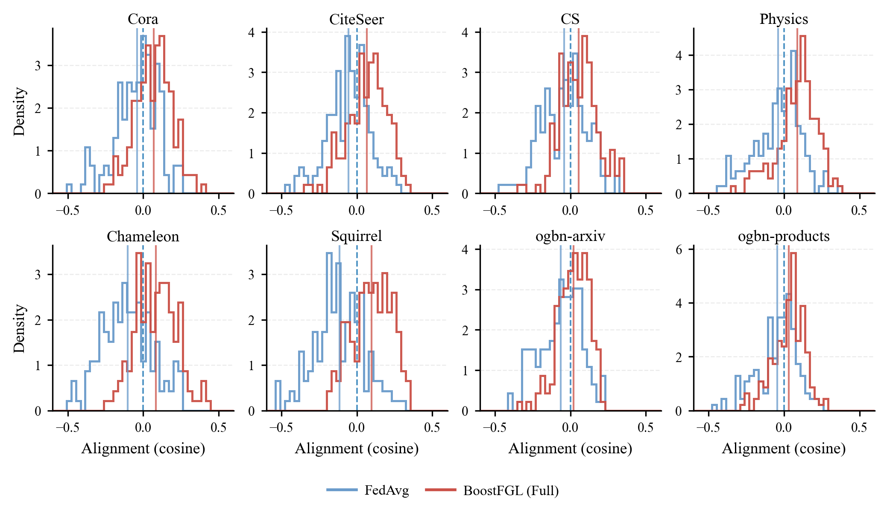

# 直方图 - alignment_plot


## 使用场景

对比两种设置（如 FedAvg vs Full/Boost）下，alignment（余弦相似度）指标在各数据集的分布差异，常用于分析表示对齐程度、正负比例与均值变化。

## 效果预览

1. 坐标轴含义
    - x 轴为 Alignment (cosine)。
    - y 轴为 Density（概率密度）。
2. 图形元素含义
    - step-hist 叠加两条分布曲线，用于对比不同设置的 alignment 分布。
    - x=0 竖线作为正负分界；脚本中也绘制了均值位置的竖线。
    - 2×4 子图分别对应 8 个数据集。
3. 图片预览



## 代码

```python
import os
import numpy as np
import matplotlib.pyplot as plt
from matplotlib.lines import Line2D

# =========================================================
# ICML-ish style (single-column friendly)
# =========================================================
plt.rcParams.update({
    "font.family": "serif",
    "font.serif": ["Times New Roman", "Times", "DejaVu Serif"],
    "mathtext.fontset": "stix",
    "pdf.fonttype": 42,
    "ps.fonttype": 42,

    "axes.linewidth": 0.8,
    "axes.labelsize": 9,
    "xtick.labelsize": 7.5,
    "ytick.labelsize": 7.5,
    "xtick.major.size": 3,
    "ytick.major.size": 3,
    "xtick.major.width": 0.8,
    "ytick.major.width": 0.8,

    "legend.fontsize": 8,
    "legend.frameon": False,

    "savefig.bbox": "tight",
    "savefig.dpi": 300,
})

C_FED  = "#6A9BCB"
C_FULL = "#CB5148"

DATASETS = ["Cora", "CiteSeer", "CS", "Physics",
            "Chameleon", "Squirrel", "ogbn-arxiv", "ogbn-products"]

SAVE_DIR = r"D:\BoostFGL"
os.makedirs(SAVE_DIR, exist_ok=True)


def _clip(x, lo=-1.0, hi=1.0):
    return np.clip(x, lo, hi)

def synth_alignment_samples(dataset, method,
                            n_clients=10, rounds=(10, 20, 30, 40, 50), n_seeds=3,
                            per_client_noise=0.06, per_round_noise=0.03, base_noise=0.05,
                            rng=None):
    if rng is None:
        rng = np.random.default_rng(0)

    # dataset difficulty: heterophilous ones have lower FedAvg alignment and bigger room to improve
    hetero = dataset in ["Chameleon", "Squirrel"]
    large = dataset in ["ogbn-arxiv", "ogbn-products"]

    if method == "FedAvg":
        mu = -0.03 if hetero else (0.00 if not large else -0.01)
        sigma = 0.12 if hetero else (0.10 if not large else 0.07)
        # add some heavier left tail for hetero (more conflicting updates)
        mix_left = 0.35 if hetero else 0.18
    else:  # BoostFGL
        mu = 0.11 if hetero else (0.07 if not large else 0.05)
        sigma = 0.10 if hetero else (0.09 if not large else 0.06)
        mix_left = 0.18 if hetero else 0.10  # still some negative, but less

    rounds = list(rounds)
    samples = []
    for s in range(n_seeds):
        # seed-level drift (small)
        seed_drift = rng.normal(0.0, 0.015)
        for r in rounds:
            # mild improvement over training (optional)
            round_gain = (r - min(rounds)) / (max(rounds) - min(rounds) + 1e-12) * (0.03 if method != "FedAvg" else 0.01)
            for c in range(n_clients):
                client_drift = rng.normal(0.0, per_client_noise)

                # mixture: main component around mu, and a left-tail component (conflicting clients)
                if rng.random() < mix_left:
                    x = rng.normal(mu - 0.22, sigma * 0.9)  # left tail
                else:
                    x = rng.normal(mu, sigma)

                x = x + seed_drift + round_gain + rng.normal(0.0, per_round_noise) + rng.normal(0.0, base_noise)
                samples.append(x)

    return _clip(np.array(samples), -1.0, 1.0)


# =========================================================
# 2) Plotting: 2x4 step-hist + summary stats (mean±std, pos%)
# =========================================================
def summarize(x):
    x = np.asarray(x)
    mu = float(x.mean())
    sd = float(x.std(ddof=1)) if x.size > 1 else 0.0
    pos = float((x > 0).mean() * 100.0)
    return mu, sd, pos, int(x.size)

def plot_alignment_demo():
    rng = np.random.default_rng(42)

    fig, axes = plt.subplots(2, 4, figsize=(6.9, 3.9))
    axes = axes.ravel()

    # bins: consistent across subplots makes comparison easier
    bins = np.linspace(-0.6, 0.6, 40)

    for i, ds in enumerate(DATASETS):
        ax = axes[i]

        fed = synth_alignment_samples(ds, "FedAvg", rng=rng)
        full = synth_alignment_samples(ds, "BoostFGL", rng=rng)

        mu_f, sd_f, pos_f, n_f = summarize(fed)
        mu_b, sd_b, pos_b, n_b = summarize(full)

        # 0-line: important
        ax.axvline(0.0, linestyle="--", linewidth=0.9, alpha=0.8)

        # step-hist density
        ax.hist(fed, bins=bins, density=True, histtype="step",
                linewidth=1.2, color=C_FED, alpha=0.95)
        ax.hist(full, bins=bins, density=True, histtype="step",
                linewidth=1.2, color=C_FULL, alpha=0.95)

        # optional mean lines (subtle)
        ax.axvline(mu_f, color=C_FED, linewidth=1.0, alpha=0.75)
        ax.axvline(mu_b, color=C_FULL, linewidth=1.0, alpha=0.75)

        ax.set_title(ds, fontsize=9, pad=2.5)
        ax.set_xlim(bins.min(), bins.max())
        ax.grid(True, axis="y", linestyle="--", linewidth=0.6, alpha=0.25)
        ax.spines["top"].set_visible(False)
        ax.spines["right"].set_visible(False)

        if i % 4 == 0:
            ax.set_ylabel("Density")
        if i // 4 == 1:
            ax.set_xlabel("Alignment (cosine)")

        # annotate in each subplot (reviewer-friendly)
        # txt = (
        #     f"n={n_f}\n"
        #     f"FedAvg:  μ={mu_f:+.3f}, σ={sd_f:.3f}, pos={pos_f:.1f}%\n"
        #     f"BoostFGL: μ={mu_b:+.3f}, σ={sd_b:.3f}, pos={pos_b:.1f}%"
        # )
        # ax.text(0.02, 0.98, txt, transform=ax.transAxes,
        #         va="top", ha="left", fontsize=7.0)

    handles = [
        Line2D([0],[0], color=C_FED,  lw=1.6, label="FedAvg"),
        Line2D([0],[0], color=C_FULL, lw=1.6, label="BoostFGL (Full)"),
        # Line2D([0],[0], color="gray", lw=0.9, linestyle="--", label="0-alignment"),
    ]
    fig.legend(handles=handles, loc="lower center", ncol=3,
               columnspacing=1.2, handlelength=2.0, handletextpad=0.6,
               bbox_to_anchor=(0.5, -0.02))

    fig.tight_layout(pad=0.6, w_pad=0.8, h_pad=0.9)
    plt.subplots_adjust(bottom=0.18)

    out_pdf = os.path.join(SAVE_DIR, "alignment.pdf")
    out_png = os.path.join(SAVE_DIR, "alignment.png")
    plt.savefig(out_pdf)
    plt.savefig(out_png)
    plt.show()

    print("[Saved]", out_pdf)
    print("[Saved]", out_png)


if __name__ == "__main__":
    plot_alignment_demo()
```
