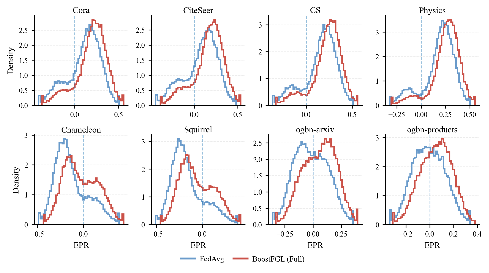

# 直方图 - epr_plot


## 使用场景

对比两种方法（例如 FedAvg 与 BoostFGL）在各数据集上的 EPR 指标分布，用于观察整体偏移、方差变化以及负值（有害）比例。

## 效果预览

1. 坐标轴含义
    - x 轴为 EPR。
    - y 轴为 Density（概率密度，若 density=True）。
2. 图形元素含义
    - 使用 step-hist（轮廓直方图）叠加两种方法的分布，便于对比。
    - x=0 的竖线作为参考：左侧为负值区域（脚本注释中标为 harmful）。
    - 2×4 子图分别对应 8 个数据集。
3. 图片预览



## 代码

```python
import os
import glob
import json
import numpy as np
import matplotlib.pyplot as plt
from matplotlib.lines import Line2D

# =========================================================
# 0) CONFIG
# =========================================================
RESULT_DIR = r"D:\BoostFGL\results\section4_diagnostics"
DATASETS = ['Cora', 'CiteSeer', 'CS', 'Physics', 'Chameleon', 'Squirrel', 'ogbn-arxiv', 'ogbn-products']

ROUND_SEL = 40          # 建议固定一个 round（例如 40），与你图里一致；也可写 "last"
BINS = 55
MAX_POINTS = 50000      # 每个数据集每个方法最多抽样多少点（太大画图慢）
DENSITY = True

MODE = "synthetic"      

# =========================================================
# ICML-ish style
# =========================================================
plt.rcParams.update({
    "font.family": "serif",
    "font.serif": ["Times New Roman", "Times", "DejaVu Serif"],
    "mathtext.fontset": "stix",
    "pdf.fonttype": 42,
    "ps.fonttype": 42,

    "axes.linewidth": 0.8,
    "axes.labelsize": 9,
    "xtick.labelsize": 7.5,
    "ytick.labelsize": 7.5,
    "xtick.major.size": 3,
    "ytick.major.size": 3,
    "xtick.major.width": 0.8,
    "ytick.major.width": 0.8,

    "legend.fontsize": 8,
    "legend.frameon": False,

    "savefig.bbox": "tight",
    "savefig.dpi": 300,
})

STYLE = {
    "FedAvg":   dict(color="#6A9BCB", linewidth=1.4),
    "BoostFGL": dict(color="#CB5148", linewidth=1.4),
}

# =========================================================
# 1) REAL-JSON LOADER (diagnostics.epr[*].epr_values)
# =========================================================
def load_json(path):
    with open(path, "r", encoding="utf-8") as f:
        return json.load(f)

def pick_round_epr_values(diag_epr_list, round_sel=40):
    valid = []
    for item in diag_epr_list:
        r = item.get("round", None)
        vals = item.get("epr_values", None)
        if isinstance(r, (int, float)) and isinstance(vals, list) and len(vals) > 0:
            valid.append((int(r), vals))

    if not valid:
        raise ValueError("No valid epr entries found.")

    if round_sel == "last":
        chosen_round = max(r for r, _ in valid)
    else:
        chosen_round = int(round_sel)

    chosen_vals = None
    for r, vals in valid:
        if r == chosen_round:
            chosen_vals = vals
            break
    if chosen_vals is None:
        available = sorted({r for r, _ in valid})
        raise ValueError(f"Round {chosen_round} not found. Available: {available}")

    arr = np.asarray(chosen_vals, dtype=float)
    arr = arr[np.isfinite(arr)]
    return chosen_round, arr

def subsample(arr, max_points=40000, seed=0):
    if arr.size <= max_points:
        return arr
    rng = np.random.default_rng(seed)
    idx = rng.choice(arr.size, size=max_points, replace=False)
    return arr[idx]

def neg_ratio(arr):
    return 100.0 * float(np.mean(arr < 0)) if arr.size else np.nan

def discover_files(result_dir):
    paths = glob.glob(os.path.join(result_dir, "*.json"))
    mapping = {}  # (dataset, method) -> path
    for p in paths:
        try:
            obj = load_json(p)
        except Exception:
            continue
        dataset = obj.get("dataset", None)
        method  = obj.get("method", None) or obj.get("model", None)
        if not isinstance(dataset, str) or not isinstance(method, str):
            continue
        dataset = dataset.strip()
        method = method.strip()
        if method in ["FedAvg", "BoostFGL"]:
            mapping[(dataset, method)] = p
    return mapping

def get_real_epr(dataset, method, mapping):
    path = mapping[(dataset, method)]
    obj = load_json(path)
    diag_epr_list = obj.get("diagnostics", {}).get("epr", None)
    if not isinstance(diag_epr_list, list):
        raise ValueError(f"{path}: diagnostics.epr is missing/not list")
    r, arr = pick_round_epr_values(diag_epr_list, round_sel=ROUND_SEL)
    arr = subsample(arr, max_points=MAX_POINTS, seed=hash((dataset, method)) % 10000)
    return r, arr

def mix_epr(n, pos_mean, pos_std, neg_mean, neg_std, neg_ratio,
            tail_ratio=0.06, tail_scale=2.0, seed=0):
    rng = np.random.default_rng(seed)
    n_neg = int(round(n * neg_ratio))
    n_pos = n - n_neg

    pos = rng.normal(pos_mean, pos_std, size=n_pos)
    neg = rng.normal(neg_mean, neg_std, size=n_neg)
    arr = np.concatenate([pos, neg])
    rng.shuffle(arr)

    # add mild heavy-tail to avoid "too clean"
    n_tail = int(round(n * tail_ratio))
    if n_tail > 0:
        idx = rng.choice(n, size=n_tail, replace=False)
        arr[idx] = rng.normal(0.0, pos_std * tail_scale, size=n_tail)

    # gentle winsorize by quantiles (NOT clamp to [-1,1])
    lo, hi = np.quantile(arr, [0.005, 0.995])
    arr = np.clip(arr, lo, hi)
    return arr

SYN_SPEC = {
  'Cora': {
    'FedAvg':   dict(pos_mean=0.18, pos_std=0.12, neg_mean=-0.18, neg_std=0.10, neg_ratio=0.18),
    'BoostFGL': dict(pos_mean=0.24, pos_std=0.12, neg_mean=-0.14, neg_std=0.10, neg_ratio=0.11),
  },
  'CiteSeer': {
    'FedAvg':   dict(pos_mean=0.16, pos_std=0.12, neg_mean=-0.20, neg_std=0.11, neg_ratio=0.22),
    'BoostFGL': dict(pos_mean=0.22, pos_std=0.12, neg_mean=-0.15, neg_std=0.10, neg_ratio=0.13),
  },
  'CS': {
    'FedAvg':   dict(pos_mean=0.22, pos_std=0.11, neg_mean=-0.16, neg_std=0.09, neg_ratio=0.15),
    'BoostFGL': dict(pos_mean=0.27, pos_std=0.11, neg_mean=-0.12, neg_std=0.09, neg_ratio=0.09),
  },
  'Physics': {
    'FedAvg':   dict(pos_mean=0.24, pos_std=0.10, neg_mean=-0.14, neg_std=0.08, neg_ratio=0.12),
    'BoostFGL': dict(pos_mean=0.29, pos_std=0.10, neg_mean=-0.10, neg_std=0.08, neg_ratio=0.06),
  },
  'Chameleon': {
    'FedAvg':   dict(pos_mean=0.10, pos_std=0.12, neg_mean=-0.22, neg_std=0.10, neg_ratio=0.74),
    'BoostFGL': dict(pos_mean=0.14, pos_std=0.12, neg_mean=-0.16, neg_std=0.10, neg_ratio=0.56),
  },
  'Squirrel': {
    'FedAvg':   dict(pos_mean=0.08, pos_std=0.12, neg_mean=-0.24, neg_std=0.10, neg_ratio=0.78),
    'BoostFGL': dict(pos_mean=0.12, pos_std=0.12, neg_mean=-0.18, neg_std=0.10, neg_ratio=0.60),
  },
  'ogbn-arxiv': {
    'FedAvg':   dict(pos_mean=0.10, pos_std=0.10, neg_mean=-0.12, neg_std=0.09, neg_ratio=0.52),
    'BoostFGL': dict(pos_mean=0.14, pos_std=0.10, neg_mean=-0.08, neg_std=0.09, neg_ratio=0.36),
  },
  'ogbn-products': {
    'FedAvg':   dict(pos_mean=0.08, pos_std=0.10, neg_mean=-0.10, neg_std=0.09, neg_ratio=0.48),
    'BoostFGL': dict(pos_mean=0.12, pos_std=0.10, neg_mean=-0.06, neg_std=0.09, neg_ratio=0.34),
  }
}

def get_synth_epr(dataset, method, n=30000):
    seed = abs(hash((dataset, method, ROUND_SEL))) % 100000
    arr = mix_epr(n, seed=seed, **SYN_SPEC[dataset][method])
    return int(ROUND_SEL if ROUND_SEL != "last" else 40), subsample(arr, MAX_POINTS, seed=seed)

# =========================================================
# 3) PLOT (2x4 distribution)
# =========================================================
def plot_epr_dist_2x4():
    mapping = discover_files(RESULT_DIR) if MODE == "real" else None

    fig, axes = plt.subplots(2, 4, figsize=(6.9, 3.8), sharex=False, sharey=False)
    axes = axes.ravel()

    for i, d in enumerate(DATASETS):
        ax = axes[i]

        # get arrays
        try:
            if MODE == "real":
                if (d, "FedAvg") not in mapping or (d, "BoostFGL") not in mapping:
                    raise FileNotFoundError(f"Missing JSON for {d} (FedAvg/BoostFGL)")
                r_f, arr_f = get_real_epr(d, "FedAvg", mapping)
                r_b, arr_b = get_real_epr(d, "BoostFGL", mapping)
            else:
                r_f, arr_f = get_synth_epr(d, "FedAvg")
                r_b, arr_b = get_synth_epr(d, "BoostFGL")
        except Exception as e:
            ax.set_title(d, fontsize=9, pad=2.5)
            ax.text(0.5, 0.5, f"{e}", ha="center", va="center", fontsize=7)
            ax.set_axis_off()
            continue

        # robust x-range by quantiles (avoid tails ruining plot)
        comb = np.concatenate([arr_f, arr_b])
        q1, q99 = np.quantile(comb, [0.01, 0.99])
        pad = 0.08 * (q99 - q1 + 1e-9)
        xmin, xmax = float(q1 - pad), float(q99 + pad)
        bins = np.linspace(xmin, xmax, BINS)

        # histogram as step
        ax.hist(arr_f, bins=bins, density=DENSITY, histtype="step", **STYLE["FedAvg"])
        ax.hist(arr_b, bins=bins, density=DENSITY, histtype="step", **STYLE["BoostFGL"])

        # zero line (negative = harmful)
        ax.axvline(0.0, linestyle="--", linewidth=0.8, alpha=0.45)

        ax.set_title(d, fontsize=9, pad=2.5)
        ax.grid(True, axis="y", linestyle="--", linewidth=0.6, alpha=0.25)
        ax.grid(False, axis="x")
        ax.spines["top"].set_visible(False)
        ax.spines["right"].set_visible(False)

        if i // 4 == 1:
            ax.set_xlabel("EPR")
        if i % 4 == 0:
            ax.set_ylabel("Density")

        # annotate stats (computed from epr_values)
        mf, mb = float(np.mean(arr_f)), float(np.mean(arr_b))
        nf, nb = neg_ratio(arr_f), neg_ratio(arr_b)
        round_txt = f"r={r_f}" if r_f == r_b else f"r(Fed)={r_f}, r(Boost)={r_b}"
        # txt = (f"{round_txt}\n"
        #        f"FedAvg:  μ={mf:+.3f}, neg={nf:.1f}%\n"
        #        f"BoostFGL: μ={mb:+.3f}, neg={nb:.1f}%")
        # ax.text(0.02, 0.98, txt, transform=ax.transAxes,
        #         ha="left", va="top", fontsize=6.8)

    # legend
    legend_handles = [
        Line2D([0], [0], color=STYLE["FedAvg"]["color"], lw=2.0, label="FedAvg"),
        Line2D([0], [0], color=STYLE["BoostFGL"]["color"], lw=2.0, label="BoostFGL (Full)"),
    ]
    fig.legend(handles=legend_handles, loc="lower center", ncol=2,
               columnspacing=1.2, handlelength=1.8, handletextpad=0.6,
               bbox_to_anchor=(0.5, -0.01))

    fig.tight_layout(pad=0.6, w_pad=0.8, h_pad=0.9)
    plt.subplots_adjust(bottom=0.16)

    # out_pdf = os.path.join(RESULT_DIR, f"EPR.pdf")
    # out_png = os.path.join(RESULT_DIR, f"EPR.png")
    # plt.savefig(out_pdf)
    # plt.savefig(out_png)
    plt.show()
    print(f"[Saved] {out_pdf}")
    print(f"[Saved] {out_png}")

if __name__ == "__main__":
    plot_epr_dist_2x4()
```
