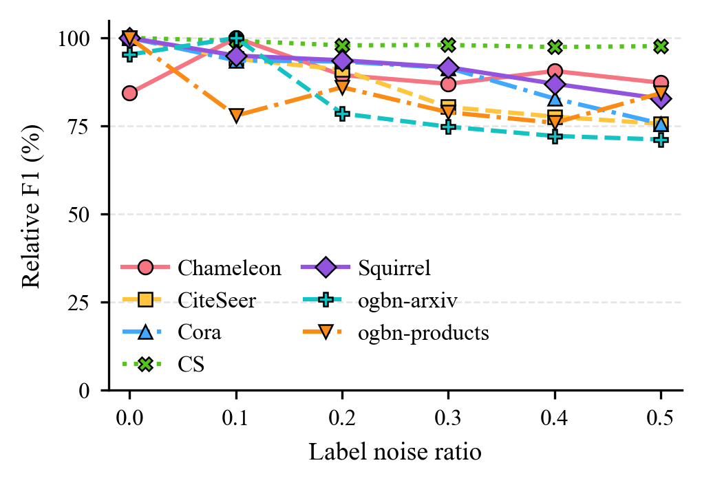

# 折线图 - label_noise_ratio_plot


## 使用场景

展示不同标签噪声比例（label noise ratio）下，各数据集的相对性能（Relative F1）变化趋势，用于评估方法对标签噪声的鲁棒性。

## 效果预览

1. 坐标轴含义
    - x 轴代表 Label noise ratio（标签噪声比例）。
    - y 轴代表 Relative F1（相对 F1，脚本中默认以百分比显示）。
2. 图形元素含义
    - 每条折线对应一个数据集（legend 为数据集名）。
    - 不同颜色/点型用于区分不同数据集；数据点为各噪声水平的测量值。
3. 图片预览



## 代码

```python
import numpy as np
import matplotlib.pyplot as plt

# =========================
# ICML single-column style
# =========================
plt.rcParams.update({
    "font.family": "serif",
    "font.serif": ["Times New Roman", "Times", "DejaVu Serif"],
    "mathtext.fontset": "stix",
    "pdf.fonttype": 42,
    "ps.fonttype": 42,
    "axes.linewidth": 0.8,
    "axes.labelsize": 9,
    "xtick.labelsize": 8,
    "ytick.labelsize": 8,
    "xtick.major.size": 3,
    "ytick.major.size": 3,
    "xtick.major.width": 0.8,
    "ytick.major.width": 0.8,
    "lines.linewidth": 1.5,
    "lines.markersize": 5.0,
    "legend.fontsize": 8,
    "legend.frameon": False,
    "savefig.bbox": "tight",
    "savefig.dpi": 300,
})

# =========================
# 你的原始数据（整理成可用结构）
# =========================
RESULTS = [
    {"dataset": "Chameleon", "noise_ratios": [0.0,0.1,0.2,0.3,0.4,0.5],
     "f1_scores": [31.067752669576375,45.24032930103532,35.693963706309695,33.45708890709682,36.743675064628434,33.72940447189533]},
    {"dataset": "CiteSeer", "noise_ratios": [0.0,0.1,0.2,0.3,0.4,0.5],
     "f1_scores": [64.23580300606461,56.648229206845855,52.65892493410663,39.05287622547536,35.52765732691681,32.91602269003996]},
    {"dataset": "Cora", "noise_ratios": [0.0,0.1,0.2,0.3,0.4,0.5],
     "f1_scores": [73.49931213611703,64.10806859330108,63.63458026390274,60.987658407090095,48.20303637351229,37.7663910718573]},
    {"dataset": "CS", "noise_ratios": [0.0,0.1,0.2,0.3,0.4,0.5],
     "f1_scores": [91.0752176959656,89.57799612898023,87.22793568301499,87.42422888102531,86.38850192517002,86.81742959940688]},
    {"dataset": "Squirrel", "noise_ratios": [0.0,0.1,0.2,0.3,0.4,0.5],
     "f1_scores": [43.12549316738007,38.80075344066598,37.64899289558858,35.945903453606384,31.897775494249565,28.254548556277232]},
    {"dataset": "ogbn-arxiv", "noise_ratios": [0.0,0.1,0.2,0.3,0.4,0.5],
     "f1_scores": [0.8866790792146242,0.9794213494556978,0.5591348681255538,0.4857020385122137,0.4341926415267916,0.414745609249186]},
    {"dataset": "ogbn-products", "noise_ratios": [0.0,0.1,0.2,0.3,0.4,0.5],
     "f1_scores": [94.68440038713466,52.91183720801802,68.15288870711845,54.71879449297271,49.06449065729064,64.99062617778594]},
]

# =========================
# 归一化设置
# =========================
AS_PERCENT = True  # True: 输出百分比(0~100)；False: 输出比例(0~1)

def normalize_by_max(scores):
    scores = np.asarray(scores, dtype=float)
    m = np.max(scores)
    # 防止全 0
    if m <= 0:
        return np.zeros_like(scores), m
    # rel = scores / m
    rel = (1-scores/m)/2 + scores/m
    return rel, m

# 一组颜色/线型/marker（你也可以按需要改）
STYLE = [
    ("#F57582", "o", "-"),
    ("#FFC53D", "s", "--"),
    ("#40A9FF", "^", "-."),
    ("#52C41A", "X", ":"),
    ("#9254DE", "D", "-"),
    ("#13C2C2", "P", "--"),
    ("#FA8C16", "v", "-."),
]

# =========================
# Plot (single column)
# =========================
fig, ax = plt.subplots(figsize=(3.25, 2.2))

for idx, item in enumerate(RESULTS):
    ds = item["dataset"]
    x = np.asarray(item["noise_ratios"], dtype=float)
    y = np.asarray(item["f1_scores"], dtype=float)

    rel, maxv = normalize_by_max(y)
    y_plot = rel * 100.0 if AS_PERCENT else rel

    color, marker, ls = STYLE[idx % len(STYLE)]
    ax.plot(x, y_plot, color=color, linestyle=ls, marker=marker,
            markeredgecolor="black", markeredgewidth=0.6, label=ds)

# Axes labels
ax.set_xlabel("Label noise ratio")
ax.set_ylabel("Relative F1 (%)" if AS_PERCENT else "Relative F1 (max=1)")

ax.set_xlim(-0.02, 0.52)
ax.set_xticks([0, 0.1, 0.2, 0.3, 0.4, 0.5])

if AS_PERCENT:
    ax.set_ylim(0, 105)
    ax.set_yticks([0, 25, 50, 75, 100])
else:
    ax.set_ylim(0, 1.05)
    ax.set_yticks([0.0, 0.25, 0.5, 0.75, 1.0])

# subtle y-grid only
ax.grid(True, axis="y", linestyle="--", linewidth=0.6, alpha=0.35)
ax.grid(False, axis="x")

ax.spines["top"].set_visible(False)
ax.spines["right"].set_visible(False)

# Legend compact (multi-column helps in single-column figure)
ax.legend(ncol=2, loc="lower left",
          columnspacing=0.9, handletextpad=0.4, borderaxespad=0.2)

fig.tight_layout(pad=0.15)

# out = "noise_robustness_relF1_percent.pdf" if AS_PERCENT else "noise_robustness_relF1_ratio.pdf"
# plt.savefig(out)
plt.show()
```
