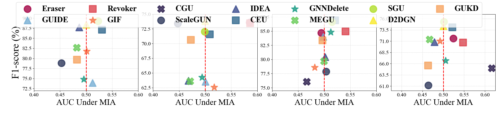

# 散点图 - 1

## 使用场景
一般用于度量不同方法在两个评测指标下的效果分布对比，x和y轴一般都代表一种不同的评测指标或评测任务。

## 效果预览

1. 坐标轴含义
    - x轴代表在 Membership Inference Attack 下的 AUC。
    - y轴代表 F1-score。
2. 图案/颜色含义
    - 不同的颜色和图案代表不同的方法。
    - 中间的红线代表分布的基准，节点大多分布在红线附近。
3. 图片预览



## 代码
```python
import matplotlib.pyplot as plt
import numpy as np
from matplotlib import rcParams

config = {
    "font.family":'Times New Roman',  # 设置字体类型
    "axes.unicode_minus": False #解决负号无法显示的问题
}
rcParams.update(config)
# 方法名称
methods = ['Eraser', 'GUIDE', 'Revoker', 'GIF', 'CGU', 'ScaleGUN', 'IDEA',
           'CEU', 'GNNDelete', 'MEGU', 'SGU', 'D2DGN', 'GUKD']

f1_scores = [71.59, 57.39, 70.71, 71.03, 64.96, 61.17, 70.78, 74.08, 66.64, 71.39,
             75.28, 74.32, 65.57]

# F1 - score (y轴)
f1_scores_cora = [81.14, 73.89, 81.09, 81.75, 86.37, 78.82, 87.71, 87.12, 74.78, 82.68, 89.26, 88.41, 79.65]

# AUC under MIA (x轴)
auc_scores = [0.5239, 0.4978, 0.5476, 0.4921, 0.6164, 0.4643, 0.4789, 0.5219, 0.5056,
              0.4673, 0.5012, 0.5003, 0.4637]

auc_scores_cora = [0.6748, 0.5120, 0.6578, 0.5010, 0.6863, 0.4527, 0.4867, 0.5304, 0.4952, 0.4817, 0.523, 0.4999, 0.4823]

f1_scores_cite = [73.57, 63.50, 73.45, 62.58, 75.62, 73.42, 63.66, 71.56, 64.26, 63.60, 72.04, 73.81, 70.63]

auc_scores_cite = [0.5852, 0.5004, 0.5862, 0.5170, 0.8465, 0.4473, 0.4677, 0.5088, 0.4938, 0.4712, 0.499, 0.5000, 0.4727]

f1_scores_pub = [84.68, 84.02, 84.94, 78.60, 76.07, 77.88, 80.44, 86.91, 84.82, 79.68, 86.61, 86.06, 83.37]

auc_scores_pub = [0.4941, 0.4979, 0.5409, 0.4819, 0.4665, 0.5037, 0.5016, 0.5208, 0.5126, 0.4995, 0.515, 0.7353, 0.4965]

colors = ['#A30445', '#76AED4', '#DC444E', '#F8774A', '#2B1D4C',
          '#2B3559', '#3B4B8D', '#31688D', '#1D9D86', '#6BCC5B',
          '#B1DE2A', '#F8E92A', '#F7A461', '#EC6C43', '#DDF698']

# 设置绘图
fig = plt.figure(figsize=(28, 4.8))

# 标记样式列表（指定您要求的图案）
markers = ['o', '^', 's', '*', 'X']

# 第一个子图
ax1 = plt.subplot(1, 4, 1)
# 绘制散点图
for i, method in enumerate(methods):
    ax1.scatter(auc_scores_cora[i], f1_scores_cora[i], label=method,
                marker=markers[i % len(markers)], s=400, edgecolors=colors[i],
                color=colors[i], alpha=0.8,linewidth = 3)

# 设置 y 轴标签
ax1.set_ylabel('F1-score (%)', fontsize=30)

# 设置 x 轴范围，确保 0.5 为图像中心
ax1.set_xlim(0.4, 0.6)
# 在 x = 0.5 位置添加红色虚线
ax1.axvline(x=0.5, color='red', linestyle='--', linewidth=2)
ax1.set_ylim(72, 91)
ax1.set_yticks(np.arange(72.5, 91, 2.5))
# 添加网格，设置为细的虚线
ax1.grid(True, linestyle=':', linewidth=0.7)
# 调整 Y 轴的数字大小
ax1.tick_params(axis='y', labelsize=16)
ax1.tick_params(axis='x', labelsize=16)
ax1.set_xticks(np.arange(0.4, 0.65, 0.05))
plt.xlabel('AUC Under MIA', fontsize=25)
# 第二个子图
ax2 = plt.subplot(1, 4, 2)
# 绘制散点图
for i, method in enumerate(methods):
    ax2.scatter(auc_scores_cite[i], f1_scores_cite[i], label=method,
                marker=markers[i % len(markers)], s=400, edgecolors=colors[i],
                color=colors[i], alpha=0.8,linewidth = 3)

# 设置 y 轴标签

# 设置 x 轴范围，确保 0.5 为图像中心
ax2.set_xlim(0.4, 0.6)
# 在 x = 0.5 位置添加红色虚线
ax2.axvline(x=0.5, color='red', linestyle='--', linewidth=2)
ax2.set_ylim(62, 75)
ax2.set_yticks(np.arange(62.5, 76, 2.5))
# 添加网格，设置为细的虚线
ax2.grid(True, linestyle=':', linewidth=0.7)
# 调整 Y 轴的数字大小
ax2.tick_params(axis='y', labelsize=16)
ax2.tick_params(axis='x', labelsize=16)
ax2.set_xticks(np.arange(0.4, 0.65, 0.05))
plt.xlabel('AUC Under MIA', fontsize=25)
# 第三个子图
ax3 = plt.subplot(1, 4, 3)
# 绘制散点图
for i, method in enumerate(methods):
    ax3.scatter(auc_scores_pub[i], f1_scores_pub[i], label=method,
                marker=markers[i % len(markers)], s=400, edgecolors=colors[i],
                color=colors[i], alpha=0.8,linewidth = 3)

# 设置 y 轴标签

# 设置 x 轴范围，确保 0.5 为图像中心
ax3.set_xlim(0.4, 0.6)
# 在 x = 0.5 位置添加红色虚线
ax3.axvline(x=0.5, color='red', linestyle='--', linewidth=2)

# 添加网格，设置为细的虚线
ax3.grid(True, linestyle=':', linewidth=0.7)
# 调整 Y 轴的数字大小
ax3.tick_params(axis='y', labelsize=16)
ax3.tick_params(axis='x', labelsize=16)
ax3.set_xticks(np.arange(0.4, 0.65, 0.05))
ax3.set_ylim(74.5, 88)
ax3.set_yticks(np.arange(75, 88, 2.5))
plt.xlabel('AUC Under MIA', fontsize=25)
# 第四个子图
ax4 = plt.subplot(1, 4, 4)
# 绘制散点图
for i, method in enumerate(methods):
    ax4.scatter(auc_scores[i], f1_scores[i], label=method,
                marker=markers[i % len(markers)], s=400, edgecolors=colors[i],
                color=colors[i], alpha=0.8,linewidth = 3)

# 设置 y 轴标签

# 设置 x 轴范围，确保 0.5 为图像中心
ax4.set_xlim(0.375, 0.625)
ax4.set_xticks(np.arange(0.4, 0.65, 0.05))
ax4.set_ylim(60, 77)
ax4.set_yticks(np.arange(61, 77, 2.5))
# 在 x = 0.5 位置添加红色虚线
ax4.axvline(x=0.5, color='red', linestyle='--', linewidth=2)

# 添加网格，设置为细的虚线
ax4.grid(True, linestyle=':', linewidth=0.7)
# 调整 Y 轴的数字大小
ax4.tick_params(axis='y', labelsize=16)
ax4.tick_params(axis='x', labelsize=16)
plt.xlabel('AUC Under MIA', fontsize=25)

font_properties = {'weight': 'bold', 'size': 24}
# 添加图例，使用 fig.legend 将图例添加到整个图形层面
fig.legend(methods, bbox_to_anchor=(0.5, 0.73), loc='lower center', ncol=7, prop=font_properties)

# 添加统一标题
# fig.suptitle('Scatter Plots of Methods on Different Datasets', fontsize=35, fontweight='bold')
# 添加统一标题，并设置位置在下方（使用 y 参数调整垂直位置，可按需微调）
# fig.suptitle('AUC under MIA', fontsize=35, fontweight='bold', y=0.085)
# 显示图形
plt.tight_layout(rect=[0.03, 0.05, 1, 0.925])
plt.show()

```
