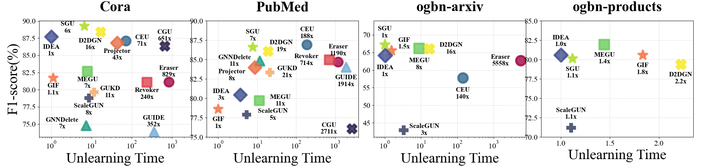

# 散点图 - 2

## 使用场景
一般用于度量不同方法在两个评测指标下的效果分布对比，x和y轴一般都代表一种不同的评测指标或评测任务。

## 效果预览

1. 坐标轴含义
    - x轴代表 Unlearning Time。
    - y轴代表 F1-score。
2. 图案/颜色含义
    - 不同的颜色和图案代表不同的方法。
    - 在每个节点上标识其方法名以及时间开销对比。
3. 图片预览



## 代码
```python
import matplotlib.pyplot as plt
import numpy as np
from matplotlib import rcParams

config = {
    "font.family":'Times New Roman',  # 设置字体类型
    "axes.unicode_minus": False #解决负号无法显示的问题
}
rcParams.update(config)
methods = ['Eraser', 'GUIDE', 'Revoker', 'GIF', 'CGU', 'ScaleGUN', 'IDEA',
           'CEU', 'GNNDelete', 'MEGU', 'SGU', 'D2DGN', 'GUKD', 'Projector']

# F1-score数据
f1 = [81.14, 73.89, 81.09, 81.75, 86.37, 78.82, 87.71, 87.12, 74.78, 82.68,
      89.26, 88.41, 79.65, 86.79]

# 时间数据
time = [24.6348, 10.4626, 7.1368, 0.0331, 19.3614, 0.2532, 0.0297, 2.1248,
        0.2186, 0.2367, 0.1943, 0.4997, 0.3406, 1.2860]
min_time = min(time)
time_normalized = [t / min_time for t in time]

methods_a= ['Eraser', 'GIF','ScaleGUN', 'IDEA',
           'CEU', 'MEGU', 'SGU', 'D2DGN' ]
f1_a = [62.72,10,10,65.52,10,43.01,64.22,57.80,10,66.15,67.20,66.08,10,10]
time_a = [1075.6175,10,10,0.2983,10,0.6384,0.1969,27.1606,10,1.7308,0.1935,3.2450,10,10]
min_time_a = min(time_a)
time_normalized_a = [t / min_time_a for t in time_a]

methods_pub = ['Eraser', 'GUIDE', 'Revoker', 'GIF', 'CGU', 'ScaleGUN', 'IDEA',
           'CEU', 'GNNDelete', 'MEGU', 'SGU', 'D2DGN', 'GUKD', 'Projector']
f1_pub = [84.68,84.02,84.94,78.6,76.07,77.88,80.44,86.91,84.82,79.68,86.61,86.06,83.37,83.97]
time_pub = [31.1849,50.1533,18.7140,0.0262,71.0314,0.1405,0.0971,4.9460,0.3043,0.2981,0.1999,0.5002,0.5509,0.2296]

colors_pub = ['#A30445', '#76AED4', '#DC444E', '#F8774A', '#2B1D4C',
          '#2B3559','#3B4B8D','#31688D','#1D9D86','#6BCC5B',
         '#B1DE2A','#F8E927','#F7A461','#EC6C43','#DDF698']
# 将time归一化为倍数（最小值为1x）
min_time_pub = min(time_pub)
time_normalized_pub = [t / min_time_pub for t in time_pub]
# 将time归一化为倍数（最小值为1x）


colors = ['#A30445', '#76AED4', '#DC444E', '#F8774A', '#2B1D4C',
          '#2B3559','#3B4B8D','#31688D','#1D9D86','#6BCC5B',
         '#B1DE2A','#F8E927','#F7A461','#EC6C43','#DDF698']

colors_a = ['#A30445', '#F8774A',
          '#2B3559','#3B4B8D','#31688D','#6BCC5B',
         '#B1DE2A','#F8E927','#F7A461']
methods_pro= [ 'GIF','ScaleGUN', 'IDEA',
           'MEGU', 'SGU', 'D2DGN' ]

f1_pro = [100,100,100,80.56,100,71.2,80.56,100,100,81.93,80.112,79.38,100,100]

time_pro = [100,100,100,90.7349,100,54.579903,49.4637,100,100,71.4151,55.369,109.9275,100,100]

colors_pro = [ '#F8774A',
          '#2B3559','#3B4B8D','#6BCC5B',
         '#B1DE2A','#F8E927','#F7A461']
min_time_pro = min(time_pro)
time_normalized_pro= [t / min_time_pro for t in time_pro]

# 设置绘图
plt.figure(figsize=(25, 4.8))


# 标记样式列表（指定您要求的图案）
markers = ['o', '^', 's', '*', 'X', '+', 'D']

# 绘制散点图，增大图案大小
ax1 = plt.subplot(1, 4, 1)
for i, method in enumerate(methods):
    # 选择图标，并增加边框粗细
    if markers[i % len(markers)] == '+':
        plt.scatter(time_normalized[i], f1[i],
                    marker=markers[i % len(markers)], s=350, edgecolors=colors[i],
                    color=colors[i], alpha=0.8, linewidth=8)  # 设置更粗的线宽
    else:
        plt.scatter(time_normalized[i], f1[i],
                    marker=markers[i % len(markers)], s=350, edgecolors=colors[i],
                    color=colors[i], alpha=0.8, linewidth=4)

        # 计算时间倍数（保留一位小数，除GIF外的其他直接为整数）
    time_label = f'{time_normalized[i]:.1f}x' if method == 'GIF' else f'{int(time_normalized[i])}x'

    # 设置文本标注位置，避免重叠
    # if i % 2 == 0:
    #     # 将文本放在点的右方
    #     plt.text(time_normalized[i] * 1.1, f1[i], f'{method}\n{time_label}',
    #              fontsize=12, ha='left', va='center', color='black')
    # else:
    #     # 将文本放在点的下方
    if i in [0,1,4]:
        plt.text(time_normalized[i], f1[i] +1.5, f'{method}\n{time_label}',
                 fontsize=14, ha='center', va='center', color='black',weight='bold')
    elif i in[7,8,12]:
        if i == 8:
            plt.text(time_normalized[i]-5.5, f1[i] + 0.3, f'{method}\n{time_label}',
                     fontsize=14, ha='center', va='center', color='black',weight='bold')
        else:
            plt.text(time_normalized[i] * 2.5, f1[i] , f'{method}\n{time_label}',
                     fontsize=14, ha='center', va='center', color='black',weight='bold')
    elif i in [10]:
        plt.text(time_normalized[i] - 4, f1[i]-0.2, f'{method}\n{time_label}',
                 fontsize=14, ha='center', va='center', color='black', weight='bold')
    elif i in [11]:
        plt.text(time_normalized[i] - 7.5, f1[i] -1.8, f'{method}\n{time_label}',
                 fontsize=14, ha='center', va='center', color='black', weight='bold')
    elif i in [6]:
        plt.text(time_normalized[i] , f1[i]- 2 , f'{method}\n{time_label}',
                 fontsize=14, ha='center', va='center', color='black', weight='bold')
    else:
        plt.text(time_normalized[i], f1[i] - 1.7, f'{method}\n{time_label}',
                 fontsize=14, ha='center', va='center', color='black',weight='bold')

plt.xlabel('Unlearning Time', fontsize=30)
plt.ylabel('F1-score(%)', fontsize=30)

plt.tick_params(axis='x', labelsize=16)  # 设置X轴数字的大小
plt.tick_params(axis='y', labelsize=16)
plt.xscale('log')
plt.grid(True, linestyle=':', linewidth=0.7)
ax1.set_xticks([1,10,100,1000])

# 设置横坐标范围，从10^0到10^3
plt.xlim(0.5, 3000)  # 横轴扩大至10^3

# methods_pub = ['Eraser', 'GUIDE', 'Revoker', 'GIF', 'CGU', 'ScaleGUN', 'IDEA',
           # 'CEU', 'GNNDelete', 'MEGU', 'SGU', 'D2DGN', 'GUKD', 'Projector']
ax2 = plt.subplot(1, 4, 2)
for i, method in enumerate(methods):
    # 选择图标，并增加边框粗细
    if markers[i % len(markers)] == '+':
        plt.scatter(time_normalized_pub[i], f1_pub[i],
                    marker=markers[i % len(markers)], s=350, edgecolors=colors_pub[i],
                    color=colors_pub[i], alpha=0.8, linewidth=8)  # 设置更粗的线宽
    else:
        plt.scatter(time_normalized_pub[i], f1_pub[i],
                    marker=markers[i % len(markers)], s=350, edgecolors=colors_pub[i],
                    color=colors_pub[i], alpha=0.8, linewidth=4)

        # 计算时间倍数（保留一位小数，除GIF外的其他直接为整数）
    time_label = f'{int(time_normalized_pub[i])}x'

    if i in [0,7,10]:
        plt.text(time_normalized_pub[i], f1_pub[i] +1.5, f'{method}\n{time_label}',
                 fontsize=14, ha='center', va='center', color='black',weight='bold')
    elif i in[2,4]:
        plt.text(time_normalized_pub[i]/3.9, f1_pub[i] , f'{method}\n{time_label}',
                     fontsize=14, ha='center', va='center', color='black',weight='bold')
    elif i in[8]:
        plt.text(time_normalized_pub[i]-9, f1_pub[i] , f'{method}\n{time_label}',
                     fontsize=14, ha='center', va='center', color='black',weight='bold')
    elif i in[6]:
        plt.text(time_normalized_pub[i]-2.5, f1_pub[i] , f'{method}\n{time_label}',
                     fontsize=14, ha='center', va='center', color='black',weight='bold')
    elif i in [1]:
        plt.text(time_normalized_pub[i], f1_pub[i] - 1.8, f'{method}\n{time_label}',
                 fontsize=14, ha='center', va='center', color='black',weight='bold')
    elif i in [11]:
        plt.text(time_normalized_pub[i]*2.2, f1_pub[i] + 0.65, f'{method}\n{time_label}',
                 fontsize=14, ha='center', va='center', color='black',weight='bold')
    elif i in [13]:
        plt.text(time_normalized_pub[i] -6.5, f1_pub[i] -1, f'{method}\n{time_label}',
                 fontsize=14, ha='center', va='center', color='black', weight='bold')
    elif i in [12]:
        plt.text(time_normalized_pub[i] +38, f1_pub[i] , f'{method}\n{time_label}',
                 fontsize=14, ha='center', va='center', color='black', weight='bold')

    elif i in [3]:
        plt.text(time_normalized_pub[i], f1_pub[i] - 1.8, f'{method}\n{time_label}',
                 fontsize=14, ha='center', va='center', color='black', weight='bold')
    elif i in [5]:
        plt.text(time_normalized_pub[i]+20, f1_pub[i], f'{method}\n{time_label}',
                 fontsize=14, ha='center', va='center', color='black',weight='bold')
    elif i in [9]:
        plt.text(time_normalized_pub[i]+28, f1_pub[i], f'{method}\n{time_label}',
                 fontsize=14, ha='center', va='center', color='black',weight='bold')
    else:
        plt.text(time_normalized_pub[i] - 5, f1_pub[i], f'{method}\n{time_label}',
                 fontsize=14, ha='center', va='center', color='black')

plt.ylim(75, 90)
plt.xlabel('Unlearning Time', fontsize=30)
# plt.ylabel('F1-score (%)', fontsize=35)
plt.tick_params(axis='x', labelsize=16)  # 设置X轴数字的大小
plt.tick_params(axis='y', labelsize=16)
plt.xscale('log')
ax2.set_xticks([1,10,100,1000])
plt.grid(True, linestyle=':', linewidth=0.7)
# 设置横坐标范围，从10^0到10^3
plt.xlim(0.5, 4000)  # 横轴扩大至10^3


ax3 = plt.subplot(1, 4, 3)
for i, method in enumerate(methods):
    if method in ['GUIDE', 'Revoker', 'CGU', 'GNNDelete', 'GUKD', 'Projector']:
        continue
    if markers[i % len(markers)] == '+':
        plt.scatter(time_normalized_a[i], f1_a[i],
                    marker=markers[i % len(markers)], s=400, edgecolors=colors[i],
                    color=colors[i], alpha=0.8, linewidth=8)  # 设置更粗的线宽
    else:
        plt.scatter(time_normalized_a[i], f1_a[i],
                    marker=markers[i % len(markers)], s=400, edgecolors=colors[i],
                    color=colors[i], alpha=0.8, linewidth=4)

        # 计算时间倍数（保留一位小数，除GIF外的其他直接为整数）
    time_label = f'{time_normalized_a[i]:.1f}x' if method == 'GIF' else f'{int(time_normalized_a[i])}x'

    # 设置文本标注位置，避免重叠
    # if i % 2 == 0:
    #     # 将文本放在点的右方
    #     plt.text(time_normalized[i] * 1.1, f1[i], f'{method}\n{time_label}',
    #              fontsize=12, ha='left', va='center', color='black')
    # else:
    #     # 将文本放在点的下方
    if method in ['SGU']:
        plt.text(time_normalized_a[i], f1_a[i] +3.5, f'{method}\n{time_label}',
                 fontsize=14, ha='center', va='center', color='black',weight='bold')
    elif method in['MEGU','CEU','IDEA']:
        plt.text(time_normalized_a[i], f1_a[i] -4.5, f'{method}\n{time_label}',
                 fontsize=14, ha='center', va='center', color='black',weight='bold')
    elif method in ['Eraser']:
        plt.text(time_normalized_a[i]*0.28, f1_a[i], f'{method}\n{time_label}',
                 fontsize=14, ha='center', va='center', color='black',weight='bold')
    elif method in['ScaleGUN']:
        plt.text(time_normalized_a[i]+9, f1_a[i], f'{method}\n{time_label}',
                 fontsize=14, ha='center', va='center', color='black',weight='bold')
    elif method in ['D2DGN']:
        plt.text(time_normalized_a[i] *4 , f1_a[i], f'{method}\n{time_label}',
                 fontsize=14, ha='center', va='center', color='black', weight='bold')
    elif method in ['GIF']:
        plt.text(time_normalized_a[i] * 2.2, f1_a[i]+2, f'{method}\n{time_label}',
                 fontsize=14, ha='center', va='center', color='black', weight='bold')
    # else:
    #     plt.text(time_normalized_a[i], f1_a[i] - 3.5, f'{method}\n{time_label}',
    #              fontsize=14, ha='center', va='center', color='black',weight='bold')
plt.xlabel('Unlearning Time', fontsize=30)
plt.ylim(41,74)
plt.tick_params(axis='x', labelsize=16)  # 设置X轴数字的大小
plt.tick_params(axis='y', labelsize=16)
plt.grid(True, linestyle=':', linewidth=0.7)
plt.xscale('log')
ax3.set_xticks([1,10,100,1000])
# 设置横坐标范围，从10^0到10^3
plt.xlim(0.5, 7800)  # 横轴扩大至10^3
ax4 = plt.subplot(1, 4, 4)
# methods = ['Eraser', 'GUIDE', 'Revoker', 'GIF', 'CGU', 'ScaleGUN', 'IDEA',
           # 'CEU', 'GNNDelete', 'MEGU', 'SGU', 'D2DGN', 'GUKD', 'Projector']
for i, method in enumerate(methods):
    if method in['Eraser','GUIDE', 'Revoker','CGU','CEU', 'GNNDelete','GUKD','Projector']:
        continue
    if markers[i % len(markers)] == '+':
        plt.scatter(time_normalized_pro[i], f1_pro[i],
                    marker=markers[i % len(markers)], s=400, edgecolors=colors[i],
                    color=colors[i], alpha=0.8, linewidth=8)  # 设置更粗的线宽
    else:
        plt.scatter(time_normalized_pro[i], f1_pro[i],
                    marker=markers[i % len(markers)], s=380, edgecolors=colors[i],
                    color=colors[i], alpha=0.8, linewidth=4)

        # 计算时间倍数（保留一位小数，除GIF外的其他直接为整数）
    time_label = f'{time_normalized_pro[i]:.1f}x'

    if method in ['IDEA','ScaleGUN']:
        plt.text(time_normalized_pro[i] , f1_pro[i]+1.8, f'{method}\n{time_label}',
             fontsize=14, ha='center', va='center', color='black',weight='bold')
    else:
        plt.text(time_normalized_pro[i], f1_pro[i] - 1.8, f'{method}\n{time_label}',
                 fontsize=14, ha='center', va='center', color='black',weight='bold')
# 设置标题和轴标签
# plt.title('F1-score vs Time Cost (Normalized)', fontsize=16)
plt.xlabel('Unlearning Time', fontsize=30)
plt.tick_params(axis='x', labelsize=16)  # 设置X轴数字的大小
plt.tick_params(axis='y', labelsize=16)

# 设置横坐标为对数刻度
# plt.xscale('log')
plt.ylim(70,85)
# 设置横坐标范围，从10^0到10^3
plt.xlim(0.8, 2.35)  # 横轴扩大至10^3
ax1.set_title("Cora",fontsize=30, fontweight='bold',pad=20)
ax2.set_title("PubMed",fontsize=30, fontweight='bold',pad=20)
ax3.set_title("ogbn-arxiv",fontsize=30, fontweight='bold',pad=20)
ax4.set_title("ogbn-products",fontsize=30, fontweight='bold',pad=20)
# 添加网格，设置为细的虚线
plt.grid(True, linestyle=':', linewidth=0.7)
# plt.suptitle('Unlearning Time', fontsize=30, y=0.1)
# 显示图形
plt.subplots_adjust(left=0.055, bottom=0.175, right=0.975, top=0.875, wspace=0.1, hspace=None)
plt.tight_layout(rect=[0.01, 0, -0.1,1])
plt.show()
```