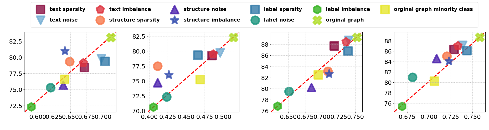

# 散点图 - 3

## 使用场景
一般用于度量不同方法在两个评测指标下的效果分布对比，x和y轴一般都代表一种不同的评测指标或评测任务。

## 效果预览

1. 坐标轴含义
    - x轴代表节点分类准确率。
    - y轴代表节点聚类的 NMI。
2. 图案/颜色含义
    - 不同的颜色和图案代表不同的方法。
    - 斜着的红线代表分布的基准，节点大多分布在红线附近。
3. 图片预览



## 代码
```python
import matplotlib.pyplot as plt
import numpy as np
from matplotlib import rcParams

config = {
    # "font.family":'Times New Roman',  # 设置字体类型
    "axes.unicode_minus": False #解决负号无法显示的问题
}
rcParams.update(config)
# 方法名称
methods = ['text sparsity', 'text noise', 'text imbalance', 'structure sparsity', 'structure noise', 'structure imbalance',
           'label sparsity', 'label noise', 'label imbalance', 'orginal graph', 'orginal graph minority class']

# node classification (y轴)
node_cls_gcn = [78.41, 79.78, 79.15, 79.33, 75.65, 80.99, 79.34, 75.28, 72.32, 83.02, 76.57]

# node clustering (x轴)
node_clu_gcn = [0.6716, 0.6976, 0.6699, 0.649, 0.6391, 0.6417, 0.7032, 0.6196, 0.5902, 0.7120, 0.6414]

node_cls_gat = [79.26, 79.70, 79.52, 77.49, 74.72, 76.01, 79.33, 72.32, 70.62, 82.29, 75.23]

node_clu_gat = [0.4853, 0.4962, 0.4868, 0.4115, 0.4114, 0.4265, 0.466, 0.4235, 0.4057, 0.5143, 0.4692]

node_cls_tape = [87.68, 88.71, 88.46, 83.11, 80.24, 82.66, 86.74, 79.51, 76.88, 89.27, 82.51]

node_clu_tape = [0.7183, 0.7394, 0.7355, 0.7086, 0.6842, 0.7105, 0.7387, 0.6509, 0.6339, 0.7520, 0.6945]

node_cls_engine = [86.34, 87.15, 87.08, 85.07, 84.6, 84.09, 86.13, 80.99, 75.39, 88.71, 80.21]

node_clu_engine = [0.7287, 0.7386, 0.7332, 0.7206, 0.7087, 0.7230, 0.7436, 0.6811, 0.6691, 0.7584, 0.7064]

colors = ["#8A0F42", '#76AED4', "#DE3440", '#F8774A', "#4B21AD",
         "#3A52B1", "#347BA9", "#19947D", "#35B321", '#B1DE2A', "#E7E72E"]

# 设置绘图
fig = plt.figure(figsize=(28, 5.5))

# 标记样式列表（指定您要求的图案）
markers = ['s', 'v', 'p', 'o', '^', '*', 's', 'o', 'h', 'X', 's']

# 第一个子图
ax1 = plt.subplot(1, 4, 1)
# 绘制散点图
for i, method in enumerate(methods):
    ax1.scatter(node_clu_gcn[i], node_cls_gcn[i], label=method,
                marker=markers[i], s=600,
                color=colors[i], alpha=0.8, linewidth=4.5)

# 设置 y 轴标签
# ax1.set_ylabel('Node clu NMI', fontsize=30)

# 设置 x 轴范围，确保 0.5 为图像中心
ax1.set_xlim(0.58, 0.72)
ax1.set_ylim(71.50, 83.90)
# 在 x = 0.5 位置添加红色虚线
# ax1.axvline(x=0.5, y=0.5, color='red', linestyle='--', linewidth=2)
ax1.plot([0.58, 0.72], [71.50, 83.90], color='red', linestyle='--', linewidth=3, zorder=0)

ax1.set_xticks(np.arange(0.6, 0.725, 0.025))
# ax1.set_yticks(np.arange(72.5, 91, 2.5))
# 添加网格，设置为细的虚线
ax1.grid(True, linestyle=':', linewidth=0.7)
# 调整 Y 轴的数字大小
ax1.tick_params(axis='y', labelsize=18)
ax1.tick_params(axis='x', labelsize=18)
# ax1.set_xticks(np.arange(0.60, 0.72, 0.02))
# ax1.set_yticks(np.arange(72.0, 84.0, 2.0))
# plt.xlabel('Node cls Acc (%)', fontsize=25)

# 第二个子图
ax2 = plt.subplot(1, 4, 2)
# 绘制散点图
for i, method in enumerate(methods):
    ax2.scatter(node_clu_gat[i], node_cls_gat[i], label=method,
                marker=markers[i], s=600,
                color=colors[i], alpha=0.8, linewidth=4.5)

# 设置 y 轴标签

# 设置 x 轴范围，确保 0.5 为图像中心
ax2.set_xlim(0.398, 0.522)
ax2.set_ylim(69.80, 83.20)
# 在 x = 0.5 位置添加红色虚线
# ax2.axvline(x=0.5, color='red', linestyle='--', linewidth=2)
ax2.plot([0.398, 0.522], [69.80, 83.20], color='red', linestyle='--', linewidth=3, zorder=0)
# ax2.set_ylim(62, 75)
# ax2.set_yticks(np.arange(62.5, 76, 2.5))
# 添加网格，设置为细的虚线
ax2.grid(True, linestyle=':', linewidth=0.7)
# 调整 Y 轴的数字大小
ax2.tick_params(axis='y', labelsize=18)
ax2.tick_params(axis='x', labelsize=18)
# ax2.set_xticks(np.arange(0.4, 0.65, 0.05))
# plt.xlabel('Node cls acc', fontsize=25)

# 第三个子图
ax3 = plt.subplot(1, 4, 3)
# 绘制散点图
for i, method in enumerate(methods):
    ax3.scatter(node_clu_tape[i], node_cls_tape[i], label=method,
                marker=markers[i], s=600,
                color=colors[i], alpha=0.8, linewidth=4.5)

# 设置 y 轴标签

# 设置 x 轴范围，确保 0.5 为图像中心
ax3.set_xlim(0.624, 0.76)
ax3.set_ylim(75.8, 90.20)
# 在 x = 0.5 位置添加红色虚线
# ax3.axvline(x=0.5, color='red', linestyle='--', linewidth=2)
ax3.plot([0.624, 0.76], [75.8, 90.20], color='red', linestyle='--', linewidth=3, zorder=0)

# 添加网格，设置为细的虚线
ax3.grid(True, linestyle=':', linewidth=0.7)
# 调整 Y 轴的数字大小
ax3.tick_params(axis='y', labelsize=18)
ax3.tick_params(axis='x', labelsize=18)
ax3.set_xticks(np.arange(0.65, 0.775, 0.025))
# ax3.set_ylim(74.5, 88)
ax3.set_yticks(np.arange(76.0, 90.0, 2.0))
# plt.xlabel('Node cls Acc', fontsize=25)

# 第四个子图
ax4 = plt.subplot(1, 4, 4)
# 绘制散点图
for i, method in enumerate(methods):
    ax4.scatter(node_clu_engine[i], node_cls_engine[i], label=method,
                marker=markers[i], s=600,
                color=colors[i], alpha=0.8, linewidth=4.5)

# 设置 y 轴标签

# 设置 x 轴范围，确保 0.5 为图像中心
ax4.set_xlim(0.66, 0.765)
ax4.set_ylim(74.3, 89.7)
# ax4.set_xticks(np.arange(0.4, 0.65, 0.05))
# ax4.set_ylim(60, 77)
ax4.set_yticks(np.arange(76, 90, 2.0))
# 在 x = 0.5 位置添加红色虚线
# ax4.axvline(x=0.5, color='red', linestyle='--', linewidth=2)
ax4.plot([0.66, 0.765], [74.3, 89.7], color='red', linestyle='--', linewidth=3, zorder=0)

# 添加网格，设置为细的虚线
ax4.grid(True, linestyle=':', linewidth=0.7)
# 调整 Y 轴的数字大小
ax4.tick_params(axis='y', labelsize=18)
ax4.tick_params(axis='x', labelsize=18)
# plt.xlabel('Node cls Acc', fontsize=25)

font_properties = {'weight': 'bold', 'size': 15}
# 添加图例，使用 fig.legend 将图例添加到整个图形层面
fig.legend(methods, bbox_to_anchor=(0.52, 0.77), loc='lower center', ncol=6, labelspacing=1.2, borderpad=1.0, prop=font_properties)

# 添加统一标题
# fig.suptitle('Scatter Plots of Methods on Different Datasets', fontsize=35, fontweight='bold')
# 添加统一标题，并设置位置在下方（使用 y 参数调整垂直位置，可按需微调）
# fig.suptitle('AUC under MIA', fontsize=35, fontweight='bold', y=0.085)
# 显示图形
plt.tight_layout(rect=[0.03, 0.05, 1, 0.78], w_pad=10.0)
plt.show()
```